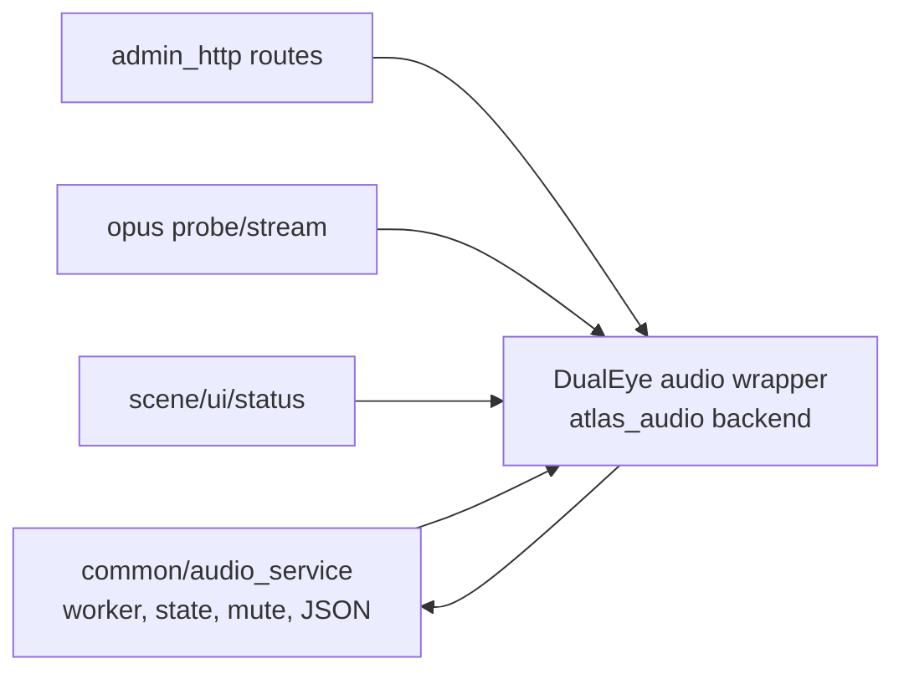

# Atlas DualEye common 化拆分执行计划

日期：2026-06-24
分支：`codex/atlas-firmware-common-split`
范围：仅固件 worktree `/Users/macbook/Documents/Atlas-One-Firmware`

## 拆分原则

- 先保留现有 public wrapper，再把内部实现迁到 `common/`，避免一次性改坏双眼、时钟、番茄、日历、宠物头和 Brain 离线降级。
- 与 Brain 共享的字段先落到 `specs/` 或本文档；新增字段只做兼容扩展，不删除旧字段。
- 固件 common 层不直接依赖 DualEye board/audio/display 设备实现，设备应用层通过 backend callback 或 wrapper 绑定。
- 每轮至少跑 `cd firmware/dualeye && idf.py build`，真机验收再跑 `tools/check_atlas_preflash.py`。

## P0-P5 顺序

### P0 audio service 真服务化

目标：把音频任务调度、状态机、mute 窗口、计数和 JSON 输出变成可复用 common service。

本轮边界：

- 新增 `firmware/dualeye/main/common/atlas_common_audio_service.*`。
- `atlas_audio_service.*` 保留旧 API，作为 DualEye app wrapper。
- common 层通过 `measure_mic_fn`、`capture_wav_fn`、`play_wav_pcm_fn` backend callback 访问设备音频。
- `/api/status`、`/api/status/lite`、`/api/selftest`、`/api/voice/turn`、`/api/audio/opus-probe` 和 OPUS stream 状态字段保持兼容。

下一步验收：

- 构建通过。
- 自检里的 `audio_service.initialized`、`worker_started` 仍为 true。
- 异步 voice turn 和 OPUS probe 继续走同一个 worker。

### P1 常驻 Brain WebSocket session

目标：把 `atlas_brain_ws_client` 拆成 common session runtime 和 DualEye event adapter。

本轮边界：

- 新增 `firmware/dualeye/main/common/atlas_common_brain_session.*`。
- `atlas_brain_ws_client.*` 保留旧 API，作为 DualEye app wrapper。
- common 层负责 base URL 转换、health probe、connect/reconnect、hello/ping、turn WAV request、TTS binary receive 和状态 JSON。
- app wrapper 通过 callback 提供 Wi-Fi ready、runtime state、device id、protocol 和 Brain base URL。
- 保留 `/api/brain/ws`、`/api/brain/events`、`brain_ws` status 字段；`atlas.brain.session.v1` payload 兼容当前 Brain。
- Brain 离线时仅更新 `brain_ws.stage=brain_offline/waiting_wifi`；双眼、时钟、番茄、日历等本地页面继续由 scene/UI 层显示，不因 session 断开切到异常页。

### P2 OPUS 60ms 真机链路

目标：把 OPUS probe 与持续推流入口拆成 common audio stream adapter。

本轮边界：

- 新增 `firmware/dualeye/main/common/atlas_common_opus_stream.*`。
- `atlas_opus_stream.*` 保留旧 API，作为 DualEye app wrapper。
- common 层固化 AOP1 header、60ms frame、OPUS encoder、probe statistics、WebSocket uplink、sequence、send failure、mute statistics 和状态 JSON。
- app wrapper 通过 callback 提供 PCM capture、播放 mute 状态、audio service 阶段通知、device id 和 task name。
- 保留 `/api/audio/opus-probe`、`/api/audio/opus-stream/start|stop|status` 与 `atlas.audio.stream.v0`；Brain 侧 `/api/device/opus-*` 代理语义不需要固件改路由。
- Brain 离线不影响本地 UI；OPUS stream start 仍只返回 host bridge 未配置/连接失败状态，不改双眼、时钟、番茄、日历本地页面降级规则。

### P3 WakeNet/AEC 资源验证

目标：把 ESP-SR 资源检查独立成 probe contract，不急于启用常驻唤醒任务。

计划：

- common 层输出 model partition、WakeNet model、wake words、chunk/sample-rate、heap 风险。
- app 层提供分区名、fallback 策略和页面提示。
- 保留 `/api/sr/status` 字段兼容。

### P4 Tool Schema V0 adapter

目标：把工具表和工具调用从 HTTP handler 中拆成 schema adapter。

计划：

- common 层定义 tool descriptor、JSON list writer、call dispatcher。
- app 层注册 eyes、clock、calendar、pomodoro、status、audio、ota 等 DualEye tool handlers。
- 固件只更新 `specs/atlas_tool_schema_v0.md` 的兼容扩展，不直接改 Brain 实现。

### P5 OTA manifest/包管理接口

目标：把 OTA manifest/status/packages/apply 从 HTTP handler 中拆成 manifest adapter。

计划：

- common 层负责 package metadata、version/hash/offset 字段输出和兼容 JSON。
- app 层负责 ESP-IDF app OTA apply、storage/model/partition USB-only 状态说明。
- 保留 `/api/ota/status`、`/api/ota/manifest`、`/api/ota/packages`、`/api/ota/apply`。

## 模块边界图

## 当前兼容承诺

- 旧 C 符号 `atlas_audio_service_*` 全部保留。
- 旧 enum 宏 `ATLAS_AUDIO_SERVICE_MODE_*` 全部保留。
- 旧 JSON 字段 `initialized/worker_started/mode/busy/job_running/continuous_enabled/muted/*_count/last_*` 全部保留。
- common 层新增能力暂不改变 HTTP contract。
