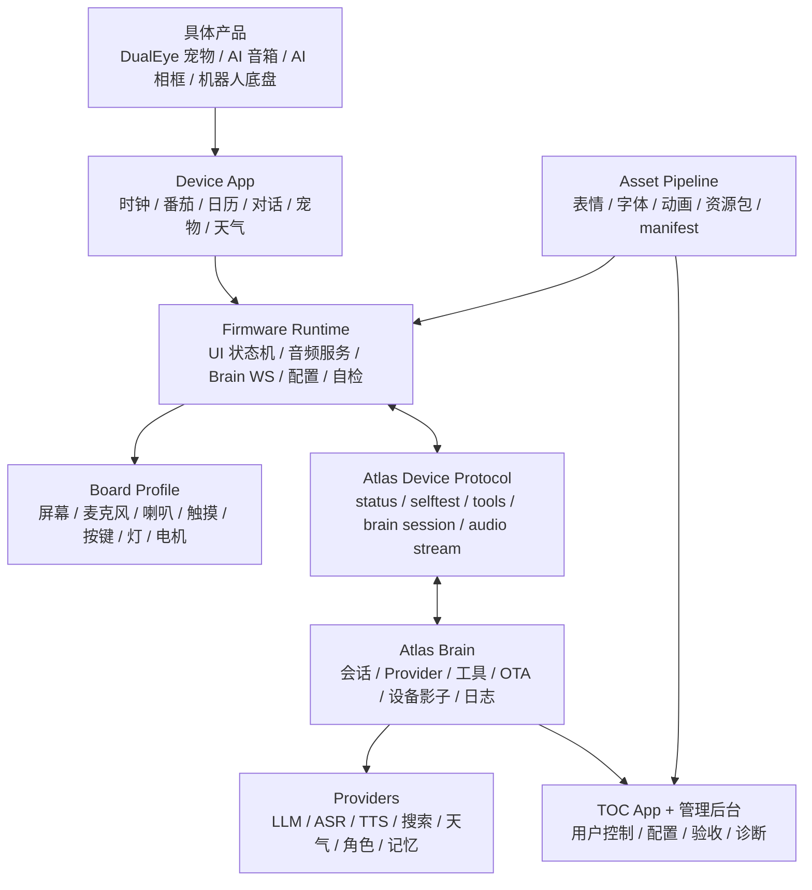

# Atlas 智能硬件平台化资产沉淀方案 V0.1

日期：2026-06-24  
项目阶段：Atlas DualEye 桌面智能硬件 / 电子宠物从单品 Demo 向可复用平台沉淀  
对标对象：`78/xiaozhi-esp32`、`xinnan-tech/xiaozhi-esp32-server`，以及 Atlas 当前固件、Atlas Brain、Web 控制端、资源流水线

## 0. 一句话结论

这次 Atlas 开发最值得沉淀的，不是某一台 DualEye 设备的页面、表情或脚本，而是一套以后能服务更多智能硬件产品的 **Atlas Device Platform**：

```text
设备固件运行时 + Brain 服务端 + App/管理端 + 工具协议 + 资源流水线 + 测试验收体系
```

第二个产品来了，比如桌面音箱、双眼宠物、AI 相框、机器人底盘、智能摆件，理想状态不是重新开荒，而是：

1. 新建一个 board profile。
2. 选择一套 device app。
3. 接入显示、音频、按键、触摸、灯光或运动能力。
4. 复用 Atlas Brain 的 Provider、会话、工具、OTA、管理端。
5. 复用烧录前自检、真机验收和运行日志体系。

## 1. 平台化沉淀原则

### 1.1 什么才算真正沉淀

一个模块只有同时满足下面 5 条，才算平台资产：

| 标准 | 说明 |
|---|---|
| 有契约 | 有清晰输入、输出、状态、错误码、版本号 |
| 可替换 | 不写死 DualEye、MiMo、Mac、本机 IP、某个页面 |
| 可观测 | 出错时能从日志、状态接口、自检结果看到原因 |
| 可测试 | 有 dry-run、脚本、模拟器或真机验收路径 |
| 有文档 | 新产品接入时能照文档完成，而不是靠回忆 |

### 1.2 现在不要过度抽象

Atlas 还在第一台设备验证阶段，抽象的顺序要保守：

| 先沉淀 | 暂不强抽象 |
|---|---|
| 协议、状态、音频、工具、Provider、OTA manifest、资源规范、自检 | 所有 UI 组件、所有业务 App、多租户后台、完整云平台、复杂权限系统 |

原因很现实：现在最容易复用、也最容易稳定的是“链路和契约”；最容易变化的是具体 UI、角色、IP 形象和硬件外壳。

## 2. 目标平台分层



平台要分成 6 层：

| 层 | 目标 | 当前 Atlas 对应物 |
|---|---|---|
| Board Profile | 适配具体硬件 | `firmware/dualeye/main/*` 目前还和 DualEye 混在一起 |
| Firmware Runtime | 固件通用能力 | `atlas_audio_service`、`atlas_scene`、`atlas_runtime`、`atlas_brain_ws_client` |
| Device App | 具体产品应用 | 双眼、时钟、番茄、日历、对话、宠物 |
| Atlas Device Protocol | 设备与 Brain 契约 | `/api/status`、`/api/selftest`、`/ws/brain`、`/ws/audio`、Tool Schema |
| Atlas Brain | 本地或云端智能硬件后端 | `tools/atlas_brain_server.py`、`atlas_brain_core.py`、`atlas_brain_providers.py`、`atlas_brain_runtime.py` |
| Web Console | 用户端和管理端 | `tools/atlas_web_ui.py` 目前是轻量内嵌页面 |

## 3. 对标 xiaozhi 后的资产差距

### 3.1 xiaozhi-esp32 值得学什么

| xiaozhi 固件能力 | Atlas 应沉淀的资产 |
|---|---|
| 多板型 board abstraction | `atlas_board_profile`，把屏幕、音频、按键、灯、电机从业务里拆出来 |
| AudioService | `atlas_audio_service` 真服务化，录音、播放、监听、打断、mute、队列统一 |
| WebSocket/MQTT 协议层 | `atlas_brain_ws_client` 作为主链路，HTTP 只做配置和兜底 |
| OPUS 60ms 帧 | `atlas_opus_stream`，统一 AOP1 帧格式、统计、错误码 |
| WakeNet/VAD/AEC | `atlas_sr_service`，先探针和资源评估，再启用 WakeNet/AEC |
| 设备状态机 | `atlas_scene`，把页面、表情、音频、Brain、Wi-Fi 合成用户可理解状态 |
| 设备 MCP/IoT 工具 | `atlas_tool_schema_v0`，先类 MCP，再逐步兼容标准 MCP |

### 3.2 xiaozhi-server 值得学什么

| xiaozhi-server 能力 | Atlas 应沉淀的资产 |
|---|---|
| ConnectionHandler 会话 | `AtlasBrainSession`，一个设备一条 session，管理状态、音频、工具、回复 |
| Provider 抽象 | `atlas_brain_providers`，LLM/ASR/TTS/天气/搜索可替换 |
| 智控台/管理端 | `Atlas Admin`，设备、Provider、工具、OTA、日志、验收 |
| App 端 | `Atlas Device App Console`，一个设备一个 TOC 用户页 |
| OTA 管理 | `atlas_ota_manifest`，先包清单/hash/兼容性，再真 OTA |
| 插件/工具系统 | `atlas_tool_registry`，schema、权限、执行日志、失败原因 |

### 3.3 Atlas 自己的差异化要沉淀什么

Atlas 不能只做“小智复刻”。我们最有价值的差异化是：

| Atlas 差异化 | 需要沉淀 |
|---|---|
| 双圆屏表达 | 双屏布局规范、左右屏职责、圆屏安全区域、旋转方向校验 |
| 电子宠物人格 | pet state machine、表情状态、情绪值/能量/好奇心、长期互动规则 |
| 2.5D 表情资源 | `pet_head` 资源规范、透明 PNG 帧动画、资源包 manifest |
| 桌面应用化 | 时钟、番茄、日历、天气、对话、音乐、故事等 App 模板 |
| 本地 Mac Brain 开发闭环 | 本地 Provider、局域网设备发现、dry-run、预检、验收页 |
| 产品体验评审 | TOC 控制台、非调试页 UI、用户主链路测试报告 |

## 4. 可复用资产清单

### 4.1 固件侧资产

| 资产 | 当前文件 | 当前状态 | 复用方向 |
|---|---|---|---|
| 配置服务 | `atlas_config.*` | 已有 | Wi-Fi、Brain URL、设备名、Provider 缓存、NVS schema |
| 配网与连接 | `atlas_wifi.*` | 已有 | SoftAP/STA、后续补局域网发现和二维码配网 |
| 配对与安全 | `atlas_pairing.*` | 已有 | PIN 配对、本地 API 防误控 |
| 状态与诊断 | `atlas_runtime.*` | 已有 | 语音 turn、失败原因、最近事件、运行时评分 |
| 场景状态机 | `atlas_scene.*` | 已有 | 用户感知状态，不再出现黑屏/异常文字页 |
| 音频基础 | `atlas_audio.*` | 已有 | ES7210/ES8311 接入、录音播放基础 |
| 音频服务 | `atlas_audio_service.*` | 已有骨架 | 需要继续服务化为任务队列和状态机 |
| Brain WS 客户端 | `atlas_brain_ws_client.*` | 已有 | 常驻 session，语音 turn 主链路 |
| Brain intent | `atlas_brain_intent.*` | 已有 | 设备执行结构化 intent |
| OPUS 流 | `atlas_opus_stream.*` | 已有 | 60ms 帧、AOP1、后续接流式 ASR |
| SR 探针 | `atlas_sr_probe.*` | 已有 | WakeNet/AEC 资源评估 |
| UI 与显示 | `atlas_ui.*`、`atlas_display.*` | 已有 | 后续拆成圆屏渲染器、页面组件、产品 App |
| 表情系统 | `atlas_expression.*`、`atlas_pet.*` | 已有 | 宠物状态、眼睛主题、2.5D 头部动画 |
| HTTP 管理 | `atlas_admin_http.*` | 已有 | 后续只保留配置/自检/兜底，不做主控制链路 |
| 底盘 UART | `atlas_rover_uart.*` | 暂停 | 未来作为 motion board adapter，不进当前主链路 |

建议下一步把固件拆成三类目录：

```text
firmware/common/atlas_runtime
firmware/common/atlas_audio
firmware/common/atlas_brain_client
firmware/common/atlas_device_protocol
firmware/common/atlas_assets
firmware/boards/waveshare_dualeye_s3
firmware/apps/desktop_pet
```

V0.1 阶段先不大搬目录，先在文档和头文件里明确边界。

### 4.2 Atlas Brain 服务端资产

| 资产 | 当前文件 | 当前状态 | 复用方向 |
|---|---|---|---|
| 主服务 | `tools/atlas_brain_server.py` | 可用但偏大 | 后续拆 routes、sessions、tools、ota、audio |
| 平台模型 | `tools/atlas_brain_core.py` | 已有 | Device、Provider、Protocol、App registry |
| Provider | `tools/atlas_brain_providers.py` | 已有 | MiMo/OpenAI 兼容、本地 TTS fallback |
| Runtime | `tools/atlas_brain_runtime.py` | 已有 | session、audio stream、score、event log |
| Web UI | `tools/atlas_web_ui.py` | 已有 | TOC App 和 Admin 应拆成独立前端模板 |
| Provider 自检 | `tools/check_atlas_providers.py` | 已有 | LLM/ASR/TTS 真链路验收 |
| 预检 | `tools/check_atlas_preflash.py` | 已有 | 烧录前验收和版本指纹 |
| OPUS 模拟 | `tools/simulate_opus_stream.py` | 已有 | AOP1 帧测试、流式 ASR 前置测试 |

建议演进目录：

```text
brain/atlas_brain/
  server.py
  config.py
  sessions.py
  devices.py
  providers/
    base.py
    mimo.py
    openai_compatible.py
    local_tts.py
  tools/
    registry.py
    schema.py
    builtin_apps.py
  audio/
    aop1.py
    wav_turn.py
    opus_stream.py
  ota/
    manifest.py
    packages.py
  web/
    routes_app.py
    routes_admin.py
    routes_acceptance.py
```

### 4.3 App 端和管理端资产

| 资产 | 当前状态 | 应沉淀形态 |
|---|---|---|
| TOC 控制台 | 已有轻量页 | 一个设备一个 App 页面，真实状态同步，不做调试页质感 |
| 管理后台 | 已有 `/admin` | Provider、设备、工具、OTA、日志、自检分区 |
| 烧录验收页 | 已有 `/acceptance` | 每版烧录前后必跑 |
| 设备列表 | 已有 `/devices` | 多设备-ready，但先服务单设备 |
| 语音对话台 | 已有基础 | ASR/LLM/TTS 状态、连续监听、自动播报、失败原因 |
| Pet 控制 | 已有 | 状态、动画、资源版本、Brain 同步 |
| 应用模板 | 部分已有 | 时钟、番茄、日历、天气、音乐、故事、对话统一 App schema |

后续前端不应该长期写在 Python 字符串里。短期可以保留，等主链路稳定后迁移成：

```text
web/atlas_console/
  app/
  admin/
  shared/components/
  shared/api/
```

### 4.4 视觉与资源资产

| 资产 | 当前路径 | 复用价值 |
|---|---|---|
| 双眼主题 PNG | `assets/dualeye_sdcard_v0_1/sdcard/atlas_eyes` | 圆屏主题、眼睛状态、旋转类素材 |
| pet head 资源 | `assets/dualeye_sdcard_v0_1/sdcard/atlas_pet_head` | 2.5D 宠物人格核心资产 |
| pet head 规范 | `docs/Atlas_pet_head资源规范_V0.3.md` | 以后换角色也照这个规范生成 |
| 资源生成脚本 | `tools/build_dualeye_sdcard_assets.py`、`tools/build_pet_head_v03_assets.py` | 无 SD 卡 / SPIFFS 资源包流水线 |
| 中文字体 | `atlas_font_zh_16.c`、`tools/font_assets/*` | 中文 App 的基础能力 |
| 预览页 | `tools/dualeye_function_preview.html` | 固件实现前先做评审 |

需要补齐的资源契约：

```text
assets/specs/atlas_asset_manifest_v0.json
assets/specs/dual_round_screen_safe_area.md
assets/specs/pet_head_animation_v0.md
assets/specs/font_subset_v0.md
```

## 5. 协议和契约资产

这部分最重要，因为它决定未来服务端、固件、App 能不能独立演进。

### 5.1 Atlas Device Status V0

目标：任何设备都能通过统一状态描述自己。

建议字段：

```json
{
  "device_id": "dualeye",
  "product": "atlas_dualeye_pet",
  "firmware": "0.14.x",
  "resource_version": "dualeye-assets-v0.x",
  "wifi": {"connected": true, "ip": "192.168.x.x"},
  "brain_ws": {"connected": true, "stage": "ready"},
  "scene": {"page": "chat", "expression": "listen", "severity": "ok"},
  "audio": {"mode": "listening", "playing": false, "last_error": null},
  "apps": {"clock": true, "pomodoro": true, "calendar": true, "pet": true},
  "capabilities": {"display": true, "mic": true, "speaker": true, "opus": true}
}
```

现有来源：

- DualEye `/api/status`
- DualEye `/api/status/lite`
- DualEye `/api/capabilities`
- Mac Brain `/api/devices`
- Mac Brain `/api/device/scene`

### 5.2 Atlas Selftest V0

目标：烧录后不用猜，设备自己说“我能不能用”。

检查项建议固定：

| 类别 | 检查 |
|---|---|
| 固件 | 版本指纹、构建时间、分区、heap/PSRAM |
| 资源 | SPIFFS mount、关键 PNG、字体、manifest |
| 显示 | 左右屏初始化、页面渲染、圆屏安全区域 |
| 音频 | mic ready、speaker ready、音量、播放测试 |
| 网络 | AP/STA、Wi-Fi 状态、IP、NTP |
| Brain | WS 地址、连接状态、最近 ack |
| 工具 | tools list、tools call dry-run |
| 降级 | Brain 离线时页面是否仍可用 |

### 5.3 Atlas Brain Session V1

当前已开始落地 `/ws/brain`。后续要把它正式文档化：

```text
device -> brain:
  hello
  ping
  state
  turn.audio.begin
  binary WAV or OPUS
  turn.audio.end
  tool.result

brain -> device:
  hello.ack
  state.ack
  turn.result
  binary TTS audio
  tool.call
  app.intent
  error
```

关键原则：

- 控制事件走 JSON。
- 大音频走 binary。
- OPUS 真流走 `/ws/audio` 或 session 子通道，不能和普通 HTTP 混在一起。
- 失败必须有 `code/message/retryable/stage`。

### 5.4 Atlas Tool Schema V0

Tool Schema 是未来接 LLM、类 MCP、App 控制的核心。

每个工具需要：

| 字段 | 说明 |
|---|---|
| `name` | 例如 `atlas.page.show`、`atlas.pet.set_state` |
| `description` | 给 LLM/管理端看的自然语言说明 |
| `inputSchema` | JSON schema |
| `outputSchema` | 返回结构 |
| `risk` | `read/display/audio/config/motion` |
| `target` | `device/brain/provider` |
| `confirm_required` | 是否需要用户确认 |
| `timeout_ms` | 默认超时 |
| `offline_policy` | Brain 离线或设备离线时怎么办 |

不要急着完整 MCP 化，但 schema 要按 MCP 思路长。

### 5.5 AOP1 Audio Frame V0

当前已有 `tools/simulate_opus_stream.py` 和 `/ws/audio`。建议把 AOP1 固化成平台协议：

| 字段 | 说明 |
|---|---|
| magic | `AOP1` |
| codec | `opus/pcm` |
| sample_rate | 默认 16000 |
| channels | 默认 mono |
| frame_ms | 默认 60 |
| seq | 帧序号 |
| timestamp_ms | 设备侧时间 |
| payload_len | 音频数据长度 |

验收目标：

- 可统计丢帧、乱序、帧大小异常。
- 可接流式 ASR。
- 播放期 mute 或 AEC 状态可同步给 Brain。

## 6. 新产品接入流程模板

未来如果做第二个产品，流程应当是：

### 6.1 建产品定义

```text
product_id: atlas_dualeye_pet
device_type: desktop_pet
board_profile: waveshare_dualeye_s3
apps:
  - clock
  - pomodoro
  - calendar
  - chat
  - pet
  - weather
capabilities:
  display: dual_round_240
  mic: true
  speaker: true
  touch: true
  opus: true
  motion: false
```

### 6.2 选择硬件 profile

硬件 profile 必须描述：

- 芯片、Flash、PSRAM。
- 屏幕数量、分辨率、旋转方向。
- 麦克风、喇叭、I2S pin。
- 触摸、按键、LED、传感器。
- 是否支持电机/运动控制。
- 分区表、资源包大小。

### 6.3 选择应用包

应用包不应该依赖具体硬件，只依赖能力：

| App | 依赖能力 |
|---|---|
| 时钟 | display、time、ntp |
| 番茄 | display、timer、optional speaker |
| 日历 | display、calendar provider |
| 对话 | display、mic、speaker、brain |
| 宠物 | display、asset loader、scene |
| 天气 | display、weather provider |
| 音乐 | speaker、tts/audio provider |

### 6.4 生成资源包

资源包应包括：

```text
manifest.json
fonts/
eyes/
pet_head/
apps/
boot/
```

### 6.5 烧录前验收

必须跑：

```bash
python3 tools/check_atlas_preflash.py --brain-url http://127.0.0.1:8787 --skip-dualeye
python3 tools/check_atlas_providers.py --brain-url http://127.0.0.1:8787
```

真机后必须跑：

```text
GET /api/selftest
GET /api/status
GET /api/status/lite
GET /api/diagnostics/turn
GET /api/system/info
```

## 7. 平台目录演进建议

当前不要立刻大规模搬目录，但要朝下面收敛。

```text
Atlas One/
  specs/
    atlas_device_status_v0.md
    atlas_brain_session_v1.md
    atlas_tool_schema_v0.md
    atlas_asset_manifest_v0.md
    atlas_aop1_audio_frame_v0.md

  firmware/
    common/
      atlas_runtime/
      atlas_audio/
      atlas_brain_client/
      atlas_device_protocol/
      atlas_assets/
      atlas_ui/
    boards/
      waveshare_dualeye_s3/
      xiao_esp32c3_chassis/
    apps/
      desktop_pet/
      rover/

  brain/
    atlas_brain/
      server.py
      sessions.py
      devices.py
      providers/
      tools/
      audio/
      ota/
      web/

  web/
    atlas_console/
      app/
      admin/
      shared/

  assets/
    specs/
    dualeye/
    pet_head/
    fonts/
    boot/

  tests/
    firmware_contract/
    brain_contract/
    e2e/
    assets/
```

## 8. 里程碑

### M0：当前单品稳定

目标：Atlas DualEye 作为桌面宠物可用。

验收：

- 双眼、时钟、番茄、日历、对话、宠物页面稳定。
- Brain 离线不黑屏，不进入异常文字页。
- 语音 turn 失败时有原因。
- Provider 真链路通过。
- 烧录前和烧录后自检通过。

### M1：协议和文档沉淀

目标：把现有隐性契约写成规格。

交付：

- `specs/atlas_device_status_v0.md`
- `specs/atlas_brain_session_v1.md`
- `specs/atlas_tool_schema_v0.md`
- `specs/atlas_asset_manifest_v0.md`
- `specs/atlas_aop1_audio_frame_v0.md`

### M2：Brain 模块化

目标：Atlas Brain 不再是一个大脚本。

交付：

- `brain/atlas_brain/sessions.py`
- `brain/atlas_brain/providers/*`
- `brain/atlas_brain/tools/*`
- `brain/atlas_brain/audio/*`
- `brain/atlas_brain/ota/*`

### M3：固件 common 化

目标：第二块硬件能复用 60% 固件基础能力。

交付：

- `firmware/common/atlas_audio`
- `firmware/common/atlas_brain_client`
- `firmware/common/atlas_runtime`
- `firmware/common/atlas_device_protocol`
- `firmware/boards/waveshare_dualeye_s3`

### M4：Web 分层

目标：TOC App 和管理后台不再是调试页。

交付：

- 用户端：设备日常控制、对话、宠物、应用切换。
- 管理端：Provider、OTA、工具、日志、自检、设备列表。
- 移动端优先配网和状态页。

### M5：真实 OTA 和包管理

目标：从“USB 烧录工程”升级为“版本管理工程”。

交付：

- 固件包 manifest。
- 资源包 manifest。
- 版本兼容矩阵。
- hash 校验。
- 回滚策略。
- 升级后 selftest。

## 9. 优先级

| 优先级 | 要做的事 | 原因 |
|---|---|---|
| P0 | 固化 `status/selftest/session/tool/audio/asset` 规格 | 先把多人协作和未来产品接入的语言统一 |
| P1 | Atlas Brain 拆模块 | 服务端是后续复用核心，不能长期一个大文件 |
| P2 | `atlas_audio_service` 真服务化 | 直接决定语音连续体验和稳定性 |
| P3 | WebSocket Brain session 主链路稳定 | 让 HTTP 退回配置/兜底位置 |
| P4 | OPUS 真流接流式 ASR | 追平 xiaozhi 语音体验地基 |
| P5 | App/Admin 前端分层 | 让产品像 TOC 产品，而不是调试台 |
| P6 | OTA 生产化 | 烧录频繁后必须解决版本交付问题 |

## 10. 不建议继续沉淀的东西

这些内容保留历史即可，不应该作为未来平台核心：

| 内容 | 原因 |
|---|---|
| MimiClaw 命名和旧桥接口径 | 当前主线已统一为 Atlas Brain / Mac 桥 |
| 早期小车底盘主链路 | 本阶段实体不做运动，运动未来作为可选 board/app |
| 写死 MiMo 的业务流程 | Provider 要可替换，MiMo 是默认实现不是平台本体 |
| 写死 DualEye 的 App 逻辑 | DualEye 是第一块板，不是平台边界 |
| 纯 mock 的页面 | 用户感知功能必须和真实状态/工具/Provider 对上 |
| 无错误码的异常页 | 后续所有异常必须有原因、恢复建议和日志入口 |

## 11. 建议立即新增的规格文件

本轮已先落第一批规格文件，作为后续代码拆分的安全护栏：

```text
specs/atlas_device_status_v0.md
specs/atlas_selftest_v0.md
specs/atlas_brain_session_v1.md
specs/atlas_tool_schema_v0.md
specs/atlas_asset_manifest_v0.md
specs/atlas_aop1_audio_frame_v0.md
specs/atlas_board_profile_v0.md
```

配套的渐进式改造计划见：

```text
docs/Atlas_平台与应用分层隔离改造计划_V0.1.md
```

每个规格文件都按同一格式：

```text
1. 目标
2. 适用范围
3. 数据结构
4. 状态机
5. 错误码
6. 示例
7. 兼容策略
8. 测试方法
```

## 12. 成功标准

如果平台化沉淀做对了，后面应该出现这些变化：

1. 新设备接入时，不再从零写配网、状态、Brain 连接、自检。
2. 新 App 接入时，不再修改音频链路和 Provider 链路。
3. 新 Provider 接入时，不影响固件。
4. 新资源包接入时，不需要改 C 代码。
5. 烧录前能知道版本、资源、Provider、Brain 是否匹配。
6. 出问题时，不靠肉眼看屏幕猜，而是能从 `status/selftest/diagnostics` 定位。
7. TOC 用户页和管理端分工清楚，用户不会看到工程调试噪音。
8. xiaozhi 做得好的通用语音架构我们有对应实现；Atlas 自己的双眼人格体验继续保持差异化。

## 13. 当前判断

Atlas 现在已经不是“一个 ESP32 双眼 Demo”，而是具备平台雏形：

- 固件侧有 runtime、scene、audio service、Brain WS、OPUS、selftest。
- Brain 侧有 session、Provider、Tool Schema、OTA manifest、验收脚本。
- Web 侧已经区分 TOC 控制和管理后台。
- 资源侧有 pet head、双眼主题、中文字体和生成脚本。

但它还没有真正变成平台：

- 规格文件还不完整。
- Brain 仍然偏单文件主服务。
- 固件 common/board/app 边界还没拆干净。
- OPUS 流式 ASR、WakeNet/AEC、生产 OTA 仍是下一阶段。
- App 端产品感还要继续打磨。

所以接下来的重点不是继续堆更多页面，而是把已经跑通的东西沉淀成可复用契约。这样 Atlas Mk.1 的每一次踩坑，才会变成 Atlas Mk.2、Mk.3 的加速器。
