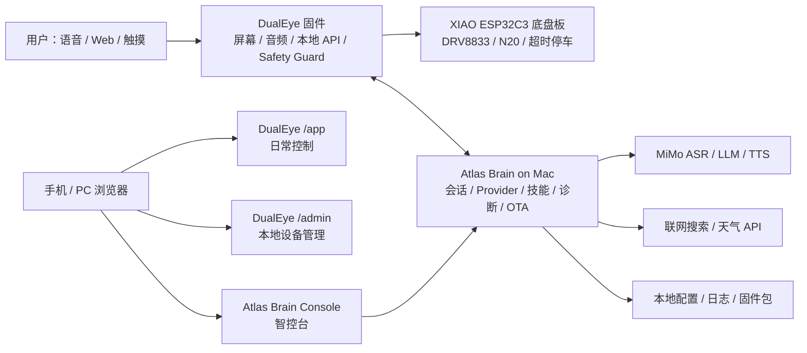
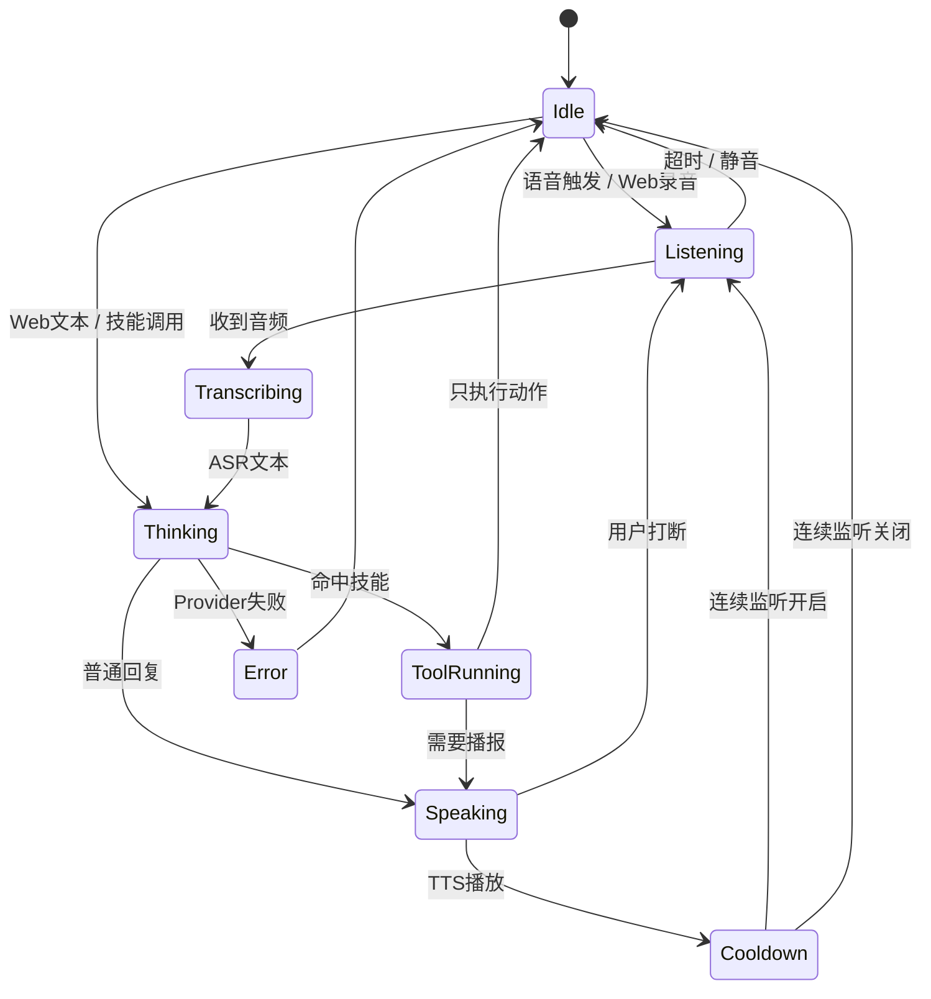

# Atlas Rover Mk.1 智能体架构设计 V0.11

版本：V0.11  
日期：2026-06-21  
参考：`xinnan-tech/xiaozhi-esp32-server` 的会话型服务、插件函数、工具调用、OTA/智控台思路；结合 Atlas 当前 DualEye 固件、Mac Bridge 和底盘双板方案重新收敛。

## 1. 设计结论

Atlas Mk.1 不直接复刻 xiaozhi 全量服务端，而是吸收它最适合我们的几个架构思想：

- 会话型架构：每台机器人维护一个 `RobotSession`，不要把每次语音/文本请求当成孤立 HTTP 调用。
- 模块可插拔：ASR、LLM、TTS、联网搜索、天气、OTA、记忆都通过 provider 适配层接入。
- 工具/技能系统：Web、语音、MimiClaw/LLM 都统一调用同一套技能，不再各写一套控制逻辑。
- 智控台与管理后台分层：DualEye 内置 `/admin` 只做设备本地设置，Mac/PC 上的 Atlas Brain Console 做模型、技能、日志、OTA 和会话诊断。
- 音频链路状态机化：录音、识别、思考、播报、连续监听、打断、回声规避都要由一条 turn 状态机管理。
- OTA 后置但提前设计：V0.11 先定义 manifest/版本/校验，不急着真机远程升级，避免 OTA 分区和回滚没验证就上车。

当前最推荐的总体路线：

```text
V0.11：Mac Bridge 重构成 Atlas Brain，补技能系统和会话诊断
V0.12：Web 智控台补联网搜索、天气、角色切换、技能开关
V0.13：音频链路升级为连续会话，修复“说完还要再点”的体验
V0.14：本地 OTA 管理与固件包校验
V0.15：再评估 MimiClaw 端侧合并或保留 Mac Brain 长期方案
```

## 2. 总体拓扑



设备边界保持不变：

| 模块 | 职责 | 不做什么 |
|---|---|---|
| DualEye 固件 | 双眼显示、页面、音频采集/播放、本地 Web、配网、配对码、意图执行、安全裁剪、UART 下发 | 不直接承载完整复杂后台，不把云端返回任意字符串直接发给电机 |
| Atlas Brain on Mac | 会话管理、ASR/LLM/TTS、联网搜索、天气、角色、技能编排、日志、OTA 管理 | 不绕过 DualEye Safety Guard 直接控底盘 |
| 底盘板 | 电机 PWM、短时动作、限速、动作超时、STOP | 不接大模型、不接 Web、不自行解释自然语言 |
| 用户 Web | `/app` 日常控制，`/admin` 本地配置，Brain Console 高级调试 | 不把三个入口混成一个复杂页面 |

## 3. 会话型架构

当前 Mac Bridge 已能跑通文本、ASR、TTS 和 DualEye 播放，但它还偏“请求处理器”。V0.11 要升级为会话型：

```text
RobotSession
  device_id
  device_url
  pairing_code_cache
  current_page
  current_expression
  current_theme
  current_role
  audio_state
  conversation_history
  last_turn
  last_tool_calls
  provider_status
  safety_snapshot
```

每一次交互都进入统一 turn：



会话型设计解决这些已暴露的问题：

- 语音回复后不应该每次重新点“开启语音触发”。
- 命令型语音例如“打开番茄页面”不应被普通聊天回复覆盖页面。
- TTS 播放时不能继续把自己的声音当成用户输入。
- 页面、表情、角色、音色要跟随同一个上下文，而不是散在多个接口里。
- 日志要能回答“刚才为什么没回复”“卡在哪一步”。

## 4. 模块可插拔设计

参考 xiaozhi 的 `VAD / ASR / LLM / TTS / Intent / Memory` 模块选择方式，Atlas Brain 使用 provider 接口，而不是把小米 MiMo 写死到业务流程里。

### 4.1 Provider 接口

| Provider | 必需方法 | 当前推荐实现 | 备注 |
|---|---|---|---|
| `ASRProvider` | `transcribe(audio, language)` | MiMo ASR | 后续可接本地 Whisper/FunASR |
| `LLMProvider` | `chat(messages, tools, options)` | MiMo Pro | 需要支持关闭思考模式、短回复、工具调用 |
| `TTSProvider` | `synthesize(text, voice, style)` | MiMo TTS | 保留夹子音、甜美、俏皮、兴奋、唱歌风格 |
| `SearchProvider` | `search(query, max_results)` | Tavily/Metaso/简单搜索 API | 只在需要实时信息时调用 |
| `WeatherProvider` | `weather(location)` | 和风天气 / Open-Meteo | 默认城市可配置 |
| `OtaProvider` | `manifest(device)` | 本地文件 manifest | V0.14 再启用下载升级 |
| `MemoryProvider` | `read/write/summarize` | 暂无 / 本地短记忆 | V0.12 后再开 |

### 4.2 配置归属

| 配置 | 放在哪里 | 原因 |
|---|---|---|
| Wi-Fi | DualEye NVS | 设备独立联网必须本地保存 |
| Pairing code | DualEye 运行态 | 防止 Mac/手机未授权控制 |
| MiMo API Key | 优先 Mac Brain 本地配置或环境变量 | 不把高价值密钥放小设备 NVS |
| 默认角色/主题/音色 | Mac Brain + DualEye UI 配置缓存 | 方便 Web 改，设备断网仍有默认 |
| 安全限制 | DualEye NVS 为准 | 大模型和 Mac 不可信，运动必须本地裁剪 |
| OTA manifest | Mac Brain | 固件包体积和校验逻辑更适合宿主侧 |

## 5. 工具/技能系统

Atlas V0.11 的核心改造是把“页面切换、表情、番茄、音乐、天气、搜索、底盘移动”统一成技能。

### 5.1 ActionResponse

参考 xiaozhi 插件函数的思想，Atlas 技能返回统一动作类型：

| Action | 含义 | 示例 |
|---|---|---|
| `NONE` | 已执行，不需要回复 | 切到时钟页面 |
| `RESPONSE` | 直接播报固定回复 | “已经切到电子宠物模式” |
| `REQLLM` | 技能拿到数据后交给 LLM 组织语言 | 天气、新闻、联网搜索结果 |
| `DEVICE` | 需要调用 DualEye 或底盘 | 页面、表情、主题、运动 |
| `RECORD` | 进入录音/继续听 | “你继续说” |
| `ERROR` | 失败并给出可读原因 | Provider 超时、天气未配置 |

### 5.2 首批技能清单

| 技能 ID | 用户说法 | 执行目标 | 风险 |
|---|---|---|---|
| `atlas.show_page` | 打开番茄/时钟/日历/状态 | DualEye `/api/mimiclaw/intent` | 低 |
| `atlas.set_expression` | 开心一点/别睡了/大哭 | DualEye 表情状态 | 低 |
| `atlas.set_theme` | 切到猛禽眼/电子宠物 | DualEye 主题 | 低 |
| `atlas.role.switch` | 变成机械管家/电子宠物 | 角色 + 主题 + prompt + 音色 | 中 |
| `atlas.pomodoro.start` | 开始 25 分钟番茄，任务是写代码 | DualEye 番茄页 + 状态 | 低 |
| `atlas.pomodoro.stop` | 停止番茄 | DualEye 番茄状态 | 低 |
| `atlas.calendar.today` | 今天农历/今天适合干嘛 | 日历页 + LLM/本地历法 | 低 |
| `atlas.music.play` | 播放音乐/唱一首 | TTS/本地音频/后续音乐库 | 中 |
| `atlas.story.tell` | 讲故事 | LLM + TTS + 故事表情 | 低 |
| `atlas.chat` | 普通聊天 | LLM + TTS + 对话页 | 低 |
| `atlas.weather.query` | 今天杭州天气 | WeatherProvider + 天气页 | 低 |
| `atlas.web_search` | 帮我查一下最新消息 | SearchProvider + LLM总结 | 中 |
| `atlas.rover.move` | 前进/左转 | DualEye Safety Guard + UART | 高 |
| `atlas.rover.stop` | 停止 | DualEye STOP | 低，最高优先级 |
| `atlas.ota.check` | 检查固件更新 | Brain manifest | 中 |

### 5.3 技能描述格式

V0.11 可以先用 Python 注册表，后续再抽成 JSON/YAML：

```json
{
  "name": "atlas.weather.query",
  "title": "天气查询",
  "description": "查询指定城市当前天气和今天建议。",
  "args": {
    "location": "城市名，可为空，空则使用默认城市"
  },
  "risk": "low",
  "requires_pairing": false,
  "requires_motion_enabled": false
}
```

运动技能必须带安全元数据：

```json
{
  "name": "atlas.rover.move",
  "risk": "high",
  "requires_pairing": true,
  "requires_motion_enabled": true,
  "max_speed_percent": 40,
  "max_duration_ms": 700
}
```

## 6. 联网搜索

联网搜索放在 Mac Brain，不放在 DualEye 固件里。

调用条件：

- 用户明确说“查一下、搜索、最新、今天新闻、现在怎么样”。
- LLM 判断问题依赖实时信息。
- 天气、新闻、价格、政策、库版本这类容易过期的信息。

不调用条件：

- 本地设备控制，例如“打开番茄页面”。
- 普通闲聊。
- 已经在 Atlas 本地状态里能回答的问题，例如当前 IP、当前页面。

输出原则：

- 给 LLM 的搜索结果保留来源和时间。
- 给 TTS 的回复必须短，优先 1-3 句。
- Web 智控台显示完整来源，DualEye 屏幕只显示摘要。

建议 V0.11 先做最小实现：

```text
POST /skill atlas.web_search
  -> SearchProvider.search()
  -> LLMProvider.chat(带搜索结果)
  -> TTSProvider.synthesize()
  -> DualEye 播放并切到 chat/status 页
```

## 7. 角色切换

角色不是只换 prompt。对 Atlas 来说，角色应同时影响：

- LLM system prompt
- 双眼主题
- 默认表情
- TTS 音色/风格
- 可用技能
- 回复长度
- 安全策略提示

首批角色建议：

| 角色 | 视觉主题 | TTS 风格 | 行为 |
|---|---|---|---|
| `pet` 电子宠物 | pet | 甜美/俏皮 | 主动表达心情、适合讲故事/番茄陪伴 |
| `raptor` 猛禽 | raptor | 冷静、有压迫感 | 短句、巡游/警戒感强 |
| `mecha` 机械电子 | mecha | 清晰、理性 | 状态报告、调试、设备管理 |
| `goggle` 黄色护目镜 | goggle | 活泼 | 日常陪伴、音乐、轻松聊天 |

角色切换后的执行链路：

```text
atlas.role.switch(role=pet)
  -> 保存 RobotSession.current_role
  -> set_theme(pet)
  -> set_expression(happy)
  -> set_tts_style(playful)
  -> 回复“好呀，我切到电子宠物状态啦”
```

默认不要让角色影响运动安全。即使是猛禽/巡游角色，移动仍然必须走 DualEye Safety Guard。

## 8. 天气能力可行性评估

结论：可行，建议 V0.12 接入，风险低。

### 8.1 推荐实现

天气不烧进 DualEye；由 Mac Brain 调天气 API，再把结果转成 DualEye 页面和 TTS。

```text
用户：“今天外面冷吗？”
  -> atlas.weather.query(location=默认城市)
  -> WeatherProvider
  -> LLM 生成一句自然回复
  -> DualEye 左眼：天气图标/电子宠物
  -> DualEye 右眼：温度、天气、建议
```

### 8.2 数据源选择

| 数据源 | 优点 | 风险 |
|---|---|---|
| 和风天气 | 中文体验好，天气图标体系清晰 | 需要 API Key |
| Open-Meteo | 免费友好，不一定要 key | 中文城市地理编码要补 |
| 联网搜索兜底 | 不新增天气 API | 稳定性和格式不如专用接口 |

建议先接和风天气或 Open-Meteo 二选一，保留搜索兜底。

### 8.3 UI 设计

| 屏幕 | 内容 |
|---|---|
| 左眼 | 电子宠物天气状态：晴天开心、雨天打伞、低温围巾 |
| 右眼 | 城市、温度、天气、空气/风力、今日建议 |

DualEye 屏幕小，天气页只显示 3-4 个核心信息。完整天气详情放 Web 智控台。

## 9. 音频链路升级

当前链路：

```text
DualEye 麦克风录 WAV
  -> Mac Bridge /device/audio/wav
  -> MiMo ASR
  -> 意图/LLM
  -> MiMo TTS
  -> DualEye /api/audio/play-url
```

V0.11/V0.13 需要把它升级为 turn 管理：

| 问题 | 方案 |
|---|---|
| 回复后还要手动再点监听 | `continuous_listen=true` 时 TTS 完成后自动回到 Listening |
| TTS 被麦克风重新收进去 | 播放期间 DualEye 进入 `audio_muted_until_ms`，Mac turn 标记 `speaking` |
| 没有“卡在哪”的证据 | 每个 turn 生成 `turn_id`，记录 ASR、LLM、skill、TTS、DualEye 播放结果 |
| 声音小 | TTS WAV 归一化 + DualEye 音量配置 + PA 状态检测 |
| 唤醒不稳定 | DualEye 本地 VAD 只负责触发，ASR 热词/命令理解放 Mac |
| 用户打断 | V0.13 引入 stop playback + start listen；AEC 后续再评估 |

推荐事件格式：

```json
{
  "turn_id": "20260621-001",
  "device_id": "dualeye-e235",
  "source": "device_audio",
  "asr_text": "打开番茄页面",
  "intent": "atlas.show_page",
  "tool_calls": [
    {"name": "atlas.show_page", "args": {"page": "pomodoro"}}
  ],
  "tts": {"played": false},
  "final_state": "idle"
}
```

## 10. 智控台与管理后台

这里拆成三个入口：

| 入口 | 地址 | 目标用户 | 职责 |
|---|---|---|---|
| 日常应用页 | DualEye `/app` | 普通使用 | 切表情、切页面、手动控制、聊天、番茄、音乐、故事 |
| 本地管理后台 | DualEye `/admin` | 配网/维护 | Wi-Fi、配对码、音量、亮度、安全、桥接地址、诊断 |
| Atlas Brain Console | Mac `:8787/admin` 或后续独立前端 | 开发/高级用户 | Provider、API Key、技能开关、角色、会话日志、联网搜索、天气、OTA |

DualEye 资源有限，`/admin` 不应塞进完整智控台。重模型配置、日志检索、OTA 包管理都放 Mac Brain Console。

Brain Console 首批页面：

| 页面 | 功能 |
|---|---|
| 总览 | DualEye 在线状态、Bridge 状态、最近 turn、ASR/LLM/TTS 是否可用 |
| 会话 | 最近 20 条对话、技能调用、失败原因、TTS 播放结果 |
| Provider | MiMo Base URL、模型名、TTS 风格、搜索/天气 provider |
| 技能 | 启用/禁用技能、查看参数、手动调用 |
| 角色 | pet/raptor/mecha/goggle 角色配置 |
| OTA | 固件包列表、目标设备版本、校验、手动推送 |
| 设备 | Pairing、DualEye URL、Wi-Fi 状态、音量/亮度 |

## 11. OTA 管理

OTA 暂不立刻启用自动升级，但 V0.11 要把设计留好。

### 11.1 Manifest

```json
{
  "device_model": "waveshare-dualeye-s3-1.28",
  "channel": "dev",
  "version": "0.11.0",
  "build": "2026-06-21",
  "min_current_version": "0.10.0",
  "firmware_url": "http://192.168.3.53:8787/firmware/dualeye-0.11.0.bin",
  "sha256": "填写固件sha256",
  "size": 3145728,
  "notes": "技能系统和音频链路升级"
}
```

### 11.2 上线前置条件

- DualEye 分区表确认有 OTA app slot，或明确当前只支持 USB 烧录。
- 固件包 SHA256 校验。
- 下载失败不影响当前固件启动。
- OTA 只能局域网配对后手动触发。
- 高风险版本必须先 USB 烧录验证，再放 OTA。
- 底盘板 OTA 单独设计，不与 DualEye 混用包。

短期建议：

```text
V0.11：只在 Brain Console 显示当前版本和本地固件包
V0.14：再做手动 OTA 下载/校验/重启
```

## 12. 接口草案

### 12.1 Brain API

| 方法 | 路径 | 作用 |
|---|---|---|
| `GET` | `/health` | Bridge 健康检查 |
| `GET` | `/diagnostics` | 最近 turn、provider、tts、device 状态 |
| `GET` | `/skills` | 返回技能清单 |
| `POST` | `/turn/text` | 文本进入完整会话 |
| `POST` | `/turn/audio` | 音频进入 ASR + 完整会话 |
| `POST` | `/skill` | 手动调用技能 |
| `POST` | `/role/switch` | 切换角色 |
| `GET` | `/ota/manifest` | 返回 OTA manifest |
| `POST` | `/ota/push` | 手动触发 DualEye OTA，后续实现 |

### 12.2 DualEye API 保持精简

DualEye 已有这些关键接口，V0.11 继续复用：

- `/api/status`
- `/api/mimiclaw/intent`
- `/api/audio/status`
- `/api/audio/play-url`
- `/api/voice/turn`
- `/api/voice/wake`
- `/api/app/page`
- `/api/app/expression`
- `/api/app/action`
- `/api/pet/event`
- `/api/rover/move`
- `/api/rover/stop`
- `/api/config/*`

新增建议：

| 方法 | 路径 | 作用 |
|---|---|---|
| `GET` | `/api/capabilities` | 返回页面、主题、表情、音频、运动能力 |
| `GET` | `/api/ota/status` | 返回 OTA 支持情况和当前版本 |
| `POST` | `/api/ota/apply` | 后续手动 OTA |

## 13. 安全原则

- STOP 永远可用，不需要配对码。
- 运动永远由 DualEye Safety Guard 裁剪，再由底盘板二次超时停车。
- LLM 不允许输出原始 UART 指令。
- 高风险技能必须有 `risk=high` 标记。
- API Key 优先保存在 Mac，不提交源码，不回显。
- Brain Console 默认只监听局域网，公网访问默认禁止。
- OTA 必须校验 hash，后续再考虑签名。
- 联网搜索结果必须区分“搜索结果”和“模型推断”。

## 14. V0.11 落地任务

按最小可用顺序：

1. 已完成：在 `tools/mimiclaw_bridge_macos.py` 内加入 `RobotSession`、Provider 状态和 `SkillRegistry`，保持现有接口兼容。
2. 已完成：增加 `GET /skills` 和 `POST /skill`。
3. 已完成：把页面、表情、主题、角色、番茄、日历、聊天、音乐/故事入口、天气、联网搜索、移动、停止注册成技能。
4. 已完成：增加 `atlas.role.switch`，切换角色时联动主题、表情、页面、TTS 风格和 prompt。
5. 已完成：增加 `atlas.web_search` provider 骨架；没有 API Key 时返回明确诊断，并把提示推到对话页。
6. 已完成：增加 `atlas.weather.query` provider；默认用 Open-Meteo 免 key 查询城市天气，并显示到 DualEye 日历页。
7. 已完成：增强 `/diagnostics`，返回 Provider、Session、最近 turn、最近 skill 和技能数量。
8. 已完成：Brain Console 复用当前 `:8787/admin`，增加技能快测按钮。
9. 已完成：DualEye 补齐 `/api/capabilities` 和 `/api/ota/status`，暂不大改 UI。
10. 已完成：写回路线图和进展日志，明确 V0.11 验收标准。

当前新增接口：

| 方法 | 路径 | 状态 | 说明 |
|---|---|---|---|
| `GET` | `/skills` | 已实现 | 返回技能清单和角色配置。 |
| `POST` | `/skill` | 已实现 | 手动调用任意已注册技能。 |
| `POST` | `/role/switch` | 已实现 | 角色切换快捷入口。 |
| `POST` | `/turn/text` | 已实现 | `/text` 的兼容别名。 |
| `POST` | `/turn/audio` | 已实现 | `/audio` 的兼容别名。 |
| `GET` | `/admin` | 已实现 | Mac Brain 控制台入口。 |
| `GET` | `/capabilities` | 已实现 | Mac Brain 能力发现入口，会尝试读取 DualEye 能力。 |
| `GET` | `/ota/manifest` | 已实现 | 返回 V0.11 OTA manifest 形状，状态仍为设计阶段。 |

DualEye 新增接口：

| 方法 | 路径 | 状态 | 说明 |
|---|---|---|---|
| `GET` | `/api/capabilities` | 已实现 | 返回双屏、主题、表情、页面、音频、运动、安全和资源能力。 |
| `GET` | `/api/ota/status` | 已实现 | 明确当前为单 factory app 分区，OTA 仅完成状态暴露，仍需 USB 烧录。 |

构建验证：

```text
python3 -m py_compile tools/mimiclaw_bridge_macos.py 通过
firmware/dualeye idf.py build 通过
atlas_rover_dualeye.bin size: 0x1dd5d0
app partition: 6M，剩余约 69%
```

已注册技能：

```text
atlas.show_page
atlas.set_expression
atlas.set_theme
atlas.role.switch
atlas.pomodoro.start
atlas.pomodoro.stop
atlas.calendar.today
atlas.weather.query
atlas.web_search
atlas.music.play
atlas.story.tell
atlas.chat
atlas.rover.stop
atlas.rover.move
atlas.ota.check
```

联网搜索配置：

```bash
export ATLAS_SEARCH_PROVIDER=tavily
export ATLAS_SEARCH_API_KEY="你的搜索服务 API Key"
```

也可以提供自定义搜索端点：

```bash
export ATLAS_SEARCH_ENDPOINT="http://127.0.0.1:9000/search"
```

天气配置：

```bash
export ATLAS_WEATHER_PROVIDER=open_meteo
export ATLAS_WEATHER_DEFAULT_LOCATION=济南
```

V0.11 当前仍然保持一个重要边界：所有运动类技能只会生成 `atlas_rover_move / atlas_rover_stop`，真正能不能移动仍由 DualEye Safety Guard 和底盘板二次保护决定。

## 15. 验收标准

V0.11 通过条件：

- Web 文本“切到电子宠物角色”能联动角色、主题、表情、TTS 风格。
- Web 文本“查一下今天北京天气”能走天气 provider，并在 DualEye 播报/展示。
- Web 文本“搜索一下最新的 ESP32-S3 DualEye 资料”能走联网搜索，失败时有明确配置提示。
- 语音“打开番茄页面”只执行页面技能，不被普通聊天覆盖。
- 语音“讲个故事”能进入故事技能，自动 TTS 播放，播放后回到连续监听。
- `/diagnostics` 能解释最近一次失败原因。
- 所有移动指令仍必须经过 DualEye 安全限制，STOP 不受影响。
- 没有配置搜索/天气 API Key 时，系统可运行，相关技能只提示未配置。

## 16. 与 xiaozhi 的取舍

值得学习：

- 每个设备一条会话连接/会话状态。
- provider 可插拔，不把模型写死。
- 插件函数注册和 ActionResponse 思路。

## 17. V0.12 收敛：桌面智能硬件优先

2026-06-22 本轮把产品范围收敛为“桌面智能硬件 / 电子宠物伴侣”优先。动态底盘、小车移动和真车标定先放一放，避免它继续牵扯语音链路、服务端抽象和 UI 稳定性。

### 17.1 固件端变化

新增：

- `atlas_runtime.*`：记录最近语音 turn 的状态、ASR、回复、TTS、播放错误和失败原因。
- `atlas_audio_service.*`：作为音频服务层第一版，记录录音/播放/监听/mute 状态，避免 HTTP handler 直接承担所有音频状态管理。
- `GET /api/diagnostics/turn`：专门查看语音 turn 诊断。
- `GET /api/system/info`：查看固件、资源、芯片、heap/PSRAM、音频和 runtime。
- `GET /api/brain/ws`：JSON 事件 WebSocket PoC，先验证事件通道和状态回包，不承载音频流。
- `GET /api/sr/status`：ESP-SR/WakeNet/AEC 探针，当前返回 fallback 状态和资源线索。
- `/api/status.runtime`：把运行态直接放入主状态包。
- `/api/status.audio_service`：把服务层音频状态放入主状态包。
- `/api/status.features.rover_motion=false`：明确本版动态底盘暂停。

默认关闭：

```c
#define ATLAS_ROVER_MOTION_BUILD_ENABLED 0
```

即使历史 NVS 里保存过 `motion_enabled=true`，本轮固件加载后也会强制关闭，`/api/capabilities` 会返回：

```json
{
  "control": {
    "motion_supported": false,
    "motion_enabled": false,
    "disabled_reason": "desk_companion_build"
  }
}
```

### 17.2 Atlas Brain 服务端变化

新增平台化设备入口：

| 方法 | 路径 | 说明 |
|---|---|---|
| `GET` | `/api/devices` | 平台设备列表，目前默认一台 DualEye |
| `GET` | `/api/platform` | 平台快照：设备、Provider、协议、App |
| `GET` | `/api/providers` | Provider 注册表 |
| `GET` | `/api/protocols` | Brain 通信协议注册表 |
| `GET/POST` | `/api/brain/events` | JSON 事件通道 PoC，保存最近事件 |
| `GET` | `/api/audio/stream/status` | P3 音频流统计 |
| `POST` | `/api/audio/stream/simulate` | P3 60ms 帧模拟 |
| `GET` | `/ws/audio` | P3 WebSocket 音频帧 PoC |
| `GET` | `/api/sr/status` | P4 ESP-SR 探针 |
| `POST` | `/api/sr/simulate` | P4 门限/VAD 仿真 |
| `GET` | `/devices` | 设备列表页 |
| `GET` | `/devices/<device_id>/app` | 单设备 App 操作页 |

页面分层变为：

| 页面 | 定位 |
|---|---|
| `/devices/<id>/app` | 用户日常操作：对话、角色、时钟、番茄、日历、天气、故事 |
| `/admin` | 平台管理端：Provider、技能、会话、诊断、OTA manifest |
| DualEye `/app` | 设备本地控制和救援入口 |
| DualEye `/admin` | 设备本地配置：Wi-Fi、Bridge、音频、固件状态 |

默认不再注册：

```text
atlas.rover.move
atlas.rover.stop
```

需要恢复时显式设置：

```bash
export ATLAS_ENABLE_ROVER_SKILLS=1
```

### 17.3 P0-P4 当前状态

| 阶段 | 状态 | 说明 |
|---|---|---|
| P0 稳定 WAV turn | 已完成第一版 | runtime 诊断、失败原因、播放期 mute 可见化已落地 |
| P1 `atlas_audio_service` | 已完成第一版骨架 | 录音、播放、监听和 mute 已通过服务层记录；下一步继续迁出 turn 调度 |
| P2 WebSocket Brain | 已完成 JSON 事件 PoC | 固件 `/api/brain/ws` 与 Mac `/api/brain/events` 已有事件契约；下一步变成长连接事件流 |
| P3 OPUS 流式 PoC | 已完成 Mac 侧帧通道 PoC | `/ws/audio` 可接模拟 60ms 帧；DualEye OPUS 编码尚未接入 |
| P4 ESP-SR 唤醒/AEC | 已完成探针/仿真 | `/api/sr/status` 和 `/api/sr/simulate` 可用；WakeNet/AEC 尚未启用 |

### 17.4 验证

```text
python3 -m py_compile tools/atlas_brain_core.py tools/mimiclaw_bridge_macos.py tools/simulate_opus_stream.py tools/check_mimiclaw_network_macos.py tools/preview_dualeye_admin.py
通过

firmware/dualeye idf.py build
通过
atlas_rover_dualeye.bin binary size 0x1e1140
6MB app partition 剩余约 69%
```

本轮详细记录见：[Atlas桌面智能硬件平台化执行记录_V0.12.md](Atlas桌面智能硬件平台化执行记录_V0.12.md)。
- 智控台负责模型、角色、设备、OTA、日志。
- OTA manifest 下发。

暂不照搬：

- 全量 Java 管理平台。
- MQTT/UDP 网关。
- 多用户权限体系。
- 声纹、RAG、MCP 全套生态。
- 大规模设备管理。

Atlas Mk.1 是单台桌面机器人原型，现阶段最重要的是“链路稳定、可诊断、可扩展、安全”。先把小脑袋跑顺，再考虑长出更大的后台。
