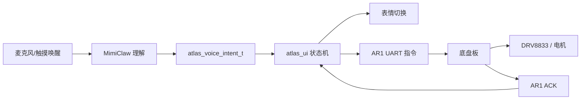

# Atlas Rover Mk.1 DualEye 固件 V0.1/V0.2 设计说明

## 1. 本版目标

DualEye 固件 V0.1 的目标不是一次性完成所有硬件驱动，而是先把核心程序骨架写稳：

- 双实体圆屏表情模型。
- 页面与表情状态机。
- MimiClaw 语音事件入口。
- UART 底盘控制协议。
- 移动安全超时和 `AR1,STOP` 保护。
- 后续接入 Waveshare 官方双屏、触摸、音频驱动的适配边界。

V0.2 在 V0.1 上继续补齐“烧录后怎么配置和调试”的骨架：

- NVS 保存 Wi-Fi、LLM/API 和安全设置。
- SoftAP/STA/APSTA 网络启动。
- 手机/电脑 Web 管理页。
- 用户应用页 `/app` 和管理后台 `/admin` 分离，根路径 `/` 默认进入应用页。
- 6 位配对码。
- STOP、短时移动、文本意图测试 API。
- MimiClaw 适配层占位。

## 2. 双板职责

| 板子 | 职责 | 不做什么 |
|---|---|---|
| DualEye | 双目表情、页面、触摸、语音、MimiClaw、向底盘板发送运动意图 | 不直接驱动电机，不承担电机闭环，不从自身给电机供电 |
| 底盘板 | 电机 PWM/闭环、DRV8833、限速、超时停车、灯光执行、ACK 回传 | 不做复杂语音理解，不负责双目 UI |

## 3. 程序结构

| 文件 | 作用 |
|---|---|
| `firmware/dualeye/main/main.c` | 程序入口，启动 UI、UART RX、开发事件演示任务 |
| `atlas_expression.*` | 双眼表情参数帧。每块屏一只眼，参数包含目光、虹膜、瞳孔、眼睑、眉线、颜色、动效 |
| `atlas_display.*` | 显示适配层。V0.1 先输出日志；接真机时在这里换成 LVGL/屏幕绘制 |
| `atlas_rover_uart.*` | `AR1,` UART 协议封装，负责发送 STOP/MOVE/TURN 和解析 ACK |
| `atlas_voice.*` | 语音事件和文本意图归一化入口 |
| `atlas_ui.*` | 页面、表情、运动、安全状态机 |
| `atlas_config.*` | NVS 配置读写，保存 Wi-Fi、LLM、安全、UI 配置 |
| `atlas_wifi.*` | SoftAP/STA/APSTA 网络启动和状态查询 |
| `atlas_admin_http.*` | Web 管理页和 REST API |
| `atlas_pairing.*` | 启动时生成 6 位本地配对码 |
| `atlas_llm_client.*` | LLM 配置状态和就绪判断，不直接控制电机 |
| `atlas_mimiclaw_adapter.*` | 把本地文本或后续 MimiClaw 结果转成 `atlas_voice_intent_t` |

`main.c` 中的 `ATLAS_ENABLE_DEV_EVENT_DEMO` 默认开启，用于烧录后观察聆听、思考、说话、成功几个表情状态切换；它不会发送移动指令。接入真实 MimiClaw 后可把该宏设为 `0`。

## 4. 表情状态

当前固件已包含以下表情枚举：

| 表情 | 用途 |
|---|---|
| `idle` | 待机 |
| `happy` | 指令成功、互动成功 |
| `listen` | 唤醒/收音 |
| `thinking` | MimiClaw 理解指令 |
| `speaking` | 语音回复播放 |
| `moving` | 底盘执行运动 |
| `curious` | 不确定、等待确认、底盘忙 |
| `sleepy` | 长时间空闲或低功耗准备 |
| `surprised` | 急停/突然触碰 |
| `wink` | 任务完成彩蛋 |
| `angry` | 拒绝危险指令 |
| `charging` | 充电 |
| `error` | UART/电源/底盘故障 |

## 5. 语音到移动的链路



示例：

| 用户意图 | DualEye 表情 | UART 输出 |
|---|---|---|
| 唤醒 | `listen` | 不发移动 |
| 正在理解 | `thinking` | 不发移动 |
| 前进 | `moving`，目光向前 | `AR1,MOVE,F,40,500` |
| 后退 | `moving`，目光向下 | `AR1,MOVE,B,35,400` |
| 左转 | `moving`，目光向左 | `AR1,TURN,L,30` |
| 右转 | `moving`，目光向右 | `AR1,TURN,R,30` |
| 停止 | `idle` | `AR1,STOP` |

## 6. 安全策略

1. DualEye 只主动发送 `AR1,` 开头的指令。
2. 上电后先发送 `AR1,STOP`。
3. 每次移动指令后，DualEye 约 700 ms 后补发 `AR1,STOP`。
4. 底盘板仍必须独立实现 300-500 ms 级别的超时停车。
5. 底盘板必须忽略非 `AR1,` 前缀内容。
6. 电机供电不能从 DualEye 取，DualEye、底盘板和电机电源只共 GND。
7. Web/语音移动默认开启，方便开箱即用；仍可在管理页安全设置中关闭。
8. STOP 不需要配对码；移动、配置修改、重启、清配置需要 6 位配对码。
9. LLM/MimiClaw 不能直接输出 UART 字符串，只能输出结构化意图，再由本地 Safety Guard 裁剪。
10. API Key 不写源码、不进 GitHub、不打印日志；当前原型阶段尚未启用 NVS 加密。
11. 控制模式默认 `manual`：Web 方向按钮可以控制；切到 `ai` 后，运动类语音/MimiClaw 意图可以控制，Web 方向按钮会被拒绝。

## 7. 真机适配待办

| 待办 | 文件位置 | 说明 |
|---|---|---|
| 双屏 LCD 初始化 | `atlas_display.c` | 接入 Waveshare 官方 ESP-IDF/LVGL 示例 |
| 圆屏绘制 | `atlas_display.c` | 把 `atlas_eye_frame_t` 绘制成左/右 240 x 240 图层 |
| 触摸 | 新增或扩展 UI 层 | 触摸切页面、切主题、确认/取消指令 |
| 麦克风与 TTS 音量 | `atlas_ui_state_t.audio_level` | 让 listen/speaking 表情随音量跳动 |
| MimiClaw | `atlas_voice.*` | 把语义输出映射成 `atlas_voice_event_t` |
| 真机 UART 引脚确认 | `atlas_rover_uart.*` | 当前按官方 LCD1 UART 口使用，若后续改独立 UART，需要在这里换端口/引脚 |
| 真实 LLM/宿主调用 | `atlas_llm_client.*` | 当前只做配置状态，后续接入 HTTPS/HTTP 或 WebSocket |
| 管理页优化 | `atlas_admin_http.*` | 当前为基础嵌入式页面，后续补日志、表情调试、OTA 和更好的手机布局 |
| mDNS/设备发现 | `atlas_wifi.*` | 当前使用 SoftAP 地址或局域网 IP，后续再补 `atlas-rover.local` |

## 8. 当前验证

本版应至少通过：

```bash
cd firmware/dualeye
export IDF_PATH="$HOME/.espressif/esp-idf-v5.5.2"
export IDF_PYTHON_ENV_PATH="$HOME/.espressif/python_env/idf5.5_py3.9_env"
. "$IDF_PATH/export.sh"
idf.py build
```

构建通过后，说明固件骨架、模块拆分和 ESP-IDF 配置是可用的；后续再进入真机显示/音频适配。

当前项目已按 DualEye 官方规格把 Flash 配置为 16MB，并使用自定义分区表：

| 分区 | 大小 | 用途 |
|---|---:|---|
| `nvs` | 24KB | 保存 Wi-Fi、LLM/API、安全配置 |
| `factory` | 4MB | DualEye 应用固件 |
| `storage` | 4MB | 后续预留给资源、日志或文件系统 |

V0.2 本地构建通过，应用镜像约 `0xca210` 字节，4MB app 分区仍有约 80% 空间。PSRAM 暂未在 V0.2 中启用，因为真实双屏/LVGL 工程需要跟随 Waveshare 官方示例确认 PSRAM 模式、缓存策略和显示缓冲区位置。
