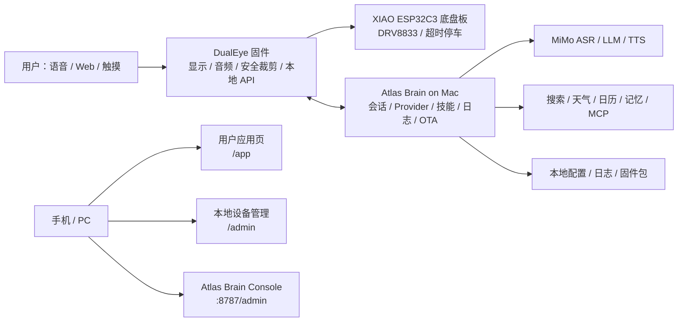

# xiaozhi-esp32-server 对标分析报告：Atlas Rover Mk.1 V0.11

日期：2026-06-22  
对标对象：`xinnan-tech/xiaozhi-esp32-server`  
核对快照：`a1973e0`，已确认本地克隆与 `origin/main` 一致  
Atlas 基线：DualEye 固件 V0.11、Mac Brain/MimiClaw Bridge、DualEye `/app` 与 `/admin`、XIAO ESP32C3 底盘双板方案

## 1. 一句话结论

`xiaozhi-esp32-server` 不是单个 ESP32 固件示例，而是一套偏平台化的智能硬件后端：它把设备连接、会话、流式音频、模型 Provider、工具/插件、MCP/MQTT、智控台、OTA 和部署体系都做成了服务端能力。

Atlas Rover Mk.1 当前仍是单台桌面机器人原型，最该学习的是它的“会话型架构、Provider 化、工具系统、诊断闭环和部署/OTA 规范”；暂时不建议完整照搬 MySQL、Redis、Java 管理后台、MQTT 网关、声纹、RAG、设备互呼等重型生态。

推荐路线：

```text
先把 Atlas Brain 变稳：
会话状态机 -> 音频链路 -> 技能注册 -> 日志诊断 -> Web 智控台 -> OTA manifest

再按真实需求加平台能力：
搜索/天气 -> 角色/记忆 -> WebSocket 流式音频 -> HomeAssistant/MCP -> OTA -> 多设备管理
```

## 2. xiaozhi-esp32-server 的核心能力拆解

| 维度 | xiaozhi 做法 | 对 Atlas 的启发 |
|---|---|---|
| 项目定位 | 为 `xiaozhi-esp32` 提供后端服务，README 明确支持 MQTT+UDP、WebSocket、MCP 接入点、声纹识别、知识库 | Atlas 不应只把 Mac Bridge 当脚本，而要升级为 `Atlas Brain` 服务 |
| 部署形态 | 分“最简 Server”和“全模块”两种部署；全模块包含 server、manager-web/API、MySQL、Redis | Atlas 先保留轻量 Mac 本地服务，等多设备/多用户需求真实出现再上数据库 |
| 设备连接 | WebSocket 为主，也支持 MQTT+UDP 网关；OTA 可向设备下发 WebSocket/MQTT 配置 | Atlas 现阶段 HTTP 能调试，但连续语音应逐步迁移到 WebSocket 流式通道 |
| 音频链路 | 配置里定义 Opus、采样率、帧长；支持 VAD、ASR、TTS 和流式 Provider | Atlas 现在 WAV 上传/播放可跑通，但要减少延迟和杂音，需要流式、VAD、播放期间静音/回声规避 |
| 会话连接 | `ConnectionHandler` 为每个设备连接维护 session、device_id、client 状态、VAD/ASR/TTS、对话历史、工具处理器 | Atlas 已有 `RobotSession`，但还需要明确 turn 状态机和可追溯日志 |
| Provider | ASR/LLM/TTS/VAD/VLLM/Memory/Intent 都按模块选择，配置可替换 | Atlas 需要把 MiMo ASR/LLM/TTS 从业务代码里拆成 Provider 接口 |
| 工具系统 | 有插件注册、统一工具管理器、服务端插件、服务端 MCP、设备 MCP、设备 IoT、MCP 接入点 | Atlas 的 15 个技能已有雏形，下一步要做 schema、风险等级、执行器分层 |
| 智控台 | 全模块提供 Web 管理、模型/参数/智能体/设备管理 | Atlas 应拆分“用户应用页”和“开发/管理后台”，避免 DualEye 页面越来越臃肿 |
| OTA | 单模块也内置 OTA 固件管理：按 `{设备型号}_{版本}.bin` 匹配，并下发下载 URL | Atlas 当前只暴露 manifest/status，方向对；真 OTA 要等分区、hash、回滚验证 |
| 联网能力 | 天气、联网搜索、RAGFlow、上下文源、HomeAssistant 等以插件/配置形式接入 | Atlas 先落地天气/搜索，RAG 和 HomeAssistant 后置 |
| 高阶生态 | 声纹、设备互呼、数字人、通讯录、MCP endpoint | Atlas 可借鉴思路，但 Mk.1 阶段不应背上这些复杂度 |

## 3. Atlas 当前能力现状

Atlas 已经具备一个小型产品原型的核心闭环：

| 模块 | 当前状态 | 主要风险 |
|---|---|---|
| DualEye 固件 | 双 GC9A01/LVGL、SPIFFS 主题、中文字体、时钟/日历/番茄/电子宠物页面、音频接口、`/api/capabilities`、`/api/ota/status` | 小屏中文渲染、页面视觉、资源内存和刷新流畅度仍需继续标定 |
| Mac Brain / MimiClaw Bridge | 已有 `RobotSession`、Provider 诊断、15 个技能、角色切换、天气、搜索骨架、TTS 播放 | 仍偏单文件，Provider/技能/HTTP/Admin 混在一起，长期维护会吃力 |
| Web 控制端 | DualEye `/app`、`/admin` 与 Mac `:8787/admin` 可用 | 用户应用页、设备管理页、开发诊断页边界还需要更清楚 |
| 音频链路 | DualEye 麦克风录音 -> Mac ASR/LLM/TTS -> DualEye 外放，已可对话 | 连续语音、回声、TTS 播放后杂音、唤醒触发、失败可观测性仍是第一优先级 |
| 技能系统 | 页面、表情、主题、角色、番茄、日历、天气、搜索、音乐/故事入口、底盘移动/停止、OTA check | 需要工具 schema、权限、安全等级、执行日志和 Web 可配置 |
| 底盘控制 | DualEye 通过安全裁剪再发 UART；底盘板负责 DRV8833、限速、超时停车 | 开环 N20 + 万向轮方向精度有限，安全策略必须始终在设备侧兜底 |
| OTA | 已有状态接口和 manifest 形状 | 当前分区仍以 USB 烧录为准，不能贸然启用远程升级 |

## 4. 架构对标

### 4.1 推荐目标架构



### 4.2 连接协议

| 项目 | xiaozhi | Atlas 当前 | 建议 |
|---|---|---|---|
| 设备主连接 | WebSocket，另可通过 MQTT+UDP 网关 | HTTP REST/Form 为主，DualEye 主动录音后 POST 到 Mac | 短期保留 HTTP 调试；V0.12/V0.13 新增 WebSocket turn 通道 |
| 音频传输 | Opus 帧、VAD、流式 ASR/TTS Provider | WAV 录制、HTTP 上传、TTS WAV 回放 | 保留 WAV 兜底，新增分片音频上传/回放，降低等待和卡顿 |
| 多设备 | 支持 MQTT 网关和智控台管理 | 当前单台机器人 | 暂不引入 MQTT；等第二台 Atlas 或远程控制需求出现再做 |
| 配置下发 | OTA 接口可下发 WebSocket/MQTT 信息 | DualEye NVS + Web 配置 + Mac 环境变量 | 设备 Wi-Fi/安全在 DualEye，模型 Key/Provider 在 Mac Brain |

判断：Atlas 现在的问题不是协议不够高级，而是链路状态和失败诊断不够强。先做 turn 状态机，再谈协议升级。

### 4.3 会话与音频

| 项目 | xiaozhi | Atlas 当前 | 差距 |
|---|---|---|---|
| 会话对象 | `ConnectionHandler` 维护 session、device、client、VAD/ASR/TTS、dialogue、tool handler | `RobotSession` 已有 page/theme/role/last_turn/provider | Atlas 需要把每次语音变成完整 turn，而不是散落在多个 HTTP 回调里 |
| VAD | 服务端 VAD 和客户端状态结合 | DualEye 简易阈值唤醒 + Mac ASR | 缺少稳定静音判断、播放期间禁收、用户打断策略 |
| TTS | 多 Provider，支持流式和播放通道 | MiMo TTS -> WAV -> DualEye 播放；有 macOS say 兜底 | 需要音量归一化、播放确认、失败自动降级、避免尾音杂音 |
| 日志 | 连接日志、组件初始化、工具执行都有记录 | `/diagnostics` 已可看最近 turn 和 provider | 需要最近 20 条 turn、每步耗时、ASR 原文、技能结果、TTS 播放结果 |

Atlas 近期最重要的状态机：

```text
Idle
 -> Listening
 -> Transcribing
 -> Thinking
 -> ToolRunning
 -> Speaking
 -> PlaybackMuted
 -> Listening 或 Idle
```

每一步都必须记录 `turn_id`、开始/结束时间、成功/失败、错误内容。这样以后再出现“讲笑话没回复”“播报失效”“卡死了”，可以直接定位是哪一段坏了。

### 4.4 Provider 和配置

| 能力 | xiaozhi | Atlas 当前 | 建议 |
|---|---|---|---|
| ASR | 多 Provider：本地/云端/流式 | MiMo ASR 单主线 | 抽 `ASRProvider`，保留 MiMo，未来可加本地 Whisper/FunASR |
| LLM | 多模型配置，支持 OpenAI 兼容、Dify、Ollama 等 | MiMo Pro 为主 | 抽 `LLMProvider`，支持关闭思考、短回复、工具调用 |
| TTS | 多 Provider：Edge、火山、讯飞、OpenAI 等 | MiMo TTS + macOS say 兜底 | 抽 `TTSProvider`，把音色、风格、唱歌能力作为参数 |
| Weather/Search | 插件配置，天气默认城市，搜索可选 Metaso/Tavily | Open-Meteo 已跑，搜索骨架未配置 | Web 管理页补 Provider 配置和测试按钮 |
| API Key | `.config.yaml` 或智控台配置 | 目前 Mac 环境变量/启动参数为主，DualEye NVS 也有旧入口 | 高价值 Key 统一留在 Mac，不回写 DualEye，不打印日志 |

配置边界建议：

| 配置项 | 归属 | 理由 |
|---|---|---|
| Wi-Fi、配对码、安全限制、运动开关 | DualEye | 设备离线也要安全 |
| MiMo API Key、搜索 Key、天气 Key、角色 Prompt | Mac Brain | 密钥更安全，修改更方便 |
| 主题/默认页面/音量/亮度 | DualEye + Mac 缓存 | 设备断网也要能显示 |
| 技能启用、角色、Provider 测试、日志 | Mac Brain Console | 小屏和 ESP32 RAM 不适合承载复杂后台 |

### 4.5 工具/技能系统

xiaozhi 的工具系统最值得学。它不是把每个功能写成 if/else，而是：

- 插件函数注册；
- 工具描述可交给 LLM function call；
- `ActionResponse` 表示执行后要不要回复、是否再请求 LLM、是否记录；
- 统一工具管理器再分发到服务端插件、服务端 MCP、设备 MCP、设备 IoT、MCP 接入点。

Atlas 当前已经有 15 个技能：

```text
atlas.show_page
atlas.set_expression
atlas.set_theme
atlas.role.switch
atlas.pomodoro.start
atlas.pomodoro.stop
atlas.calendar.today
atlas.weather.query
atlas.web_search
atlas.music.play
atlas.story.tell
atlas.chat
atlas.rover.stop
atlas.rover.move
atlas.ota.check
```

下一步建议把技能从“Python 函数注册”升级为“可描述、可验证、可管理”：

| 字段 | 示例 | 用途 |
|---|---|---|
| `name` | `atlas.pomodoro.start` | 技能唯一 ID |
| `title` | `开始番茄` | Web 显示 |
| `description` | `启动番茄专注并打开番茄页面` | LLM/用户理解 |
| `args_schema` | `task_name/focus_minutes/break_minutes` | 参数校验 |
| `risk` | `low/medium/high` | 安全等级 |
| `requires_pairing` | `true/false` | 是否需要配对 |
| `requires_motion_enabled` | `true/false` | 是否允许运动 |
| `executor` | `dualeye/http/provider/local` | 执行位置 |
| `timeout_ms` | `8000` | 防卡死 |
| `visible_in_console` | `true` | 是否在智控台显示 |

运动技能必须永远是高风险技能，并且只生成结构化动作，不允许 LLM 生成 UART 原始字符串。

## 5. 功能逐项评分

评分说明：5 分代表成熟平台级，3 分代表能跑但需打磨，1 分代表只有概念或骨架。

| 维度 | xiaozhi | Atlas | 差距等级 | Atlas 下一步 |
|---|---:|---:|---|---|
| 会话型架构 | 5 | 3 | 高 | 建立 turn 状态机和最近 20 条日志 |
| 音频链路 | 5 | 2.5 | 很高 | 流式/分片、播放确认、静音窗口、杂音定位 |
| Provider 插拔 | 5 | 2.5 | 高 | 拆出 ASR/LLM/TTS/Search/Weather Provider 类 |
| 工具/技能 | 5 | 3 | 高 | 加 schema、风险等级、可配置开关和执行器分层 |
| Web 管理 | 5 | 3 | 中高 | 用户应用页、设备管理页、Brain Console 分层 |
| 联网搜索 | 4 | 1.5 | 中 | 配置 Metaso/Tavily 或自定义搜索端点，补测试 |
| 天气 | 4 | 3 | 中 | 默认济南可用，补城市识别和 Web 配置 |
| 角色切换 | 4 | 3 | 中 | 角色联动 prompt、视觉、音色、可用技能 |
| OTA | 4 | 1.5 | 高但不急 | 先 manifest/hash/USB 包管理，后续再真 OTA |
| 多设备/MQTT | 4 | 1 | 低优先级 | 当前不做，等多台设备再评估 |
| MCP/HomeAssistant | 4 | 1 | 中后期 | 先把 Atlas 内部技能系统稳定，再接 MCP |
| RAG/知识库 | 4 | 0.5 | 低优先级 | 桌面机器人初期不需要 |
| 声纹识别 | 4 | 0 | 低优先级 | 不是 Mk.1 的关键卖点，暂缓 |
| 部署/运维 | 5 | 2 | 中 | `.env.example`、启动脚本、健康检查、日志目录 |

## 6. Atlas 应该重点借鉴的 9 件事

### 6.1 每个机器人一个长期会话

不要把“打开番茄”“讲笑话”“天气查询”当成孤立请求。Atlas Brain 应为每台机器人维护：

- 当前页面；
- 当前主题/表情/角色；
- 是否正在听；
- 是否正在播；
- 最近 ASR 文本；
- 最近技能调用；
- 最近错误；
- 最近 TTS 文件；
- Provider 健康状态。

### 6.2 音频 turn 全链路可观测

每次语音都记录成一个 turn：

```json
{
  "turn_id": "20260622-001",
  "source": "device_audio",
  "asr_text": "打开番茄时钟",
  "intent": "atlas.show_page",
  "skill_results": [],
  "llm_ms": 0,
  "tts_ms": 0,
  "playback": "not_needed",
  "final_state": "idle"
}
```

这会直接解决用户体验上的“我不知道它为什么没反应”。

### 6.3 Provider 不写死

MiMo 可以继续作为默认方案，但代码结构上不要写死。建议目录：

```text
tools/atlas_brain/
  app.py
  session.py
  providers/
    asr_mimo.py
    llm_mimo.py
    tts_mimo.py
    weather_open_meteo.py
    search_tavily.py
  skills/
    registry.py
    dualeye.py
    weather.py
    rover.py
  web/
    admin.html
```

### 6.4 工具统一入口

Web 手动点击、语音指令、LLM function call 都应该调用同一套 `SkillRegistry`，不能三套逻辑各写一遍。

### 6.5 智控台分层

建议三层：

| 层 | 面向谁 | 内容 |
|---|---|---|
| DualEye `/app` | 普通用户 | 表情、页面、番茄、故事、音乐、手动移动 |
| DualEye `/admin` | 设备维护 | Wi-Fi、配对、桥接地址、音量、亮度、安全 |
| Mac Brain `:8787/admin` | 开发/高级用户 | Provider、API Key、技能、角色、日志、OTA 包、测试 |

### 6.6 OTA 先做管理，不急着真升级

xiaozhi 的 OTA 是成熟服务思路，但 Atlas 当前还在频繁烧录、分区和回滚没完全验证。短期只做：

- 当前版本展示；
- 本地固件包列表；
- SHA256；
- release notes；
- “仍需 USB 烧录”的明确提示。

### 6.7 上下文源可以轻量引入

xiaozhi 的上下文源很适合 Atlas。我们可以让 Brain 在每次唤醒时注入：

- DualEye 电量/供电状态；
- 当前页面/主题；
- 最近一次失败；
- 当前 Wi-Fi/IP；
- 当前番茄任务；
- 默认城市天气简报。

这比上 RAG 更实际。

### 6.8 HomeAssistant/MCP 后置但方向正确

Atlas 未来可以通过 MCP 接入 HomeAssistant、日历、待办、天气、智能家居。但前提是内部技能系统先稳定，否则外部 MCP 会把问题放大。

### 6.9 部署体验要工程化

Atlas 现在靠手动命令启动 Mac Bridge，容易忘参数。建议补：

- `tools/atlas_brain/.env.example`
- `scripts/start_atlas_brain.sh`
- `scripts/stop_atlas_brain.sh`
- `scripts/check_atlas_e2e.sh`
- `launchd` 可选配置
- Web 端“重启 Brain/查看日志”入口

## 7. 不建议现在照搬的内容

| xiaozhi 能力 | 暂不照搬原因 | Atlas 替代方案 |
|---|---|---|
| 全模块 Java + Vue + MySQL + Redis | 当前只有一台原型，维护成本过高 | 单 Python Brain + 静态 Web Console |
| MQTT+UDP 网关 | 多设备/远程唤醒才体现价值 | 局域网 HTTP/WebSocket 足够 |
| 声纹识别 | 数据库、注册流程、隐私和误识别成本高 | 先用配对码和本地家庭场景 |
| RAGFlow | 重部署，桌面机器人初期知识库价值不如稳定语音大 | 搜索 + 少量本地上下文 |
| 设备互呼 | 需要多设备、远程唤醒、AEC 和权限体系 | Mk.1 不做 |
| 完整 MCP endpoint | 能力强但复杂，会放大调试难度 | 先做 Atlas 本地技能 schema，再兼容 MCP |
| 公网部署 | 安全风险和密钥风险高 | 默认局域网，禁止公网 |

## 8. P0/P1/P2 优先级路线图

### P0：本轮最值得做，直接改善体验

| 任务 | 目标 | 验收标准 |
|---|---|---|
| turn 状态机 | 语音链路不再“玄学” | `/diagnostics` 显示最近 20 条 turn，每条有阶段耗时和错误 |
| 音频播放闭环 | 解决播报失效、尾音杂音、重复收音 | TTS 播放后自动恢复监听，播放期间不会把自己识别进去 |
| Brain 代码拆包 | 降低单文件风险 | `providers/skills/session/web` 拆出模块，原接口兼容 |
| 技能 schema | Web/语音/LLM 统一调用 | `/skills` 返回 schema/risk/enabled，Web 可手动测试 |
| Web Console 诊断页 | 快速判断 LLM/ASR/TTS/天气/搜索是否通 | 页面能一键测试文本、ASR、TTS、天气、搜索 |
| 默认城市和天气 | 避免“查不到城市” | 不带城市时默认济南，并在回复里说明 |

### P1：1-2 周内适合推进

| 任务 | 目标 | 验收标准 |
|---|---|---|
| WebSocket turn 通道 | 降低音频和状态同步延迟 | DualEye 可通过 WebSocket 收发 turn 事件，HTTP 仍可兜底 |
| 搜索 Provider | 支持“最新/查一下” | 配置 Metaso/Tavily 后，搜索结果有来源和时间 |
| 角色配置页 | 产品感增强 | 角色联动主题、表情、音色、Prompt、技能开关 |
| 启动脚本/环境文件 | 降低调试成本 | 一条命令启动 Brain，`.env` 不提交密钥 |
| 本地日志文件 | 问题可复盘 | 日志按日期落盘，Web 可下载最近日志 |
| OTA 包管理 | 为后续远程升级铺路 | Console 展示 bin、版本、hash、构建时间 |

### P2：等机器人更稳定后再做

| 任务 | 条件 |
|---|---|
| 真 OTA | 分区/回滚/hash/失败恢复全部验证后 |
| MCP/HomeAssistant | Atlas 本地技能 schema 稳定后 |
| RAG/长期记忆 | 用户真的需要知识库或长期陪伴记忆后 |
| 声纹 | 有多用户身份识别需求后 |
| MQTT 网关 | 多台 Atlas 或远程公网部署需求出现后 |
| 设备互呼/通讯录 | 至少两台机器人、有远程唤醒和 AEC 后 |

## 9. 建议后的 Atlas Brain 目录结构

```text
tools/atlas_brain/
  __init__.py
  app.py                  # HTTP/WebSocket 入口
  config.py               # .env 和配置加载，密钥脱敏
  session.py              # RobotSession / TurnState
  diagnostics.py          # 最近 turn、provider 状态、日志
  providers/
    base.py
    asr_mimo.py
    llm_mimo.py
    tts_mimo.py
    weather_open_meteo.py
    search_tavily.py
  skills/
    registry.py
    dualeye.py
    pomodoro.py
    calendar.py
    weather.py
    search.py
    rover.py
    ota.py
  clients/
    dualeye_http.py
    dualeye_ws.py
  web/
    admin.html
    app.css
    app.js
```

为了不破坏当前可用链路，可以保留 `tools/mimiclaw_bridge_macos.py` 作为兼容入口，内部逐步改为调用 `tools/atlas_brain/`。

## 10. 关键验收清单

下一轮优化后，建议按下面清单回归：

| 验收项 | 通过标准 |
|---|---|
| 文本对话 | Web 输入“1+1 等于多少”能回复并自动播报 |
| 连续语音 | 用户说完后自动听下一句，不需要重新点按钮 |
| 页面控制 | 语音“打开番茄页面/打开时钟/切到电子宠物”准确执行 |
| 天气 | “今天外面冷吗”默认查询济南，不再因为缺城市失败 |
| 搜索 | 未配置搜索 Key 时给出明确提示；配置后返回来源摘要 |
| TTS | 播放后没有明显“得得得/哒哒哒”尾音；播放期间不误触发 ASR |
| 诊断 | 任一失败都能在 `/diagnostics` 查到阶段和错误 |
| 安全 | STOP 永远可用；运动技能仍受 DualEye Safety Guard 和底盘超时停车保护 |
| 配置 | Web Console 不显示完整 API Key，日志也不打印 Key |
| 重启 | Mac Brain 重启后能自动重新读取 DualEye 状态和最新配对码 |

## 11. 最终建议

Atlas 现在不缺“再加几个 App”，真正缺的是一条稳定、能解释自己的智能体链路。xiaozhi 给我们的最大启发是：不要把语音助手做成很多散落的接口，而要做成一个围绕设备会话运转的服务。

下一步建议按这个顺序执行：

1. 先重构 Mac Brain：拆包、Provider、turn 状态机、日志。
2. 再升级 Web Console：把 Provider 测试、技能测试、最近 turn、配置脱敏做扎实。
3. 同步优化 DualEye 音频：播放确认、静音窗口、尾音处理、连续监听恢复。
4. 搜索和天气补成真实可配置能力。
5. OTA 只做包管理和 manifest，不急着真机远程升级。

这样 Atlas 不会被大后台压垮，也能一步步长出平台能力。

## 12. 参考来源

- xiaozhi-esp32-server GitHub 仓库：<https://github.com/xinnan-tech/xiaozhi-esp32-server>
- xiaozhi-esp32-server README：<https://github.com/xinnan-tech/xiaozhi-esp32-server/blob/main/README.md>
- 最简部署文档：<https://github.com/xinnan-tech/xiaozhi-esp32-server/blob/main/docs/Deployment.md>
- 全模块部署文档：<https://github.com/xinnan-tech/xiaozhi-esp32-server/blob/main/docs/Deployment_all.md>
- MQTT 网关集成：<https://github.com/xinnan-tech/xiaozhi-esp32-server/blob/main/docs/mqtt-gateway-integration.md>
- MCP 接入点启用与集成：<https://github.com/xinnan-tech/xiaozhi-esp32-server/blob/main/docs/mcp-endpoint-enable.md>、<https://github.com/xinnan-tech/xiaozhi-esp32-server/blob/main/docs/mcp-endpoint-integration.md>
- OTA 升级指南：<https://github.com/xinnan-tech/xiaozhi-esp32-server/blob/main/docs/ota-upgrade-guide.md>
- 天气插件：<https://github.com/xinnan-tech/xiaozhi-esp32-server/blob/main/docs/weather-integration.md>
- 联网搜索插件：<https://github.com/xinnan-tech/xiaozhi-esp32-server/blob/main/docs/web-search-integration.md>
- RAGFlow 集成：<https://github.com/xinnan-tech/xiaozhi-esp32-server/blob/main/docs/ragflow-integration.md>
- 声纹识别集成：<https://github.com/xinnan-tech/xiaozhi-esp32-server/blob/main/docs/voiceprint-integration.md>
- HomeAssistant 集成：<https://github.com/xinnan-tech/xiaozhi-esp32-server/blob/main/docs/homeassistant-integration.md>
- 设备间呼叫：<https://github.com/xinnan-tech/xiaozhi-esp32-server/blob/main/docs/device-call-guide.md>
- 上下文源：<https://github.com/xinnan-tech/xiaozhi-esp32-server/blob/main/docs/context-provider-integration.md>
- xiaozhi-server 配置文件：<https://github.com/xinnan-tech/xiaozhi-esp32-server/blob/main/main/xiaozhi-server/config.yaml>
- xiaozhi-server 会话连接代码：<https://github.com/xinnan-tech/xiaozhi-esp32-server/blob/main/main/xiaozhi-server/core/connection.py>
- xiaozhi-server 统一工具代码：<https://github.com/xinnan-tech/xiaozhi-esp32-server/tree/main/main/xiaozhi-server/core/providers/tools>
- xiaozhi-server 插件函数：<https://github.com/xinnan-tech/xiaozhi-esp32-server/tree/main/main/xiaozhi-server/plugins_func/functions>

