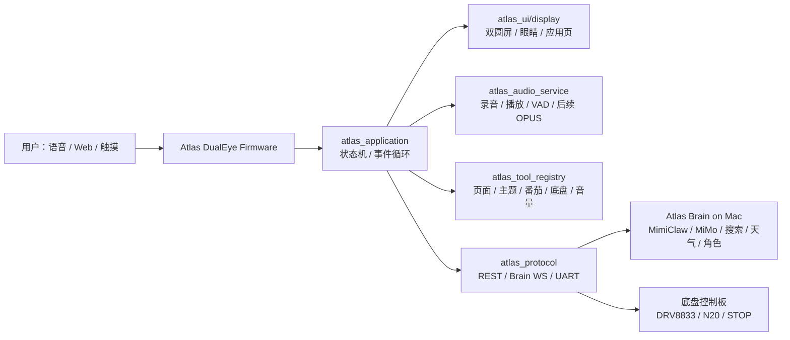

# xiaozhi-esp32 固件对标分析报告（Atlas Rover Mk.1 / DualEye V0.11）

版本：V0.11  
日期：2026-06-22  
对标对象：`78/xiaozhi-esp32` 固件仓库  
对标仓库版本：`0d1ffd3f383214bc9b59fc699b77817771fe6a26`（2026-06-18）  
Atlas 当前基线：DualEye 固件 V0.11，本地已具备双圆屏 UI、Web 控制端、Mac Bridge、MiMo/MimiClaw 方案、板载麦克风/喇叭自检、UART 底盘控制、SPIFFS 主题资源和 3500 常用汉字字库。

## 1. 结论先行

`xiaozhi-esp32` 不是一个“页面更多”的固件，而是一套成熟的实时语音智能体固件骨架。它最值得 Atlas 学的不是某个 UI，而是下面六件事：

1. **全局 Application + DeviceStateMachine**：所有网络、音频、唤醒、说话、错误、升级都走统一状态机。
2. **实时音频服务**：麦克风、唤醒、VAD、AEC、Opus 编码、TTS 播放被拆成稳定的任务和队列。
3. **协议抽象**：设备不直接依赖某个 HTTP 接口，而是通过 `Protocol` 接入 WebSocket 或 MQTT+UDP。
4. **设备侧 MCP 工具系统**：音量、亮度、主题、拍照、系统状态、升级等能力以工具形式暴露给大脑。
5. **OTA + assets 分区设计**：固件升级和模型/字体/表情/背景等资源更新被拆开管理。
6. **板级抽象**：不同 ESP32 板子的音频、屏幕、按键、网络、电源都挂在 `Board` 层，业务代码不直接散落引脚。

Atlas 不能直接替换成 `xiaozhi-esp32`。我们的产品边界不同：DualEye 是双圆屏桌面机器人 HMI，还要保留电子宠物、番茄、时钟、日历、Web 控制、小车 UART 安全控制和 Mac Brain/MimiClaw 方案。最合理的路线是：**保留 Atlas 产品固件，吸收 xiaozhi 的底层架构思想，逐步把语音链路和设备能力协议化。**

## 2. 双方定位差异

| 维度 | xiaozhi-esp32 固件 | Atlas DualEye 固件 | 对 Atlas 的判断 |
|---|---|---|---|
| 产品目标 | 通用 ESP32 AI 语音终端 | 双圆屏桌面机器人 + 小车 HMI | 不能直接替换，只能架构借鉴 |
| 交互核心 | 连续语音对话 | Web 控制 + 双眼 UI + 语音桥接 | Atlas 需要补连续语音体验 |
| 音频链路 | OPUS 流式收发、VAD、Wake Word、AEC | WAV 录音轮次 + Mac Bridge + 实验 VAD | 这是当前最大差距 |
| UI 显示 | OLED/LCD/emoji/status/chat | 双 GC9A01 圆屏、PNG 眼睛、宠物、时钟、番茄、日历 | Atlas UI 产品感更强 |
| 技能系统 | 设备侧 MCP 工具 | MimiClaw 意图 + Web API + Mac Brain 技能规划 | 需要统一成设备工具注册表 |
| 通信协议 | WebSocket 或 MQTT+UDP | HTTP REST + 局域网 Bridge | 需要增加长连接协议层 |
| OTA | OTA 分区 + assets 资源分区 | 当前主要 USB 烧录 + SPIFFS | 中后期必须补 |
| 底盘控制 | 通用 GPIO/Servo/LED 等工具 | DualEye UART -> 底盘板 -> DRV8833/N20 | Atlas 在运动安全上更贴产品 |

一句话：`xiaozhi-esp32` 强在“实时语音智能体底座”，Atlas 强在“机器人产品形态和双屏体验”。我们应该合体思路，而不是二选一。

## 3. 架构对标

### 3.1 Application 和状态机

`xiaozhi-esp32` 的主控入口围绕 `Application` 展开，内部用 FreeRTOS event bits 统一处理网络连接、音频发送、唤醒词、VAD、开始/停止监听、状态变化、定时 tick 等事件。设备状态由 `DeviceStateMachine` 管，状态包括 `starting / wifi_configuring / idle / connecting / listening / speaking / upgrading / activating / audio_testing / fatal_error`。

Atlas 当前 `main.c` 仍偏模块初始化式：

- 初始化配置、显示、音频、UART、Wi-Fi、HTTP。
- 起 `atlas_ui` 渲染任务。
- 起 `chassis_rx` 串口 ACK 任务。
- Web/语音/桥接逻辑主要散在 `atlas_admin_http.c`、`atlas_ui.c`、`atlas_mimiclaw_*`。

这能跑通功能，但“为什么刚才没回复”“为什么播报后又录到自己声音”“现在到底是听、想、说还是卡住”会越来越难排查。

建议 Atlas V0.12 引入：

```text
atlas_application
  device_state: boot / provisioning / idle / listening / transcribing / thinking / tool_running / speaking / app_page / error / upgrading
  event_group: wifi_connected / voice_triggered / audio_ready / brain_reply / tts_started / tts_done / rover_ack / error
  current_turn_id
  current_page
  current_role
  current_audio_state
```

先不要大改所有业务，只把语音 turn、页面切换、TTS 播放、连续监听、错误诊断纳入统一状态机。

### 3.2 音频链路

`xiaozhi-esp32` 的音频链路是目前最值得学习的部分：

```text
麦克风 -> AudioProcessor/VAD/WakeWord -> OPUS Encoder -> Protocol -> Server
Server -> Protocol -> OPUS Decoder -> Playback Queue -> Speaker
```

关键能力：

- 60ms OPUS 帧。
- 输入、输出、编码/解码任务分离。
- 支持 ESP-SR AFE、VAD、WakeNet/自定义唤醒词。
- 支持设备侧 AEC 或服务端 AEC。
- TTS 播放时有队列和状态，不是简单阻塞播放。

Atlas 当前音频链路：

- `atlas_audio.c` 已接 ES7210 麦克风、ES8311 输出、I2S/I2C、蜂鸣测试、WAV 捕获和 WAV 播放。
- `/api/voice/turn` 录一段 16k/16bit WAV，发给 Mac Bridge。
- Mac Bridge 做 ASR/LLM/TTS 后，DualEye 拉回 WAV 播放。
- `/api/voice/wake` 是音量门限/VAD 触发，不是关键词唤醒。

判断：

- V0.11 这条链路适合快速验证，不适合长期连续对话。
- “说完还要再点”“播报后杂音/误触发”“有时卡住不回”本质上都是 turn 状态和音频输入输出互斥不够严格。
- 先不要马上全量移植 OPUS/WebSocket，否则风险太大；但应该按 xiaozhi 的形态重构内部状态。

建议路线：

| 阶段 | 目标 | 说明 |
|---|---|---|
| P0 | 继续稳定 WAV turn | 先把状态、日志、播放期间 mute、失败原因打全 |
| P1 | 增加 `atlas_audio_service` | 把录音、播放、唤醒、连续监听拆成服务，不再塞在 HTTP handler |
| P2 | WebSocket Brain 通道 | 建立长连接，先传 JSON 事件，再传音频 chunk |
| P3 | OPUS 流式 PoC | 参考 xiaozhi 的 60ms OPUS 帧，替代整段 WAV |
| P4 | ESP-SR 唤醒/AEC | 资源占用验证后再上 WakeNet 或自定义唤醒词 |

### 3.3 协议层

`xiaozhi-esp32` 把协议抽成 `Protocol`，下面可以是：

- WebSocket：JSON 控制 + binary audio。
- MQTT+UDP：MQTT 控制通道 + UDP 加密音频通道。

设备启动后会发送 hello，声明：

- 协议版本。
- transport。
- audio codec/sample rate/channels/frame duration。
- 是否支持 AEC。
- 是否支持 MCP。

Atlas 当前主要是 HTTP REST：

- `/api/status`
- `/api/app/action`
- `/api/voice/turn`
- `/api/audio/play-url`
- `/api/mimiclaw/intent`
- `/api/rover/move`
- `/api/config/*`

REST 对 Web 控制很合适，但对连续语音不理想。建议保留 REST，新增一层：

```text
atlas_protocol
  atlas_protocol_http_local      当前 REST，给手机/PC 管理用
  atlas_protocol_brain_ws        DualEye <-> Mac Brain 长连接
  atlas_protocol_serial_rover    DualEye <-> 底盘板 UART
```

第一版 WebSocket Brain hello 建议：

```json
{
  "type": "hello",
  "device": "atlas-dualeye",
  "version": "0.12",
  "features": {
    "dual_screen": true,
    "audio_wav_turn": true,
    "audio_stream_opus": false,
    "mcp_tools": true,
    "rover_uart": true,
    "ota": false
  },
  "audio": {
    "sample_rate": 16000,
    "channels": 1,
    "format": "pcm16_wav_turn"
  }
}
```

这样 Mac Brain 和 DualEye 就能建立长期会话，不用每次靠浏览器按钮或 HTTP 单请求硬凑。

### 3.4 设备侧 MCP / 工具能力

`xiaozhi-esp32` 设备侧 MCP 已经做得很系统：工具有名字、描述、参数 schema、返回值类型，LLM/服务端能调用设备能力。内置工具包括：

- 获取设备状态。
- 设置扬声器音量。
- 设置屏幕亮度。
- 设置屏幕主题。
- 获取系统信息。
- 重启。
- 升级固件。
- 屏幕截图/预览图片（有条件编译）。
- 设置 assets 下载地址。

Atlas 当前能力散在 Web API 和 MimiClaw intent：

- 页面切换。
- 主题/表情。
- 番茄/日历/聊天/故事/音乐状态。
- 音量、亮度。
- 底盘运动和 STOP。
- 音频录播。

建议新增 `atlas_tool_registry`，先不必完全实现 MCP 协议，但要把设备能力用统一结构表达：

```text
atlas.device.get_status
atlas.screen.set_page
atlas.screen.set_theme
atlas.screen.set_expression
atlas.audio.set_volume
atlas.audio.play_tts_url
atlas.voice.start_turn
atlas.pet.set_mood
atlas.pomodoro.start
atlas.pomodoro.stop
atlas.calendar.show
atlas.rover.move
atlas.rover.stop
atlas.system.reboot
atlas.ota.check
```

其中运动工具必须保留 Atlas 的安全裁剪：

- 必须有配对码或已授权会话。
- `motion_enabled` 必须开启。
- 最大速度、最大时长本地限制。
- 所有移动命令必须能被 STOP 抢占。
- 大模型不能直接发任意电机指令，只能发高层动作意图。

### 3.5 Board 抽象和引脚治理

`xiaozhi-esp32` 支持很多 ESP32 板卡，每块板通过 `boards/*` 提供：

- 音频 codec。
- 显示屏。
- 背光。
- LED。
- 摄像头。
- 网络。
- 电池和电源管理。
- 系统信息。

Atlas 当前是单板定制，直接在模块中写 DualEye 引脚，例如 `atlas_audio.c` 写了 ES7210/ES8311 的 I2C/I2S/PA 引脚，`main.c` 打印 UART 接线说明。

短期没必要做几十块板的复杂抽象，但建议 V0.12 把引脚和硬件对象集中到：

```text
atlas_board_dualeye.h/.c
  atlas_board_get_audio_pins()
  atlas_board_get_display_pins()
  atlas_board_get_rover_uart_pins()
  atlas_board_get_touch_pins()
  atlas_board_get_flash_psram_info()
  atlas_board_get_system_info_json()
```

好处：

- 避免后续“改音频把屏幕/触摸/I2C 搞坏”。
- 给系统诊断页提供真实硬件信息。
- 以后如果换 DualEye 批次或底盘控制板，影响面更小。

### 3.6 OTA 和资源分区

`xiaozhi-esp32` v2 分区把 app 和 assets 分开。assets 可放：

- 唤醒词模型。
- 主题文件。
- 字体。
- 音效。
- 背景。
- UI 元素。
- emoji 包。
- 语言配置。

Atlas 当前已经有 SPIFFS 资源分区，用来放双眼 PNG、电子宠物和字体资源，但还没有完整 OTA。当前 USB 烧录适合开发期；一旦用户侧使用，必须补 OTA 或至少补本地固件包升级。

推荐 Atlas OTA 路线：

| 阶段 | 做法 | 备注 |
|---|---|---|
| V0.12 | `/api/system/info` 输出 app hash、分区、资源版本 | 先解决诊断 |
| V0.13 | Mac Brain Console 管理固件包 manifest | 不马上让设备自升级 |
| V0.14 | DualEye 支持本地 HTTP OTA | Mac 作为升级源 |
| V0.15 | assets 单独版本化 | 眼睛/字体/宠物资源可独立更新 |
| V0.16+ | 远程 OTA/回滚 | 需要完整回归测试后再开 |

如果现在直接上远程 OTA，风险高于收益，因为 Atlas 还在频繁改屏幕、字体、音频和配网。

## 4. 功能成熟度评分

5 分表示成熟可参考，1 分表示原型阶段。

| 能力 | xiaozhi-esp32 | Atlas DualEye V0.11 | 差距判断 |
|---|---:|---:|---|
| 连续语音对话 | 5 | 2.5 | Atlas 需要状态机和音频服务化 |
| OPUS 流式音频 | 5 | 1 | Atlas 当前是 WAV turn |
| 唤醒词/VAD/AEC | 4.5 | 2 | Atlas 只有实验门限触发 |
| 协议抽象 | 5 | 2 | Atlas REST 多，长连接弱 |
| 设备侧工具/MCP | 5 | 2.5 | Atlas 有能力但缺统一工具注册 |
| OTA/资源体系 | 5 | 2 | Atlas 有 SPIFFS 资源，还缺升级闭环 |
| 板级抽象 | 5 | 2 | Atlas 单板硬编码较多 |
| 双屏产品 UI | 3 | 4 | Atlas 更符合当前产品 |
| 电子宠物/应用页 | 2 | 4 | Atlas 明显更产品化 |
| 小车运动安全 | 2 | 4 | Atlas 的双板 UART 安全边界更清晰 |
| Web 管理/日常控制 | 3 | 4 | Atlas 已有 `/app`、`/admin` 和 Mac Bridge |

## 5. Atlas 应该立刻借鉴的 8 个点

### 5.1 全局状态机

优先级：P0  
目标：解决语音链路卡死、重复触发、播报后不能继续、失败原因不清楚。

新增：

- `atlas_device_state.h/.c`
- `atlas_turn_state.h/.c`
- `/api/diagnostics/turn`

状态至少包括：

```text
idle
listening
recording
transcribing
thinking
tool_running
speaking
cooldown
error
```

这里的 `cooldown` 不是固定等 4-6 秒，而是“播放完成后的短暂防回声/防自触发窗口”，时长应可配置，且连续监听开启时自动恢复 listening。

### 5.2 音频服务化

优先级：P0/P1  
目标：不要让 HTTP handler 直接负责录音、播报、唤醒循环。

当前 `atlas_admin_http.c` 里语音 wake/turn 逻辑较重，建议搬到：

```text
atlas_audio_service
  capture_turn()
  play_tts()
  start_continuous_listen()
  stop_continuous_listen()
  mute_input_for_playback()
  get_audio_debug_snapshot()
```

### 5.3 设备工具注册表

优先级：P0  
目标：Web、语音、MimiClaw、Mac Brain 调同一套设备能力。

先做本地 C 结构，不急着 JSON-RPC：

```text
atlas_tool_registry
  name
  risk_level
  input_schema_summary
  handler
  requires_pairing
  requires_motion_enabled
```

### 5.4 Brain 长连接协议

优先级：P1  
目标：让 DualEye 和 Mac Brain 形成真正的会话，不再每次靠零散 HTTP。

第一阶段只传 JSON：

```text
device.hello
turn.started
asr.partial
llm.reply
tts.started
tts.finished
tool.call
tool.result
state.changed
error
```

第二阶段再传音频 chunk。

### 5.5 系统信息与诊断

优先级：P0  
目标：以后不用靠猜“是不是固件没更新”“是不是 Wi-Fi 掉了”“是不是 Bridge 卡了”。

建议新增：

- `/api/system/info`
- `/api/diagnostics/audio`
- `/api/diagnostics/network`
- `/api/diagnostics/brain`
- `/api/diagnostics/turn`

内容包括：

- firmware version/build time/git hash。
- app 分区、SPIFFS 资源版本、字体版本。
- heap/PSRAM。
- Wi-Fi STA/AP 状态、RSSI、IP。
- 音频 codec 初始化状态、最近录音电平、播放错误。
- 最近 10 个 turn 的状态和失败点。

### 5.6 Board 硬件集中定义

优先级：P1  
目标：把 DualEye 的引脚、codec、屏幕、触摸、UART 统一收口。

这能防止后续继续发生“某个功能考虑了，但引脚/硬件边界没完全对齐”的问题。

### 5.7 OTA 先设计，不急着开放

优先级：P1/P2  
目标：先把版本、manifest、资源版本、校验、回滚策略写清楚。

短期仍建议 USB 烧录为主；等连续语音和显示稳定后，再开 Mac 本地 OTA。

### 5.8 资源版本化

优先级：P1  
目标：解决“皮肤没有更新”“PNG 白屏”“字体不全”“番茄页面回退”等问题。

建议每次构建输出：

```json
{
  "assets_version": "dualeye-assets-v0.5",
  "themes": ["raptor", "mecha", "goggle", "pet", "blue_pupil", "no_smoking", "tomoe_spin"],
  "font": "atlas_font_zh_16_3500",
  "build_time": "2026-06-22"
}
```

并在 `/api/status` 和屏幕调试页显示。

## 6. 暂时不建议照搬的部分

| xiaozhi 能力 | 为什么不马上照搬 | Atlas 建议 |
|---|---|---|
| 全量多板支持 | 我们目前只有 Waveshare DualEye，抽象过度会拖慢 | 只做 `atlas_board_dualeye` |
| MQTT+UDP 音频 | 实现复杂，当前 Mac Bridge 更适合调试 | 先 WebSocket，再评估 MQTT+UDP |
| 远程 OTA | 开发期固件变化太大，回滚没验证 | 先本地 OTA manifest |
| 完整 ESP-SR 唤醒词 | 模型资源、RAM、PSRAM、CPU 需要实测 | 先稳定 VAD/连续监听，再接 WakeNet |
| Speaker recognition | 当前不是核心需求 | 放到后期 |
| 摄像头工具 | DualEye 当前无摄像头链路 | 不做 |
| 多语言完整包 | 当前中文为主 | 先把中文字体和 UI 做稳 |

## 7. 推荐架构：Atlas Hybrid Firmware

最终目标不是“Atlas 变成 xiaozhi”，而是：



对应模块规划：

| 模块 | 来源思想 | Atlas 实现 |
|---|---|---|
| `atlas_application` | xiaozhi `Application` | 全局事件和状态 |
| `atlas_device_state` | xiaozhi `DeviceStateMachine` | 严格转移，非法状态报警 |
| `atlas_audio_service` | xiaozhi `AudioService` | 先 WAV，后 OPUS |
| `atlas_protocol` | xiaozhi `Protocol` | REST + Brain WS + UART |
| `atlas_tool_registry` | xiaozhi MCP server | 设备工具，后续兼容 MCP |
| `atlas_board_dualeye` | xiaozhi Board | DualEye 引脚和硬件信息集中 |
| `atlas_assets_manifest` | xiaozhi assets | 主题/字体/资源版本化 |
| `atlas_ota` | xiaozhi OTA | 后续本地 OTA |

## 8. 下一轮开发任务建议

### P0：马上做，解决当前体验痛点

1. 新增 `atlas_device_state` 和 turn 状态，先服务语音链路。
2. 把语音 wake/turn 的关键状态从 `atlas_admin_http.c` 抽到 `atlas_audio_service`。
3. 新增 `/api/diagnostics/turn`，记录最近 10 次语音请求：录音、ASR、LLM、TTS、播放、失败原因。
4. 新增 `/api/system/info`，输出固件版本、资源版本、字体版本、分区、heap、Wi-Fi、音频状态。
5. 新增 `atlas_tool_registry` 的最小版，把页面/主题/表情/番茄/底盘 STOP 先统一起来。
6. 在 Web 控制端显示：当前设备状态、当前 turn、Bridge 状态、最近错误。

### P1：MimiClaw 联调稳定后做

1. 建立 DualEye <-> Mac Brain WebSocket 长连接。
2. Mac Brain 主动下发 `tool.call`，DualEye 回 `tool.result`。
3. DualEye 主动上报 `state.changed / turn.started / tts.done / rover.ack`。
4. 语音链路支持服务端主动中断当前 TTS。
5. 资源 manifest 入 SPIFFS，并在 `/api/status` 返回。
6. Board 硬件定义集中，减少散落引脚常量。

### P2：产品化前做

1. OPUS 流式音频 PoC。
2. ESP-SR WakeNet 或自定义唤醒词验证。
3. AEC 或播放期输入 mute 优化。
4. Mac 本地 OTA。
5. assets 独立更新。
6. 电池/功耗/低电状态。

## 9. 是否应该把 Atlas 做成 xiaozhi 的一个自定义板？

可以，但现在不建议。

如果把 Atlas 直接塞进 `xiaozhi-esp32` 的 `boards/`，优点是能直接用它成熟的音频、协议、MCP、OTA；缺点也很明显：

- 要重新适配 DualEye 双 GC9A01 圆屏和布局。
- 要移植 Atlas 的眼睛 PNG、电子宠物、番茄、日历、Web 控制。
- 要接入 ES7210/ES8311 的准确引脚和初始化细节。
- 要把 UART 底盘安全协议接进 xiaozhi MCP。
- 会失去当前 Atlas Web 管理和 Mac Brain 调试节奏。

更稳妥的判断：

- **现在**：保留 Atlas 固件，把 xiaozhi 的架构思想搬进来。
- **中期**：如果 OPUS、WakeNet、MCP、OTA 自研成本过高，再评估创建 `boards/atlas-dualeye` 分支。
- **长期**：Atlas 可以兼容 xiaozhi 协议/MCP，但不必完全依赖 xiaozhi 工程结构。

## 10. 验收标准

下一轮固件优化完成后，应能回答这些问题：

1. 当前 DualEye 是 idle、listening、thinking、speaking 还是 error？
2. 最近一次语音为什么没有回复？卡在 ASR、LLM、TTS、播放还是网络？
3. TTS 播放时是否会误触发麦克风？
4. Web、语音、MimiClaw 调页面/表情/番茄/底盘 STOP 是否走同一套工具？
5. 当前烧录进去的资源版本和字体版本是什么？
6. Mac Brain 是否在线？DualEye 和 Mac Brain 是否有会话？
7. 如果 Wi-Fi 切到局域网 IP，Web 和语音链路是否都能自动识别？
8. 固件版本和 assets 版本是否能在 `/api/status` 或 `/api/system/info` 看到？

这些比“又加一个页面”更重要。它们决定 Atlas 后面能不能稳定接 MimiClaw、连续语音、联网搜索、角色切换和 OTA。

## 11. 参考来源

- `78/xiaozhi-esp32` 仓库：[https://github.com/78/xiaozhi-esp32](https://github.com/78/xiaozhi-esp32)
- README 中文说明：[https://github.com/78/xiaozhi-esp32/blob/main/README_zh.md](https://github.com/78/xiaozhi-esp32/blob/main/README_zh.md)
- WebSocket 协议文档：[https://github.com/78/xiaozhi-esp32/blob/main/docs/websocket_zh.md](https://github.com/78/xiaozhi-esp32/blob/main/docs/websocket_zh.md)
- MQTT + UDP 协议文档：[https://github.com/78/xiaozhi-esp32/blob/main/docs/mqtt-udp_zh.md](https://github.com/78/xiaozhi-esp32/blob/main/docs/mqtt-udp_zh.md)
- MCP 使用说明：[https://github.com/78/xiaozhi-esp32/blob/main/docs/mcp-usage_zh.md](https://github.com/78/xiaozhi-esp32/blob/main/docs/mcp-usage_zh.md)
- MCP 协议说明：[https://github.com/78/xiaozhi-esp32/blob/main/docs/mcp-protocol_zh.md](https://github.com/78/xiaozhi-esp32/blob/main/docs/mcp-protocol_zh.md)
- 自定义开发板说明：[https://github.com/78/xiaozhi-esp32/blob/main/docs/custom-board_zh.md](https://github.com/78/xiaozhi-esp32/blob/main/docs/custom-board_zh.md)
- 固件主应用代码：[https://github.com/78/xiaozhi-esp32/blob/main/main/application.cc](https://github.com/78/xiaozhi-esp32/blob/main/main/application.cc)
- 音频服务代码：[https://github.com/78/xiaozhi-esp32/blob/main/main/audio/audio_service.cc](https://github.com/78/xiaozhi-esp32/blob/main/main/audio/audio_service.cc)
- 协议抽象代码：[https://github.com/78/xiaozhi-esp32/blob/main/main/protocols/protocol.h](https://github.com/78/xiaozhi-esp32/blob/main/main/protocols/protocol.h)
- WebSocket 实现：[https://github.com/78/xiaozhi-esp32/blob/main/main/protocols/websocket_protocol.cc](https://github.com/78/xiaozhi-esp32/blob/main/main/protocols/websocket_protocol.cc)
- MQTT/UDP 实现：[https://github.com/78/xiaozhi-esp32/blob/main/main/protocols/mqtt_protocol.cc](https://github.com/78/xiaozhi-esp32/blob/main/main/protocols/mqtt_protocol.cc)
- 设备侧 MCP 实现：[https://github.com/78/xiaozhi-esp32/blob/main/main/mcp_server.cc](https://github.com/78/xiaozhi-esp32/blob/main/main/mcp_server.cc)
- OTA 实现：[https://github.com/78/xiaozhi-esp32/blob/main/main/ota.cc](https://github.com/78/xiaozhi-esp32/blob/main/main/ota.cc)
- Board 抽象：[https://github.com/78/xiaozhi-esp32/blob/main/main/boards/common/board.h](https://github.com/78/xiaozhi-esp32/blob/main/main/boards/common/board.h)
- v2 分区说明：[https://github.com/78/xiaozhi-esp32/blob/main/partitions/v2/README.md](https://github.com/78/xiaozhi-esp32/blob/main/partitions/v2/README.md)
