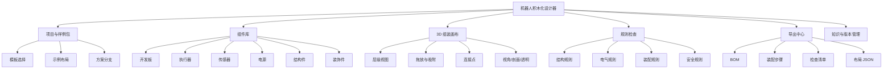

# 机器人积木化设计器 产品需求与功能架构

## 1. 产品定位

机器人积木化设计器是一个面向机器人原型设计、结构评审、装配规划和物料管理的可视化设计平台。

它的目标不是替代专业 CAD，而是把机器人设计中最常见、最容易反复试错的部分积木化：

- 常见开发板、传感器、执行器、电源、结构件、装饰件可复用。
- 组件有尺寸、接口、安装方式、约束和物料信息。
- 用户通过拖放、层级、规则检查和导出物快速完成方案评审。
- 不同机器人项目通过组件包和样例布局复用同一个平台。

AtlasOne Rover Mk1 是第一个 MVP 示例包，用来验证四轮小车、双眼 HMI、黄铜笼架、接线和 BOM 导出等能力。

## 2. 对标启发

`jasonkneen/tiny-world-builder` 的价值不在“小世界”题材，而在产品机制：

- 它提供可点击放置、擦除、切换工具、堆叠/增强、升降地形、切换相机等直接编辑体验。
- 它用工具箱组织可放置对象，例如地形、道路、水、桥、房子、树、围栏、石头、作物和动物。
- 它把场景保存为结构化 world schema，而不是只保存渲染结果。
- 它有邻接感知规则：道路连接、水岸、桥方向、围栏连接、房屋聚合、岩石外形会随邻居变化。
- 它是静态 Web 应用，Three.js 自托管，适合低门槛部署。

机器人积木化设计器应吸收这些机制，但领域对象从“地形/装饰物”换成“机器人组件/结构/电气/装配规则”。

## 3. 目标用户

| 用户 | 主要诉求 | 典型问题 |
| --- | --- | --- |
| 机器人 DIY 创作者 | 快速摆方案、看效果、下单采购 | 这个开发板、电池、电机能不能放下 |
| 硬件产品经理 | 评审原型方案、比较配置、沉淀 BOM | 哪个方案风险最少，是否可复刻 |
| 机械/结构设计者 | 检查安装孔、间隙、层级和维护空间 | 轮子是否干涉，接口能否插拔 |
| 电子/固件工程师 | 检查供电、接口、控制链路和安全边界 | 电机电流是否走错路径，GPIO 是否够 |
| 开源复刻者 | 按清单采购、按步骤装配、避坑 | 需要买什么，按什么顺序装 |

## 4. 核心用户旅程

### 4.1 从模板开始

1. 选择机器人类型：桌面 Rover、机械臂、双足/轮足、宠物机器人、传感器小车。
2. 选择样例包：AtlasOne Rover Mk1。
3. 进入默认布局，看到分层模型、组件库、规则检查和物料摘要。

### 4.2 积木化组装

1. 从组件库选择开发板、电机、轮子、电池、传感器、外壳、结构件。
2. 拖到指定层级或安装位。
3. 系统根据组件接口和安装约束提示可连接点、禁入区、间隙和冲突。
4. 用户切换视角、层级、透明模式和剖面模式进行评审。

### 4.3 规则检查

1. 结构规则：碰撞、间隙、孔位、轮组、重心、维护空间。
2. 电气规则：供电路径、共地、电流容量、电平转换、接口占用。
3. 装配规则：先后顺序、可拆卸性、焊接/热源避让。
4. 安全规则：电池正极、裸线、运动部件、防短路。

### 4.4 导出与复用

1. 导出 BOM。
2. 导出装配步骤。
3. 导出检查清单。
4. 导出布局 JSON。
5. 后续导出底板 SVG、孔位图、3D 模型或制造包。

## 5. 产品原则

- 先评审，后制造：第一目标是缩短设计评审和物料决策时间。
- 组件即知识：每个组件都带尺寸、接口、安装、供电、风险和替代件。
- 规则可解释：检查结果必须说清楚为什么，以及怎么修。
- 样例可迁移：AtlasOne Rover Mk1 是样例，不是平台边界。
- 允许不精确，但要标注精度：估算尺寸、实测尺寸、官方尺寸要区分。
- 数据优先于渲染：渲染只是投影，核心资产是组件库、布局和规则。

## 6. MVP 范围

### 6.1 MVP 必须有

| 模块 | 能力 |
| --- | --- |
| 项目/样例包 | 打开 AtlasOne Rover Mk1 示例 |
| 组件库 | 读取组件定义，按类别展示 |
| 3D 画布 | 渲染参数化组件、车架、轮组、板卡 |
| 层级控制 | 开关底板、动力、驱动、中层、车头、结构、线束 |
| 组件详情 | 显示尺寸、安装姿态、BOM、规则 |
| 规则检查 | 显示基础结构/电气/装配风险 |
| 评审工作台 | 在右侧标签页切换组件、规则、BOM 和装配步骤 |
| 导出 | BOM、装配步骤、检查清单、布局 JSON |

### 6.2 MVP 暂不做

- 完整 CAD 建模。
- 自由曲面外壳设计。
- 强物理仿真。
- 自动布线 PCB。
- 真实库存/电商下单。
- 多人协作编辑。

## 7. 功能架构

## 8. 信息架构

### 8.1 左侧：组件与项目

- 项目/样例包选择。
- 组件分类筛选。
- 组件搜索。
- 常用组件收藏。
- 方案分支切换。

### 8.2 中间：3D 组装画布

- 模型视图。
- 层级开关。
- 相机模式。
- 吸附点和连接点。
- 冲突高亮。

### 8.3 右侧：评审工作台

- 组件：选中组件详情、安装/接口/尺寸。
- 规则：规则检查摘要、风险解释、修复建议。
- BOM：按类别预览物料、数量、必需性和采购词。
- 步骤：预览装配顺序，支持导出 Markdown。
- 交付物：导出 BOM、装配步骤、检查清单、布局 JSON。

## 9. 组件库产品模型

组件不是单纯模型文件，而是一组工程知识：

| 维度 | 内容 |
| --- | --- |
| Identity | id、名称、分类、版本、来源 |
| Geometry | 尺寸、包围盒、可视模型、碰撞体 |
| Mounting | 安装孔、铜柱、夹具、扎带、胶粘、焊接 |
| Ports | 电源、GPIO、UART、I2C、SPI、PWM、电机输出 |
| Constraints | 禁入区、接口插拔空间、散热、电流、电平、方向 |
| BOM | 数量、必需性、采购词、替代件、价格 |
| Rules | 可连接对象、不可连接对象、装配顺序、风险提示 |

## 10. 规则系统产品模型

规则分为四层：

| 层 | 示例 |
| --- | --- |
| 几何规则 | 轮子到黄铜轮拱 >= 2 mm，USB-C 前方留 12 mm |
| 电气规则 | 电机 VM 不经过主控板，3.3 V GPIO 驱动 5 V WS2812B 推荐电平转换 |
| 装配规则 | 先焊黄铜结构，再装电子板；补焊前拆电池 |
| 方案规则 | Mk1 四轮方案必须 4 个 N20 + 2 块 DRV8833 |

每条规则需要输出：

- 状态：通过、警告、错误、待实测。
- 位置：关联组件、接口或层级。
- 原因：为什么触发。
- 修复建议：怎么改。

## 11. 路线图

### Phase 0：产品和架构定版

- 完成产品需求文档。
- 完成功能架构和技术架构。
- 当前 Mk1 原型改名为平台示例 Demo。
- 已落地：平台工作区首页，不再默认进入 Mk1 示例项目。
- 已落地：一级导航拆分为首页、项目、模板、组件、设计器。

### Phase 1：Mk1 示例包 MVP

- 组件数据结构化。
- 参数化 3D 渲染。
- 基础规则检查。
- BOM/步骤/检查清单导出与右侧预览。

### Phase 2：通用组件包系统

- 已落地：组件包 catalog、Robot Package manifest、组件/布局/规则拆分。
- 已落地：项目管理，本地项目可创建、打开、复制、删除、导入和导出。
- 已落地：模板库，模板用于创建独立项目副本，不直接编辑模板。
- 已落地：Mk1 示例包与通用 Rover 起步模板两个机器人项目，可验证多项目切换。
- 已落地：组件类型库搜索、分类筛选、按类型新增实例。
- 已落地：布局 JSON 导出/导入，布局包含 instances 与 connections。
- 已落地：浏览器本地草稿保存/恢复。
- 已落地：组件包 JSON 导入，可把第三方/自定义组件类型合入当前项目。
- 已落地：用户可创建自定义矩形组件并加入布局。
- 已落地：组件管理中心，可跨组件包查看类型、尺寸、端口、BOM、来源和使用次数。
- 待深化：替代件推荐、组件包版本依赖、远程组件市场。

### Phase 3：设计器交互

- 已落地：选择/移动/连接点工具。
- 已落地：选中组件拖拽移动和 X/Y/Z/Yaw 微调。
- 已落地：1/2/5/10 mm 吸附步长。
- 已落地：连接点高亮。
- 已落地：从组件类型库新增实例，支持复制、删除和吸附到最近安装点。
- 已落地：连接关系编辑，连接图用于线束渲染、线束清单和布局导出。
- 已落地：电子件底板边界和 3D 包围盒干涉检查。
- 待深化：真正鼠标拖拽“从库到画布”、精确 CAD 碰撞体、安装孔兼容性匹配。

### Phase 4：制造辅助

- 已落地：底板 SVG 导出。
- 已落地：孔位图 SVG 导出。
- 已落地：线束清单 CSV。
- 已落地：装配步骤预览/Markdown 导出。
- 已落地：制造包 HTML 导出，汇总 BOM、规则、线束、步骤、底板图和孔位图。
- 待深化：自动多视角装配图、爆炸图、PDF 直接导出、真实加工公差标注。

### Phase 5：生态化

- 已落地：布局快照。
- 已落地：当前布局与快照的增删/位置变化对比。
- 已落地：撤销/重做布局调整。
- 已落地：第三方组件包 JSON 导入。
- 已落地：用户自定义组件。
- 已落地：GLB/STL 资产可进入组件卡片预览和主画布渲染，STEP/STP 可作为制造/CAD 源资产引用。
- 部分落地：版本对比为浏览器本地项目/快照级，布局 JSON 适合 Git 追踪。
- 待深化：在线资产库、团队分享、跨设备版本历史、云端组件包注册表、Git 级可视化 diff。

### Phase 6：在线平台化

- 待建设：用户账号和个人/团队工作区。
- 待建设：云端项目库，项目、草稿、分支、版本不再只存在浏览器 localStorage。
- 待建设：云端资产库，GLB/STL/STEP/参考图上传后生成 assetId、缩略图、尺寸、包围盒和 CDN/signed URL。
- 待建设：组件包注册表，支持官方包、开源包、第三方包、私有包、版本依赖和发布审核。
- 待建设：只读分享链接、公开项目 fork、制造输出云端归档。
- 待建设：前端本地/云端双适配层，保留离线模式但以云端为 source of truth。

## 12. 成功指标

- 10 分钟内能从模板得到一个可评审机器人布局。
- 80% 常见尺寸/接口风险能在装配前暴露。
- 一个样例包能复用到另一个机器人项目，不依赖 Atlas 专用逻辑。
- BOM、步骤、检查清单能直接进入项目文档。
- 新组件添加成本低于 20 分钟。

## 13. 当前结论

现有 `simulator_web/rover_builder` 应被视为 `Robot Brick Designer` 的第一个演示器，而不是 AtlasOne Rover Mk1 专用工具。后续开发应围绕平台能力推进，再用 Mk1 示例包验证。
