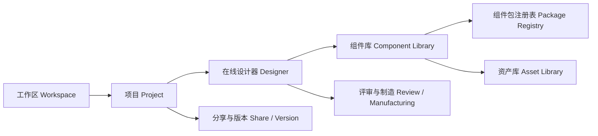
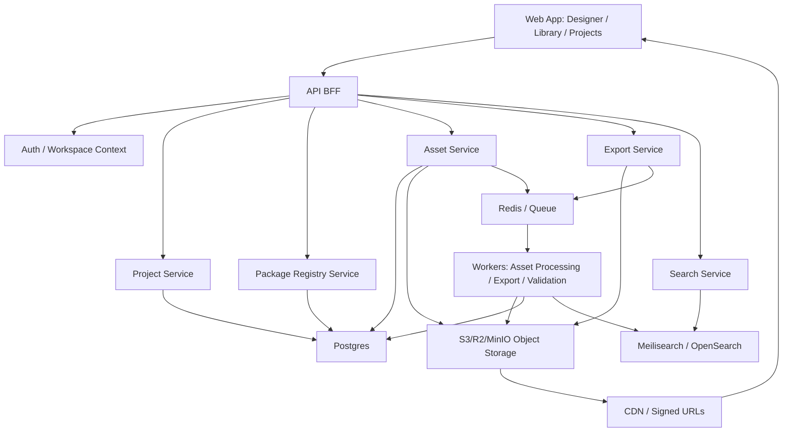
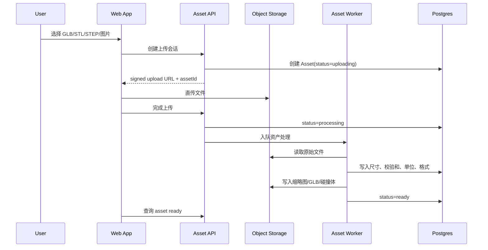
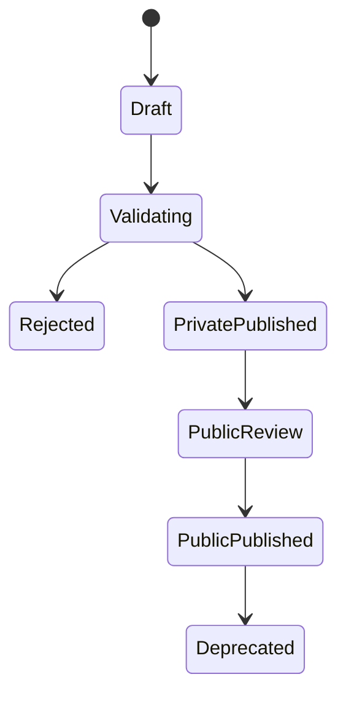
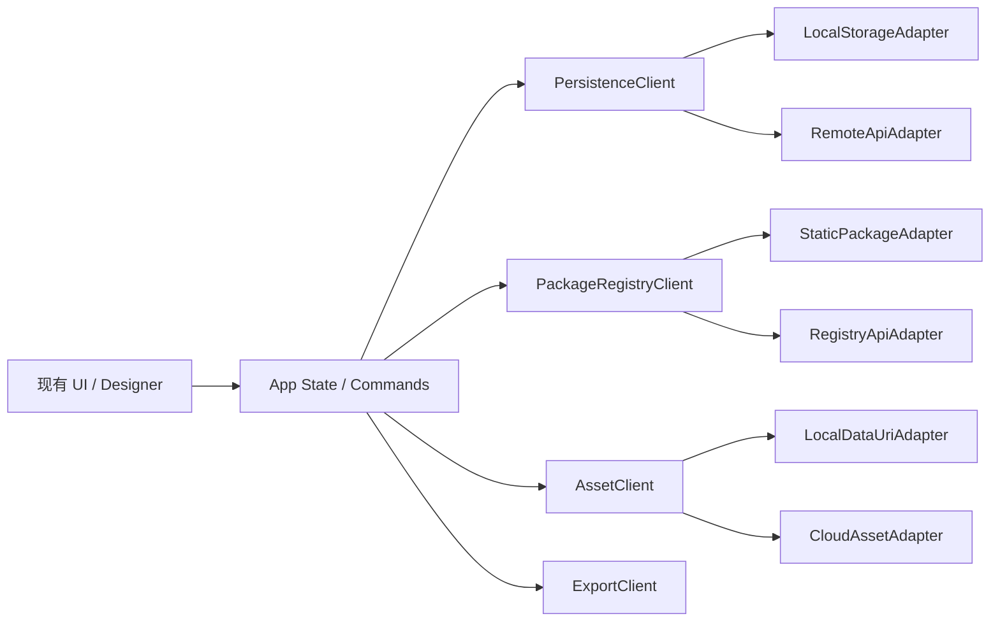

# 机器人积木化设计器在线平台产品架构

版本：2026.06

## 1. 架构目标

当前 `simulator_web/rover_builder` 已经从 Mk1 专用演示器演进成可用的本地机器人积木化设计器。下一阶段要把它打造成在线设计平台，核心变化是：

- 浏览器不再是设计资产的唯一归属地。
- 组件包、项目、布局版本、真实 3D 资产、制造输出都要有云端源数据。
- 前端继续承担高交互设计工作台职责，但项目、组件和资产的可信状态由平台服务托管。
- 本地离线能力保留为 open-source/self-host 友好的降级模式，不作为长期唯一存储。

一句话目标：

> 前端是设计工作台，云端是项目、组件、资产、版本和生态的源数据平台。

## 2. 当前架构诊断

### 2.1 已有优势

- 平台首页、项目、模板、组件库、组件包、设计器已经分区。
- 组件包目录、manifest、components、layout、rules 已经结构化。
- 组件模型支持参数化几何、真实 GLB/STL 资产引用、接口、BOM、安装点和规则。
- 设计器已支持拖放新增、安装点吸附、高亮、碰撞/越界、替代件、撤销、分支对比和制造预览。
- Qmini、UniArmL1、D-BOT、桌面人形结构包已验证多机器人包路线。
- `tools/validate_robot_designer_packages.mjs` 已经形成基础契约校验能力。

### 2.2 当前风险

| 风险 | 现状 | 后果 |
| --- | --- | --- |
| 项目资产困在浏览器 | 项目、用户组件包、草稿、快照主要在 localStorage | 换设备、清缓存、多人协作都会丢上下文 |
| 上传资产缺少平台身份 | 上传文件可进入组件，但更像本地数据 URI 或包内引用 | 难以复用、搜索、授权、版本追踪和 CDN 加速 |
| 静态 catalog 不适合生态 | `packages/catalog.json` 是开发者维护的静态目录 | 第三方发布、审核、依赖、版本更新很难产品化 |
| 项目版本仍偏本地 | 分支、版本、对比在本地项目列表里完成 | 无法形成公开项目、团队项目和跨设备历史 |
| 制造输出不可追溯 | BOM/步骤/孔位/制造包即时导出 | 无法知道某份制造包来自哪个项目版本和组件包版本 |
| 权限模型缺失 | 本地 API 原型已补用户、工作区、角色和分享链接，但仍是文件存储 | 需要迁移到正式数据库、鉴权和邀请流程 |

## 3. 目标产品架构

在线平台应拆成七个核心产品域。



### 3.1 工作区 Workspace

工作区是在线平台的组织边界。

- 个人工作区：默认给机器人爱好者使用。
- 团队工作区：后续支持多人、权限、共享组件包。
- 公开空间：承载开源机器人项目、官方组件包和第三方组件包。
- 角色边界：`owner` 管成员和资源，`editor` 可编辑项目/包/资产，`viewer` 只读评审。

### 3.2 项目 Project

项目是用户设计的机器人方案。

- 从模板创建项目。
- 从空白项目开始。
- 从公开开源包 fork。
- 拥有分支、版本、草稿、制造输出和分享链接。
- 引用组件包版本，而不是复制所有组件定义。

### 3.3 在线设计器 Designer

设计器仍是现有前端的核心能力，但数据来源要从本地对象改成远程文档。

- 打开项目时加载项目设计文档。
- 自动保存布局命令和草稿。
- 明确显示同步状态：保存中、已保存、失败、冲突、离线缓存。
- 保留设计文档修订历史，侧栏可查看最近保存、创建分支等动作。
- 支持本地缓存，但云端版本是源数据。

### 3.4 组件库 Component Library

组件库是用户查找和使用组件的入口。

- 展示所有可用组件：官方、开源、第三方、工作区私有、用户自定义。
- 支持卡片/列表、搜索、筛选、替代件、版本和来源。
- 用户新增组件时，创建的是组件定义和资产引用，不直接把文件塞进前端状态。

### 3.5 组件包注册表 Package Registry

组件包注册表是生态边界。

- 系统包：官方维护的标准件库和示例机器人包。
- 开源包：来自 GitHub 或公开社区项目。
- 私有包：团队或个人私有组件库。
- 第三方包：供应商、创作者、厂商维护。
- 支持版本、依赖、审核、发布、废弃、迁移提示。
- 私有包只在所属工作区内出现，公开发布后才进入公共 catalog。
- 公开发布走审核请求：提交时自动附带 schema 校验、资产依赖、许可证提醒和阻断原因，工作区 owner 可批准或驳回。

### 3.6 资产库 Asset Library

资产库负责真实文件。

- 支持 GLB、GLTF、STL、STEP、STP、参考图、说明文档。
- 上传后生成 `assetId`，组件只引用 `assetId` 或带签名的公开 URL。
- 生成缩略图、尺寸、包围盒、预览模型、碰撞简化体、格式衍生物。
- 记录来源、许可证、校验和、上传者、可见性和版本。
- 有明确处理状态机：上传中、已上传、处理中、可用、需复核。
- 提供引用影响分析：哪些组件定义、项目实例、制造输出依赖该资产。
- 提供替代候选关系：同格式、同尺寸区间或用户指定的替代资产可被登记和复用。
- 提供资产治理队列：缺许可证、未引用、需复核、处理中、公开但未授权的资产可被集中发现和批量处理。

### 3.7 评审与制造 Review / Manufacturing

制造输出不只是下载文件，而是项目版本的派生产物。

- BOM、装配步骤、检查清单、底板 SVG、孔位图、线束清单、制造包。
- 输出绑定项目版本、组件包版本、规则版本和导出时间。
- 支持重新生成、下载、分享和归档。

### 3.8 分享与评审 Share / Review

分享链接是在线平台从个人工具变成协作平台的关键入口。

- 支持项目、组件包、版本的只读链接。
- 支持评论链接，评审者可写入反馈但不能修改设计文档。
- 分享解析返回能力声明：可读、可评论、可下载、可 fork、不可写。
- 后续可扩展到版本发布页、公开项目页和制造包评审页。

### 3.9 平台洞察 Platform Insights

平台洞察负责把分散在项目、组件包、资产、审核和分享中的引用关系变成可操作的治理入口。

- 显示项目使用了哪些组件包和资产。
- 显示组件包引用了哪些真实模型资产，以及哪些资产缺许可证或未处理完成。
- 显示组件包发布审核的阻断、待审核和版本差异。
- 显示资源被哪些分享链接公开或评论访问。
- 作为资产治理、组件包审核和项目维护的全局入口。

## 4. 核心对象模型

### 4.1 领域对象

| 对象 | 职责 | 存储 |
| --- | --- | --- |
| User | 用户身份 | 数据库 |
| Workspace | 个人/团队空间 | 数据库 |
| Project | 机器人设计项目 | 数据库 |
| DesignDocument | 当前布局、连接、实例参数 | 数据库 JSONB + 版本快照 |
| ProjectBranch | 方案分支 | 数据库 |
| ProjectVersion | 命名版本/发布点 | 数据库 |
| ComponentPackage | 组件包 manifest | 数据库 |
| ComponentDefinition | 组件类型定义 | 数据库 JSONB 或包文档 |
| Asset | 原始上传资产 | 对象存储 + 数据库元数据 |
| AssetDerivative | 预览图、GLB 转换、碰撞体 | 对象存储 + 数据库元数据 |
| RuleSet | 规则包和规则版本 | 数据库 |
| ExportJob | 制造输出任务 | 队列 + 数据库 |
| ShareLink | 公开/私有分享链接 | 数据库 |
| ShareComment | 分享链接下的评审意见 | 数据库 |
| AuditEvent | 发布、删除、导出、权限变化 | 数据库 |

### 4.2 源数据归属

| 数据 | 本地 MVP | 在线平台目标 |
| --- | --- | --- |
| 项目列表 | localStorage | Project Service |
| 项目布局 | localStorage draft / exported JSON | DesignDocument + Branch + Version |
| 组件包目录 | 静态 `packages/catalog.json` | Package Registry |
| 系统组件包 | 静态文件 | Registry 发布版本 + CDN |
| 用户组件包 | localStorage | Workspace private package |
| 上传资产 | 前端状态/包内引用 | Asset Library + Object Storage |
| 预览缩略图 | 前端即时渲染 | 前端渲染 + 服务器派生缩略图 |
| 制造输出 | 前端下载 | ExportJob 生成并绑定版本 |
| 快照/分支对比 | localStorage | Branch/Version diff service |

## 5. 技术架构



### 5.1 推荐技术选型

优先选择 self-host 友好、未来也能 SaaS 化的组合。

| 层 | 推荐 |
| --- | --- |
| Web App | 继续 Three.js + 前端设计器，后续可迁移 Vite/React 或保持轻量模块化 |
| API | Node.js/TypeScript，Fastify 或 NestJS |
| 数据库 | Postgres，JSONB 存设计文档和包文档 |
| 对象存储 | S3 compatible：Cloudflare R2、AWS S3、MinIO |
| 队列 | Redis + BullMQ |
| 搜索 | Meilisearch 起步，规模扩大后可换 OpenSearch |
| 鉴权 | OAuth + Email，早期可用 Supabase/Auth.js |
| 文件派生 | Worker 调用 assimp、meshoptimizer、three-stdlib、Sharp |
| 部署 | 单体 API + Worker 起步，后续拆服务 |

如果追求最快上线，可以先用 Supabase 承担 Auth、Postgres、Storage，再把资产派生和导出 Worker 独立出来。长期为了开源生态和自托管，仍建议把业务层抽成自己的 API。

## 6. 资产平台设计

### 6.1 上传流程



### 6.2 Asset 关键字段

```ts
type Point3 = { x: number; y: number; z: number };

type Asset = {
  id: string;
  workspaceId: string;
  ownerId: string;
  visibility: "private" | "workspace" | "public";
  kind: "glb" | "gltf" | "stl" | "step" | "stp" | "reference_image" | "document";
  fileName: string;
  mimeType: string;
  sizeBytes: number;
  checksumSha256: string;
  storageProvider: "local-fs" | "s3" | "r2" | "minio";
  storageBucket: string;
  storageKey: string;
  storageObjectId: string;
  sourceUrl?: string;
  license?: string;
  units?: "mm" | "m" | "inch" | "unknown";
  bounds?: { min: Point3; max: Point3; size: Point3 };
  dimensions?: { x: number; y: number; z: number };
  triangleCount?: number;
  derivativeSummary?: Record<string, { contentUrl: string; mime: string; sizeBytes: number }>;
  status: "uploading" | "processing" | "ready" | "failed" | "quarantined";
  derivatives: AssetDerivative[];
  createdAt: string;
  updatedAt: string;
};
```

### 6.3 组件引用资产的方式

本地 MVP 可以继续支持 `uri`，但在线平台的数据应优先使用 `assetId`：

```json
{
  "model": {
    "fidelity": "vendor_verified",
    "asset_refs": [
      {
        "assetId": "asset_01J...",
        "kind": "stl",
        "role": "render",
        "units": "mm",
        "transform": {
          "scale": [1, 1, 1],
          "rotation": [0, 0, 0],
          "translation": [0, 0, 0]
        }
      }
    ]
  }
}
```

这样组件包可以发布、复制、fork，而真实文件不会跟着散落在各个前端客户端里。

资产 API 返回给前端的 `uri`、`contentUrl`、派生物 URL 和版本下载 URL 应在服务端按当前请求 origin 动态生成。数据库只应作为对象身份、存储 key、checksum、版本和权限的源数据，不能把某次本地调试端口或旧部署域名当成长期可信 URL。

## 7. 项目持久化与版本设计

### 7.1 项目文档

`DesignDocument` 保存机器可读设计数据：

- projectId
- activeBranchId
- robotPackageRefs
- componentPackageRefs
- layout：instances、connections、camera、layers、manufacturing settings
- documentVersion
- schemaVersion

### 7.2 草稿、版本、分支

| 概念 | 用途 |
| --- | --- |
| Draft | 高频自动保存，允许覆盖 |
| Commit | 用户明确保存的设计点 |
| Version | 用户命名版本，例如 “Qmini 外壳复刻 v1” |
| Branch | 从某个版本复制出来的方案线 |
| Release | 可分享、可制造、可引用的稳定版本 |

早期不需要实时多人协同，推荐：

- 当前文档：Postgres JSONB 保存最新状态。
- 命令日志：记录用户操作，便于撤销、审计和回放。
- 版本快照：用户命名版本时保存完整快照。
- Diff：服务端根据两个快照比较实例、连接、资产、BOM。

后续需要多人实时协同时，再引入 Yjs 或 Automerge。不要在第一阶段直接把 CRDT 作为地基，否则会拖慢平台化。

## 8. 组件包注册表设计

### 8.1 包生命周期



### 8.2 包能力

- 创建组件包。
- 导入 JSON 包。
- 从 GitHub/URL 导入开源包。
- 编辑版本信息、依赖、安装点模板和 schema。
- 发布为私有包。
- 申请公开发布。
- 维护 semver。
- 标记 deprecated。
- 为旧项目提供版本锁定和迁移建议。

### 8.3 Registry API 草案

```http
GET    /api/packages?scope=official|public|workspace&q=
POST   /api/packages
GET    /api/packages/:id
POST   /api/packages/:id/versions
POST   /api/packages/:id/validate
POST   /api/packages/:id/publish
POST   /api/packages/:id/fork
DELETE /api/packages/:id
```

## 9. API 边界草案

### 9.1 Project API

```http
GET    /api/workspaces
GET    /api/projects
POST   /api/projects
GET    /api/projects/:id
PATCH  /api/projects/:id
DELETE /api/projects/:id

GET    /api/projects/:id/document
PUT    /api/projects/:id/document
POST   /api/projects/:id/commands
POST   /api/projects/:id/branches
POST   /api/projects/:id/versions
GET    /api/projects/:id/diff?from=&to=
```

### 9.2 Asset API

```http
POST   /api/assets/uploads
POST   /api/assets/:id/complete
GET    /api/assets
GET    /api/assets/:id
GET    /api/assets/:id/content
GET    /api/assets/:id/derivatives/:derivativeId/content
GET    /api/storage/objects/:objectId
GET    /api/storage/objects/:objectId/content
GET    /api/assets/:id/download-url
GET    /api/assets/:id/versions
POST   /api/assets/:id/versions
GET    /api/assets/:id/versions/:versionId
GET    /api/assets/:id/versions/:versionId/content
POST   /api/assets/:id/versions/:versionId/restore
POST   /api/assets/reprocess
POST   /api/assets/bulk-update
GET    /api/assets/governance
PATCH  /api/assets/:id
DELETE /api/assets/:id
GET    /api/asset-jobs/:jobId
PATCH  /api/asset-jobs/:jobId
```

当前本地 API 原型已经把资产文件从“开发者客户端/浏览器状态”推进到对象存储契约：`storage_objects` 记录 provider、bucket、key、checksum、mime 和下载入口，默认 provider 是 `local-fs`，以后可替换成 S3/R2/MinIO。对象读取已新增签名 URL 契约：本地使用 HMAC token 和 `/api/storage/signed/:token`，线上可替换为 S3/R2/OSS presigned URL。Asset Worker 已经能对 STL/GLB/STEP 做基础元数据处理，并产出 `metadata`、`thumbnail`、`mesh-preview` 三类派生物。资产详情还会返回引用影响、替代候选、版本快照、许可证和来源信息，组件库可以把某个 `assetId` 绑定到自定义组件，而不是把文件 URL 复制到组件包里。独立资产库页面已经按正式 Asset API 分页/搜索/筛选，并支持真实模型/派生缩略预览、版本下载与恢复、批量重处理、批量授权和软归档。新增资产治理接口和面板后，缺许可证、未引用、需复核、处理中和公开未授权资产可以被集中发现、选中并批量修复。处理队列支持任务状态筛选、失败重试和排队/运行任务取消。它还不是完整 CAD 转换服务，但接口、状态机和前端展示已经按正式平台形态收口。

### 9.3 Platform Insights API

```http
GET    /api/platform/impact
GET    /api/platform/readiness
GET    /api/platform/backend-contract
```

当前本地 API 原型已提供平台影响图，返回 `nodes/edges/risks/summary`，覆盖项目、组件包、资产、发布审核和分享链接。前端“平台影响图”顶层页面已从列式清单升级为可点击关系画布，支持资源类型筛选、风险链路筛选、节点选择、风险队列、详情面板和跳转到项目/组件包/资产。

`/api/platform/readiness` 返回正式后端准备度，用 `dimensions/totals/migrationTasks` 跟踪用户空间、项目版本、对象存储、资产 worker、组件包发布、分享权限、制造输出和审计观测。它把“本地 API 原型还能不能迁成在线平台”变成可见检查清单，后续可直接落到数据库 schema、对象存储签名 URL、队列 worker 和正式鉴权任务。

`/api/platform/backend-contract` 进一步把后端化任务拆成可查询契约：Postgres 表与索引、对象存储签名 URL 策略、资产/制造/发布审核队列、workspace 角色和分享权限矩阵、迁移 gate。洞察页的“正式后端准备度”面板会同步显示这些表数、队列数、迁移阶段和 gate，方便从产品视角追踪工程地基是否完整。

### 9.4 Export API

```http
POST   /api/projects/:id/exports
GET    /api/projects/:id/exports
GET    /api/exports/:exportId
GET    /api/exports/:exportId/download-url
GET    /api/exports/:exportId/content
```

当前本地 API 原型已实现同步归档版 ExportJob：前端仍可即时下载制造输出，同时 `platform=api` 模式可把 BOM CSV、底板 SVG、孔位图、线束 CSV 和制造包 HTML 归档到项目下，保存文件名、mime、大小、checksum、项目版本和设计文档 revision。后续接队列和对象存储时，保留同一接口，把 `completed` 同步写入升级为 `queued/running/completed/failed` worker 流程。

## 10. 前端架构优化

不要让 `app.js` 继续直接读写所有数据。下一步应该先抽适配层。



### 10.1 必须抽出的客户端边界

| 适配层 | 当前职责来源 | 平台化目标 |
| --- | --- | --- |
| `PersistenceClient` | `readJsonStorage`、`writeJsonStorage`、项目导入导出 | local/remote 双实现 |
| `PackageRegistryClient` | `fetchJson(PACKAGE_CATALOG_URL)`、静态 packages | 静态目录和云端 registry 双实现 |
| `AssetClient` | 文件上传、data URI、asset preview loader | signed URL、assetId、CDN URL、状态轮询 |
| `ExportClient` | 前端即时下载 | 前端即时导出 + 云端 ExportJob |
| `AuthWorkspaceClient` | 无 | 当前用户、工作区、权限、配额 |
| `SearchClient` | 前端 filter | 服务端全文搜索 + 本地快速筛选 |

### 10.2 UI 需要增加的在线平台状态

- 顶栏显示当前工作区。
- 项目卡显示云端同步状态。
- 设计器显示自动保存状态。
- 资产上传显示处理状态：上传中、处理中、可用、失败。
- 组件包显示来源：官方、开源、私有、第三方、fork。
- 分享入口区分：私有链接、公开项目、只读评审链接。
- 离线时进入本地缓存模式，恢复网络后提示同步。

## 11. 数据库初版表设计

```sql
users(id, email, display_name, created_at)
workspaces(id, name, type, owner_id, created_at)
workspace_members(workspace_id, user_id, role)

projects(id, workspace_id, name, description, visibility, current_branch_id, created_by, created_at, updated_at)
project_branches(id, project_id, name, base_version_id, created_by, created_at)
project_versions(id, project_id, branch_id, name, note, document_snapshot, created_by, created_at)
design_documents(id, project_id, branch_id, schema_version, document, updated_by, updated_at)
design_document_revisions(id, project_id, branch_id, revision, action, actor_id, payload, created_at)
design_commands(id, project_id, branch_id, command_type, payload, actor_id, created_at)

component_packages(id, workspace_id, name, label_zh, visibility, latest_version, source_kind, created_by, created_at)
component_package_versions(id, package_id, version, manifest, components, rules, defaults, status, created_at)
package_dependencies(package_version_id, depends_on_package_id, version_range)

assets(id, workspace_id, owner_id, kind, file_name, mime_type, size_bytes, checksum_sha256, storage_key, status, visibility, metadata, created_at)
storage_objects(id, provider, bucket, storage_key, mime_type, size_bytes, checksum_sha256, visibility, metadata, created_at)
asset_derivatives(id, asset_id, kind, storage_object_id, storage_key, metadata, created_at)
asset_replacements(id, asset_id, replacement_asset_id, workspace_id, reason, status, created_by, created_at)

export_jobs(id, project_id, version_id, kind, status, output_storage_key, checksum_sha256, summary, created_by, created_at, completed_at)
export_artifacts(id, export_id, project_id, kind, filename, mime_type, size_bytes, storage_key, checksum_sha256, created_at)
share_links(id, target_type, target_id, permission, token_hash, expires_at, created_by, created_at)
share_comments(id, share_id, token, author_id, body, created_at)
audit_events(id, workspace_id, actor_id, action, target_type, target_id, payload, created_at)
```

## 12. 迁移路线

### Phase A：本地架构先解耦

目标：不引入后端，也先让前端不直接依赖 localStorage 和静态文件。

- 抽 `PersistenceClient`，保留 `LocalStorageAdapter`。
- 抽 `PackageRegistryClient`，保留 `StaticPackageAdapter`。
- 抽 `AssetClient`，本地先返回 data URI 或包内 URL。
- 所有项目、包、资产操作都经过 client 接口。
- 增加 `workspaceId`、`ownerId`、`assetId` 字段的兼容读取。

### Phase B：云端项目持久化

目标：用户项目不再困在浏览器。

- 增加登录和个人工作区。
- 项目 CRUD 走 API。
- 设计器自动保存到 `DesignDocument`。
- 本地 draft 变成离线缓存。
- 项目导入导出保留为迁移/备份能力。

### Phase C：云端资产库

目标：上传资产进入平台资产库。

- signed URL 直传。
- Asset Worker 生成缩略图、尺寸、包围盒、GLB/preview 衍生物。
- 组件引用 `assetId`。
- 组件卡片和主画布优先读取 CDN/signed URL。
- 资产可被多个组件和项目复用。

### Phase D：组件包注册表

目标：静态 `catalog.json` 升级为包注册表。

- 支持官方/公开/私有包。
- 支持版本发布、依赖、废弃和迁移提示。
- 支持从 GitHub 导入开源机器人仓库。
- 支持包级 schema 校验和预览。
- 组件库从 registry 查询，而不是只读静态目录。

### Phase E：分享、制造输出和生态

目标：平台具备外部协作价值。

- 项目只读分享链接。
- 版本发布页。
- 制造包云端生成和归档。
- 公开项目 fork。
- 第三方组件包发布审核。
- 后续再做多人实时协作。

## 13. 最小可上线在线版 MVP

不要一口吃成完整 SaaS。第一版在线平台建议只做：

1. 登录/个人工作区。
2. 云端项目列表、创建、打开、自动保存。
3. 云端资产上传，支持 STL/GLB/图片。
4. 组件包仍可先用静态官方包 + 用户私有包。
5. 项目分享只读链接。
6. 保留本地导入导出，作为逃生门。

当前本地 API 原型已完成 2、4、5 的大部分契约和前端接入，并用请求头模拟了 1 的用户空间。3 已具备上传会话、资产元数据、处理队列和主画布引用路径，但还没有接真实对象存储、CDN、缩略图 worker。6 已保留，并已扩展出制造输出平台归档。

上线标准：

- 用户换浏览器后仍能看到项目和上传资产。
- 用户上传 STL 后，组件卡片和主画布都能加载。
- 用户能把项目分享给别人只读查看。
- 制造输出能绑定项目版本下载。

## 14. 近期开发建议

### Sprint 1：前端适配层

- 抽 `PersistenceClient`、`PackageRegistryClient`、`AssetClient`。
- 现有 localStorage/static package 行为不变。
- 所有 UI 操作改走 client 接口。
- 加回归测试，确保当前功能不退化。

当前落地状态：

- 已新增本地 `PersistenceClient`，项目、工作区、草稿和快照继续保存到 localStorage，但调用入口已集中。
- 已新增静态 `PackageRegistryClient`，系统组件包仍来自 `packages/catalog.json`，但后续可替换为 Registry API。
- 已新增本地 `AssetClient`，自定义组件上传资产仍以内嵌 data URI 保存，但接口已预留云端 `assetId`、signed URL 和处理状态。
- 已新增浏览器 `ExportClient`，制造输出仍即时下载，后续可替换为云端 ExportJob。
- 已新增 `remote-mock` 客户端模式，可通过 `?platform=remote-mock` 打开；该模式把项目/草稿写入独立 mock remote localStorage key，把组件包读取包装为 mock registry，把上传资产包装为带 `assetId` 的 mock object storage 资产。
- 已新增 `api` 客户端模式，可通过 `?platform=api&api=http://127.0.0.1:8787` 打开；该模式把工作区、草稿/快照、组件包目录和上传资产接到 HTTP Platform API。

`remote-mock` 不是后端，只是 Sprint 2 前的前端契约验证层。它用于提前打通 UI 状态、QA 状态和客户端接口，真实 API 接入时替换适配器实现即可。

本地 Platform API 原型：

```bash
node tools/platform_api_server.mjs --port=8787
```

当前 API 原型使用 Node 内置模块实现，无外部依赖；数据保存在 `var/platform_api/`，接口覆盖：

- `GET/PUT /api/workspaces/default`：工作区项目和用户组件包。
- `GET/PUT /api/documents?key=...`：草稿、快照等项目文档。
- `POST /api/assets` 与 `GET /api/assets/:assetId/content`：上传 STL/GLB/STEP 等资产并返回 API 托管 URL。
- `GET /api/packages/catalog` 与 `GET /api/packages/:id`：组件包注册表和包文件镜像。
- 已升级出正式资源契约，详见 `docs/机器人积木化设计器_平台API契约.md`：
  - 用户空间：`users`、`workspaces`、`workspace_members`。
  - 成员权限：`owner/editor/viewer`，项目、资产、组件包读写会按角色和可见性过滤。
  - 工作区页面：前端已提供成员列表、邀请/更新、角色切换、移除和项目/组件包/资产资源概览。
  - 项目版本：`projects`、`project_branches`、`project_versions`、`design_documents`、`design_document_revisions`。
  - 设计保存：前端保存队列支持保存中、已保存、失败、冲突，后端支持 `expectedRevision` 乐观锁。
- 资产队列：`asset_uploads`、`asset_jobs`、`asset_derivatives`，支持单任务运行、失败状态、`needs_review`、任务筛选、失败重试和取消。
- 资产库：`storage_objects`、`asset_versions`、`asset_replacements`、`assets/governance`，支持版本快照、版本恢复、授权/来源字段、下载入口、引用影响、真实预览、批量重处理、批量编辑、软归档、治理桶明细和资产治理。
  - 制造输出：`export_jobs`、`export_artifacts`，支持项目内制造输出归档、分页历史、下载 URL 和内容下载。
  - 组件包生态：`component_packages`、`component_package_versions`、`package_publication_requests`，支持私有包、公开市场、发布审核详情、版本差异、直接发布、fork、发布前资产依赖阻断检查和组件包生态后台概览。
  - 分享：`share_links`、`share_comments`，支持 project/package/version 只读解析、评论链接、评论数、撤销和已撤销链接管理。
  - 平台洞察：`platform/impact`，支持项目、组件包、资产、审核和分享链接的全局影响图与风险队列。

### Sprint 2：在线项目 API

- 建 Postgres schema。
- 实现 workspace/project/document API。
- 前端增加 remote mode。
- 项目管理页显示同步状态。

当前落地状态：

- 已出现 `remote-mock` 和 `api` remote mode，顶栏和首页会显示本地/模拟云端/平台 API 状态。
- QA 状态暴露 `platformClientMode`、`persistenceBackend`、`packageRegistryBackend`、`assetBackend`、`platformSyncState` 等字段。
- 项目卡片会显示当前项目来自本地、模拟云端还是平台 API。
- 已验证 Qmini 模板可经 Platform Package Registry API 加载，上传 STL 可经 Platform Asset API 保存并在主画布实例渲染。
- 已新增“分享中心”顶层页面，支持集中创建项目/组件包/项目版本只读或评论链接，按目标和权限筛选，复制链接，撤销链接，并在刷新后保留已撤销状态用于治理。
- 已新增组件包发布审核面板：私有包可提交审核、查看待审核/已批准/已驳回/已阻断记录，owner 可批准或驳回，审核结果会同步 Registry 可见性；审核详情可查看版本摘要、差异、依赖问题和审计时间线。
- 已新增资产治理面板、治理桶明细和组件包生态后台概览，分别用于跨页发现资产治理问题和集中处理组件包发布审核。
- 已新增公开组件市场卡片，可按公开/官方/全部范围浏览并 fork 为工作区私有包。
- 已新增“平台影响图”顶层页面，用 `/api/platform/impact` 展示项目、组件包、资产、审核和分享链接之间的引用关系与风险队列，并已升级为可点击关系画布、资源类型筛选和风险链路筛选。
- 已新增 `/api/platform/readiness`、`/api/platform/backend-contract` 和洞察页“正式后端准备度”面板，跟踪数据库、对象存储、队列 worker、鉴权、分享、导出和审计观测迁移项。
- 已新增对象存储签名 URL 契约，为未来 S3/R2/OSS presigned URL 做接口占位。
- 已新增 `tools/validate_platform_api_contract.mjs`，覆盖用户空间、成员权限、项目版本、文档历史、资产处理队列、对象存储签名 URL、资产治理、组件包发布审核详情/fork、平台影响图、后端准备度、后端契约、分享只读/评论链接、评论数和撤销。

### Sprint 3：资产上传 API

- 实现 upload session。
- 接入 S3/R2/MinIO。
- Worker 生成资产元数据和缩略图。
- 自定义组件向导保存 `assetId`。

### Sprint 4：组件包注册表

- 把静态 catalog 镜像进 registry。
- 组件包页面支持本地/云端来源。
- 支持私有包发布版本。
- 支持公开发布审核请求、阻断报告和 owner 审核动作。
- 支持从 JSON 导入后保存到云端包。

## 15. 需要尽早决策的问题

| 问题 | 推荐默认 |
| --- | --- |
| 是否允许自托管 | 允许，采用 Postgres + S3 compatible + Redis |
| 第一版是否做团队协作 | 不做实时协作，先做分享和版本 |
| 资产是否公开可 CDN 访问 | 私有项目用 signed URL，公开包用 CDN |
| 组件包是否需要审核 | 公开发布需要审核，私有包不需要 |
| 是否用 GitHub 作为包来源 | 支持导入和引用，但平台 registry 是运行时源数据 |
| 是否支持离线 | 支持本地缓存和导出，但云端是 source of truth |

## 16. 架构结论

现有设计器不应被推翻。正确路线是：

1. 保留现有前端设计器的交互价值。
2. 把项目、组件包、资产、版本和制造输出抽到平台服务。
3. 用本地适配器保护当前开发效率。
4. 用云端适配器逐步替换 localStorage、静态 catalog 和本地上传资产。
5. 让组件包注册表和资产库成为平台生态的核心，而不是让设计资产继续散落在开发者客户端。
