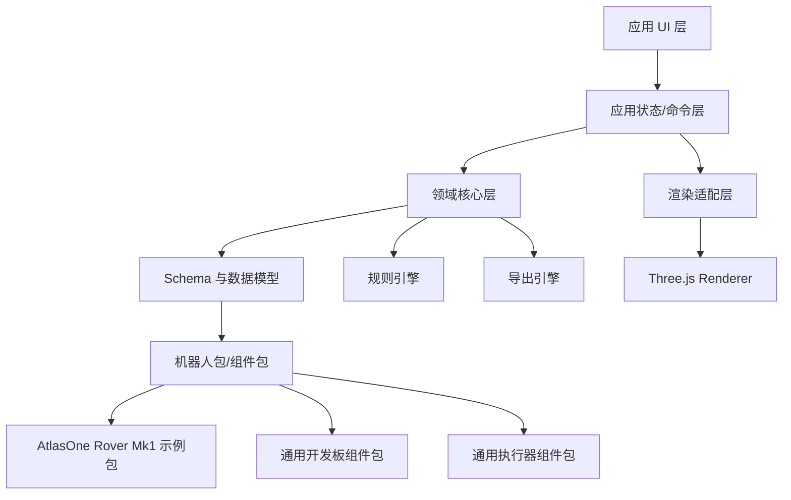

# 机器人积木化设计器 平台技术架构

## 1. 架构目标

平台技术架构要服务三个长期目标：

- 通用化：不绑定 AtlasOne Rover Mk1，支持不同机器人项目和组件包。
- 数据驱动：场景、组件、规则和导出都来自结构化数据。
- 渐进增强：先用参数化模型验证，后续可替换 GLB/STEP/STL 等高精度资产。

在线平台化补充目标见 `docs/机器人积木化设计器_在线平台产品架构.md`。该文档把当前静态 Web/localStorage MVP 进一步拆成项目服务、组件包注册表、资产库、制造输出和分享版本体系，避免设计资产长期困在开发者客户端。

## 2. 架构原则

- Schema first：先定义组件、布局、规则和导出的数据协议。
- Headless core：规则检查、BOM 聚合、布局解析不依赖 UI。
- Renderer pluggable：Three.js 是第一渲染器，但领域模型不依赖 Three.js。
- Package based：机器人项目、组件库、规则和示例布局都通过包加载。
- Offline friendly：MVP 继续保持静态 Web 可运行。
- Testable：规则引擎和导出器必须能在 Node 环境单测。

## 3. 分层架构



## 4. 核心模块

### 4.1 App Shell

职责：

- 项目选择。
- 包加载。
- 布局加载/保存。
- UI 面板状态。
- 命令分发。

不应包含：

- 组件规则判断。
- BOM 聚合细节。
- Three.js 具体模型创建逻辑。

### 4.2 Domain Core

职责：

- 解析组件定义。
- 解析机器人布局。
- 建立组件实例、安装点、接口和约束的领域模型。
- 为规则引擎和导出器提供统一数据。

核心类型：

```ts
type RobotProject = {
  id: string;
  name: string;
  packages: string[];
  activeLayoutId: string;
};

type ComponentDefinition = {
  id: string;
  name: string;
  category: string;
  geometry: GeometryDefinition;
  ports: PortDefinition[];
  mounting: MountingDefinition;
  bom?: BomDefinition;
  rules?: string[];
};

type ComponentInstance = {
  id: string;
  componentId: string;
  pose: Pose;
  layer?: string;
  role?: string;
  connections?: Connection[];
};
```

### 4.3 Package Loader

包是平台的复用边界。

包类型：

| 包类型 | 内容 |
| --- | --- |
| Robot Package | 项目模板、默认布局、项目规则 |
| Component Package | 组件定义、资产、替代件 |
| Rule Package | 规则函数、规则元数据 |
| Export Package | 导出模板 |

建议目录：

```text
simulator_web/robot_designer/
  app/
  core/
  renderer-three/
  packages/
    atlas-rover-mk1/
      package.json
      components.json
      layouts/default.json
      rules.json
      assets/
    common-boards/
    common-actuators/
```

当前 MVP 落地状态：

- `simulator_web/rover_builder` 已从“进入即 Mk1 设计器”调整为平台工作区，包含首页、项目管理、模板库、组件管理和设计器五个一级区域。
- 项目管理已使用浏览器 localStorage 存储 `robot-workspace.v1`，项目从模板创建副本后再进入设计器。
- `simulator_web/rover_builder/packages/atlas-rover-mk1/package.json` 已作为 Robot Package 清单。
- `simulator_web/rover_builder/packages/catalog.json` 已作为机器人包目录，项目包选择器从目录生成。
- `components.json`、`layouts/default.json`、`rules.json` 已从早期单文件示例拆分。
- `generic-rover-starter` 已作为第二个 Robot Package，用于验证多机器人项目切换。
- 布局模型已包含 `instances` 与 `connections`，连接端点统一使用 `instanceId.portId`。
- 前端支持组件类型库新增实例、复制、删除、安装点吸附、连接图编辑和组件包 JSON 导入。
- 前端加载器优先读取标准包，失败时回退旧版 `atlas_rover_mk1.components.json`，保证迭代期间可用。
- `tools/validate_robot_designer_packages.mjs` 已用于校验包清单、组件、布局实例和连接端点。
- 当前仍保留渲染器、规则展示、导出器在 `app.js` 内，下一步可继续拆为 `core`、`renderer-three`、`exporters`。

### 4.4 Renderer Adapter

Three.js 渲染器只关心如何把领域对象画出来。

输入：

- `ComponentInstance`
- `ComponentDefinition`
- 当前可见层级
- 当前显示模式

输出：

- Three.js Object3D。
- 选中态。
- 碰撞体可视化。
- 安装点/接口点可视化。

渲染器不直接生成 BOM，不判断电气规则。

### 4.5 Rule Engine

规则引擎分为三部分：

- Rule Registry：注册规则。
- Rule Context：当前项目、组件定义、实例布局、连接关系。
- Rule Result：检查结果。

```ts
type RuleResult = {
  id: string;
  level: "pass" | "info" | "warning" | "error" | "unknown";
  title: string;
  message: string;
  targets: string[];
  recommendation?: string;
};
```

规则类型：

| 类型 | 输入 | 输出 |
| --- | --- | --- |
| GeometryRule | 包围盒、安装点、层级 | 干涉、间隙、外宽、高度 |
| ElectricalRule | 端口、连接、电源域 | 共地、电压、电流、电平转换 |
| AssemblyRule | 层级、安装方式、热源 | 装配顺序、可维护性 |
| VariantRule | 项目方案配置 | 必选组件、禁止组合 |

### 4.6 Export Engine

导出器读取同一个领域模型，而不是读取 DOM。

导出类型：

- BOM CSV/Markdown。
- 装配步骤 Markdown。
- 检查清单 Markdown。
- 布局 JSON。
- 底板 SVG。
- 孔位图 SVG。
- 线束清单 CSV。
- 后续：PDF、GLB、制造包。

### 4.7 Persistence

MVP：

- 静态 JSON 文件。
- 浏览器 localStorage 保存草稿。
- 下载布局 JSON。
- 内存 undo/redo 历史。
- localStorage 保存布局快照。
- 本地快照对比当前布局的增删、位置和连接变化。

后续：

- 文件系统导入导出。
- Git 友好的 JSON 文档。
- 远程项目库或团队协作。
- 跨设备版本历史和权限控制。
- 在线平台阶段以云端 Project Service、Package Registry、Asset Library 作为源数据，浏览器 localStorage 降级为离线缓存和迁移备份。

### 4.8 Online Platform Adapter

为了从本地 MVP 平滑升级到在线平台，前端不应继续直接依赖 localStorage、静态 catalog 和本地上传文件。建议先抽出以下适配层：

| 适配层 | 本地实现 | 在线实现 |
| --- | --- | --- |
| PersistenceClient | localStorage project/draft/snapshot | Project API + DesignDocument |
| PackageRegistryClient | `packages/catalog.json` + 静态包 | Package Registry API |
| AssetClient | data URI / 包内相对 URL | Asset API + signed URL + CDN |
| ExportClient | 前端即时下载 | ExportJob + 对象存储 |
| AuthWorkspaceClient | 单用户默认工作区 | 用户、工作区、权限、分享链接 |

这个适配层是后续开发的关键拆分点：先保持本地实现行为不变，再逐步接入云端实现。

## 5. 数据模型设计

### 5.1 Component Schema

```json
{
  "id": "xiao_esp32c3",
  "name": "XIAO ESP32C3 底盘控制板",
  "category": "control_board",
  "geometry": {
    "kind": "rect_board",
    "size_mm": [21, 17.5, 4],
    "collision": "box",
    "render": "parametric"
  },
  "mounting": {
    "methods": ["pin_header", "carrier_plate", "tape"],
    "clearance_mm": { "usb_c": 12 }
  },
  "ports": [
    { "id": "usb_c", "kind": "usb", "direction": "front" },
    { "id": "d2", "kind": "gpio_pwm", "voltage": 3.3 }
  ],
  "bom": {
    "quantity": 1,
    "required": "required",
    "search": "Seeed XIAO ESP32C3"
  }
}
```

### 5.2 Layout Schema

```json
{
  "schema": "robot-layout.v1",
  "robotPackage": "atlas-rover-mk1",
  "variant": "mk1-four-wheel-64t",
  "units": "mm",
  "instances": [
    {
      "id": "xiao",
      "componentId": "xiao_esp32c3",
      "pose": { "x": -2, "y": 0, "z": 46, "yaw": 0 },
      "role": "chassis_controller"
    }
  ],
  "connections": [
    {
      "from": "dualeye.uart_tx",
      "to": "xiao.uart_rx",
      "kind": "uart_3v3"
    }
  ]
}
```

### 5.3 Rule Schema

```json
{
  "id": "mk1_requires_two_drv8833",
  "type": "variant",
  "level": "error",
  "when": { "variant": "mk1-four-wheel-64t" },
  "assert": {
    "componentCount": { "componentId": "drv8833_module", "gte": 2 }
  },
  "message": "四电机方案正式版需要两块 DRV8833，前后桥分开驱动。"
}
```

## 6. 与 Tiny World Builder 的架构映射

| Tiny World Builder | 机器人积木化设计器 |
| --- | --- |
| Cell / Tile | Component Instance / Mount Slot |
| Terrain | Layer / Base Plate / Mount Surface |
| Object Kind | Component Definition |
| Tool Palette | Component Library |
| Adjacency Rules | Mechanical/Electrical/Assembly Rules |
| World Schema | Robot Layout Schema |
| Seeded Demo | Robot Package Demo |
| Static Three.js App | Static Robot Designer MVP |

## 7. 当前原型重构方向

现有目录：

```text
simulator_web/rover_builder/
```

短期保留，但定位调整为：

```text
Robot Brick Designer MVP
  当前加载 AtlasOne Rover Mk1 示例包
```

中期重构目标：

```text
simulator_web/robot_designer/
  index.html
  app/main.js
  core/
    component-registry.js
    layout-model.js
    rule-engine.js
    export-engine.js
  renderer-three/
    scene.js
    component-renderers.js
    materials.js
  packages/
    atlas-rover-mk1/
```

## 8. 开发迭代策略

### Iteration 1：架构落位

- 新增产品需求文档。
- 新增技术架构文档。
- 原型 UI 改成平台定位。
- Mk1 数据标记为示例包。

### Iteration 2：数据解耦

- 将 `atlas_rover_mk1.components.json` 拆为组件定义和布局。
- 建立通用 `robot-layout.v1`。
- 从 UI 中移除 Atlas 专用假设。

### Iteration 3：规则引擎

- 把当前硬编码 `computeRuleChecks()` 迁移为规则注册表。
- 增加规则目标组件和修复建议。
- 增加单元测试。

### Iteration 4：交互设计器

- 支持拖放组件。
- 支持安装点吸附。
- 支持连接点可视化。
- 支持保存/导入布局 JSON。

### Iteration 5：组件生态

- 通用开发板包。
- 通用电机/轮组包。
- 通用电源包。
- 用户自定义组件导入。

## 9. 测试策略

| 层 | 测试 |
| --- | --- |
| Schema | JSON schema validation |
| Domain Core | 组件解析、布局解析、连接解析 |
| Rule Engine | 规则输入/输出单测 |
| Export Engine | BOM、步骤、检查清单快照测试 |
| Renderer | Playwright canvas 非空、关键 UI 状态 |
| UX Smoke | 打开示例、切层、选组件、导出 |

## 10. 风险与应对

| 风险 | 应对 |
| --- | --- |
| 组件库维护成本高 | 从常见组件包开始，允许估算/实测/官方精度分级 |
| 规则系统过度复杂 | 先实现解释型规则，后续再做表达式规则 |
| 3D 精度不足 | 参数化模型用于评审，支持 GLB/STEP/STL 替换 |
| 变成 Atlas 专用工具 | 目录、命名、schema 都按平台设计，Mk1 只作为 package |
| 与 CAD 边界不清 | 明确只做概念设计、装配评审、BOM 和检查，不做高精制造 CAD |

## 11. 近期技术结论

下一步开发不应继续在 `app.js` 里堆 Atlas 专用逻辑，而应先拆出：

- `component-registry`
- `layout-model`
- `rule-engine`
- `export-engine`
- `three-renderer`

然后让 AtlasOne Rover Mk1 变成第一个 `robotPackage`。
