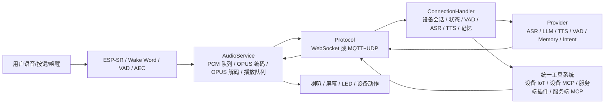
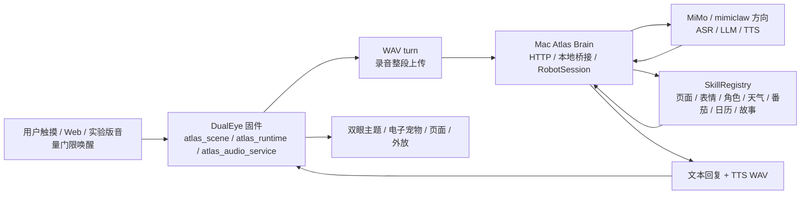

# Atlas 与 xiaozhi 端到端能力对标报告 V0.12

日期：2026-06-22，2026-06-23 更新 `0.13.0-runtime-80`

## 0. 对标快照

本报告对比三套对象：

| 对象 | 本次参考版本 | 定位 |
|---|---:|---|
| `78/xiaozhi-esp32` | `0d1ffd3`，2026-06-18 | ESP32 端语音智能硬件固件参考架构 |
| `xinnan-tech/xiaozhi-esp32-server` | `a1973e0`，2026-06-18 | 小智生态服务端、智控台、Provider、工具、OTA 平台 |
| Atlas DualEye + Atlas Brain | 本地 V0.12，2026-06-22 | 双眼桌面智能硬件、电子宠物、Mac Brain 桥接服务 |

一句话结论：

xiaozhi 是“成熟语音 IoT 栈”：设备端以状态机、音频服务、OPUS 流、WebSocket/MQTT+UDP、MCP 工具为核心；服务端以连接会话、Provider、工具系统、智控台、OTA 为核心。

Atlas 现在已经长出“平台化骨架”：`atlas_scene`、`atlas_audio_service`、`atlas_runtime`、`RobotSession`、`SkillRegistry`、P3/P4 模拟接口都在。`0.13.0-runtime-80` 进一步补上 Mac Brain session runtime、OPUS AOP1 帧统计、运行时评分和烧录前验收页，但真正的流式 ASR/TTS、WakeNet/AEC、生产 OTA 仍没达到 xiaozhi 的水平。Atlas 的优势不在“更像小智”，而在双眼显示、电子宠物、桌面应用、人格化体验。

## 1. 端到端链路对比

### 1.1 xiaozhi 标准链路



关键特征：

- 设备端不是“录一段 WAV 再传”，而是 60ms OPUS 帧流。
- 控制消息和音频消息有统一协议：WebSocket 或 MQTT+UDP。
- 设备会先发 `hello`，声明 `features` 和 `audio_params`。
- MCP 用 JSON-RPC 2.0 做工具发现和工具调用。
- 服务端每个连接有独立 `ConnectionHandler`，持有 ASR、LLM、TTS、VAD、Memory、Intent、工具处理器、对话历史。

### 1.2 Atlas 当前链路



当前状态要说清楚：

- P0 稳定 WAV turn：已做，`/api/diagnostics/turn` 能解释一次语音 turn 卡在哪里。
- P1 `atlas_audio_service`：已有骨架，但录音、播放、唤醒、连续监听还没有彻底从 HTTP handler 里解耦成独立任务队列。
- P2 WebSocket Brain：已有 JSON 事件 PoC 和 `/api/brain/ws` 入口，但还不是设备长期保持的主链路。
- P3 OPUS 流式 PoC：Mac Brain 能接收 AOP1 60ms OPUS 二进制帧并按 session 统计；DualEye 端已有真实 OPUS 编码与 WebSocket 推流入口，下一步是把帧接入流式 ASR。
- P4 ESP-SR/AEC：已有 `atlas_sr_probe` 和 `/api/sr/status`，当前仍是 energy gate VAD，不是 WakeNet/AEC。

## 2. 能力矩阵

| 环节 | xiaozhi-esp32 固件 | xiaozhi-server 服务端 | Atlas DualEye 固件 | Atlas Brain 服务端 | 判断 |
|---|---|---|---|---|---|
| 产品定位 | 通用语音智能硬件固件 | 完整智能硬件后端平台 | 双眼桌面机器人、电子宠物 | Mac 本地 Brain/桥接服务 | Atlas 差异化清楚，但基础语音链路还弱 |
| 硬件抽象 | `main/boards` 支持大量板型，含 Waveshare 多型号 | 通过设备型号、OTA、管理台适配 | 当前专注 ESP32-S3-DualEye | 默认单设备 `dualeye` | Atlas 不必急着多板型，先把一块板做稳 |
| 启动/配网 | Wi-Fi、BluFi、激活、配置 | OTA 可下发连接配置 | SoftAP Web 配网、PIN 配对、NVS | 通过设备 IP 管理 | Atlas 可用，但设备发现和配网体验偏手工 |
| 状态机 | `DeviceStateMachine`，状态包括 starting、wifi_configuring、idle、connecting、listening、speaking、upgrading、audio_testing、fatal_error | 连接状态与会话状态配套 | `atlas_scene` 合成页面、runtime、Wi-Fi、音频、Mac Brain 状态 | `/api/device/scene`、`/api/devices` 显示场景 | Atlas 这块进步明显，视觉表达比通用固件更有产品感 |
| 音频采集 | `AudioService` 管理 PCM、处理器、OPUS 编码、发送队列 | 接收 OPUS/流式音频，VAD/ASR 分流 | WAV 整段采集，`atlas_audio_service` 记录状态 | `/turn/audio` 处理整段音频 | Atlas 能跑，但延迟和连续体验不如流式 |
| OPUS | 端侧 `esp_opus_enc/dec`，默认 60ms 帧 | 支持 OPUS 音频会话 | 真实 OPUS 编码、探针和 WebSocket 推流入口 | `/ws/audio` 接收 AOP1 二进制帧，统计缺帧/mismatch/VAD 段 | P3 已从模拟推进到真机入口，仍未接流式 ASR |
| VAD/唤醒/AEC | ESP-SR、WakeWord、VAD，支持设备端 AEC 配置 | VAD、ASR、声纹可并行 | 音量门限唤醒、mute 规避回声 | `/api/sr/simulate`、状态探针 | P4 还没真正开始，后续是体验核心 |
| 协议层 | `Protocol` 抽象，WebSocket 与 MQTT+UDP 实现 | WebSocket、MQTT+UDP、HTTP | REST/Form 为主，P2 有 WS 入口 | `/ws/audio`、`/api/brain/events`、REST | Atlas 需要把 WebSocket 从 PoC 提升为主链路 |
| Hello/能力声明 | `hello` 声明 `features.mcp`、`audio_params` | 解析设备能力、建立 session | `/api/capabilities`、`/api/status` | `/api/platform`、`/api/devices` | Atlas 有能力接口，但缺少长连接握手协议 |
| 会话管理 | 应用层和协议层配合 | `ConnectionHandler` 持有 device_id、session_id、VAD、ASR、TTS、LLM、Memory、Intent、工具 | `atlas_runtime` 记录最近 turn | `RobotSession` + `AtlasBrainRuntime` 记录 session、事件、音频流和评分 | Atlas 会话骨架明显增强，但队列化和流式 Provider 还不够 |
| Provider | 设备端不直接管模型 | ASR/LLM/TTS/VAD/VLLM/Memory/Intent 多 Provider | 设备只保存桥接地址和显示配置 | MiMo/OpenAI 兼容方向，Provider 状态接口 | Atlas 应继续轻量 Provider，不要一口吃成全后端 |
| 工具/技能 | 设备端 MCP 工具可暴露音量、灯、电机、GPIO 等 | 统一工具系统：设备 IoT、设备 MCP、服务端插件、服务端 MCP、MCP Endpoint | 固件有页面/表情/主题/番茄/日历等接口 | `SkillRegistry` 已有页面、表情、角色、天气、搜索、音乐、故事、OTA 等 | Atlas 要补 schema、权限、风险等级、执行日志 |
| MCP | 设备端 MCP server，JSON-RPC 2.0 | 多种 MCP 入口与工具执行器 | 未实现 MCP，只是普通 HTTP API | 未实现标准 MCP，技能是本地 Python registry | 这是架构差距，但短期可先做“类 MCP 工具 schema” |
| Web/智控台 | 设备侧显示为主 | manager-web、manager-mobile、设备、模型、参数、智能体、OTA、知识库、声纹 | `/app` 与 `/admin` | `/devices`、单设备 `/app`、`/admin` 平台页 | Atlas 已分层，但 UI 和平台模型还浅 |
| OTA | 分区、版本、固件升级通道 | OTA 管理，按设备型号/版本下发 | 目前 USB 烧录，`/api/ota/status` | `/ota/manifest` manifest-only | Atlas 不应急着真 OTA，先做包管理/hash/回滚设计 |
| 资源/表情 | 支持自定义 assets、字体、表情、背景 | 管理台和工具链辅助 | PNG 主题、中文字体、电子宠物页面 | Web 端配置与预览 | Atlas 的双眼 IP 是优势，但素材/字体/屏幕坐标要继续打磨 |
| 日志/诊断 | 设备状态、协议、音频队列较完整 | 性能测试工具、日志、会话处理 | `/api/diagnostics/turn`、`/api/system/info`、`scene` | `/diagnostics`、P3/P4 状态 | Atlas 诊断刚补上，下一步要变成“每次失败都有原因” |
| 安全 | token、Device-Id、Client-Id、认证 | 用户、权限、认证、绑定 | PIN 配对、motion 默认暂停 | API Key 建议只在 Mac，未做完整权限系统 | 本地开发够用，后续要补 RBAC/密钥遮蔽 |
| 多设备 | 多板型、多设备 | 智控台支持多设备 | 只有一块 DualEye | 默认单设备模型 | 当前不急，等第二台设备出现再做真多设备 |
| 动态控制 | 可通过 MCP 扩展电机/GPIO | MQTT/MCP 指令下发 | 旧底盘 UART 保留，本版默认暂停 | rover 技能默认不注册 | 对的，先别让运动拖垮语音体验 |

## 3. 成熟度评分

分数不是“谁更好”，只是判断下一步该补哪里。

| 能力 | xiaozhi 参考成熟度 | Atlas V0.13 | Atlas 当前说明 |
|---|---:|---:|---|
| 设备状态机/场景表达 | 4.5/5 | 3.6/5 | `atlas_scene` 已补齐，双眼场景更有产品感 |
| 音频服务架构 | 4.5/5 | 3.0/5 | `atlas_audio_service` 已服务化记录 busy/job/mute/失败原因，OPUS 流会避开播放 mute；仍不是完整队列化音频引擎 |
| OPUS 流式链路 | 4.5/5 | 2.7/5 | DualEye 有真实 OPUS 编码与 WebSocket 推流入口，Mac Brain 能接 AOP1 帧并统计缺帧/VAD 段；还没接流式 ASR |
| WakeNet/AEC/连续监听 | 4/5 | 1.6/5 | 目前还是门限唤醒 + mute 规避 |
| WebSocket 主链路 | 4.3/5 | 2.8/5 | `/api/brain/ws` 与 `/ws/audio` 已有 JSON/二进制入口，但还没成为所有 turn 的主协议 |
| 会话管理 | 4.4/5 | 3.4/5 | `RobotSession` + `AtlasBrainRuntime` 已记录 session、事件、音频流和评分；并发治理和 Provider 流式状态仍需收口 |
| Provider 抽象 | 4.5/5 | 3/5 | 能接 MiMo/OpenAI 兼容，但 Provider 管理较浅 |
| 工具/技能系统 | 4.6/5 | 3.4/5 | `SkillRegistry` 和 Tool Schema V0 可用，缺权限分级、执行日志和标准 MCP 化 |
| 管理后台/智控台 | 4.6/5 | 3.5/5 | 已拆 `/devices`、`/app`、`/admin`，并加入 `/acceptance`、runtime score；仍是本地轻量页 |
| OTA | 4/5 | 1.8/5 | manifest + package hash 已有，仍无 OTA 分区、签名、回滚 |
| 双眼视觉/IP 体验 | 3/5 | 4/5 | 这是 Atlas 的优势项，应继续投入 |
| 桌面应用能力 | 2.8/5 | 3.4/5 | 时钟、番茄、日历、宠物等是 Atlas 的方向 |

## 4. Atlas 已经学到并落地的东西

### 4.1 从“页面状态”升级到“设备场景”

`atlas_scene` 是对标 xiaozhi 状态机后最正确的一步。它把页面、表情、runtime、audio service、Wi-Fi、Mac Brain 配置合成一个统一场景，避免屏幕、Web、日志各说各话。

下一步要把所有语音链路事件都写入 scene，例如：

- `turn.started`
- `asr.partial`
- `asr.final`
- `llm.thinking`
- `tool.running`
- `tts.streaming`
- `playback.started`
- `turn.failed`

### 4.2 从桥接脚本升级到 Atlas Brain

Mac 侧已经不只是“转发脚本”，而是有了：

- `RobotSession`
- `SkillRegistry`
- `/api/platform`
- `/api/devices`
- `/api/device/scene`
- `/ws/audio`
- `/api/sr/status`
- `/ota/manifest`

这是对标 xiaozhi-server 后正确的方向。区别是：xiaozhi-server 是多用户、多设备、全 Provider、全管理台；Atlas Brain 现在应该保持轻量，服务一台机器人，把体验跑通。

### 4.3 技能入口开始统一

页面切换、表情主题、番茄、日历、天气、故事、音乐、角色切换现在正在收敛到 `SkillRegistry`。这个方向对，因为 Web 点击、语音指令、LLM 工具调用最终必须走同一套技能，而不是三套 if/else。

## 5. 当前最主要的差距

### 5.1 连续语音体验的根因不是模型，而是链路

用户感受到的“卡死、播报失效、连续监听断掉”，本质上常见原因是：

- 录音、上传、等待 ASR/LLM/TTS、播放都在一次整段 WAV turn 里串行完成。
- 播放期间只能靠 mute 规避自激，不能真正 AEC。
- 连续监听和播放状态没有独立任务队列托管。
- HTTP handler 和音频动作耦合过重，异常时容易把 UI/控制也拖住。

所以 P1 比继续加 App 更重要：`atlas_audio_service` 要真正成为服务，而不只是状态记录器。

### 5.2 P3/P4 现在还只是“地基探测”

P3 当前是 Mac Brain 可以接模拟帧，不等于 DualEye 已经在发 OPUS。

P4 当前是 `atlas_sr_probe` 和 energy gate VAD，不等于 WakeNet/AEC 已经可用。

这个判断很重要：晚上实机测试时，如果连续语音仍然体验一般，不应该继续怀疑 MiMo 或 MimiClaw，先看音频服务和协议链路。

### 5.3 工具系统还没到 MCP 水平

Atlas 的 `SkillRegistry` 已经够第一版用，但和 xiaozhi 的统一工具/MCP 体系相比，还缺：

- 每个技能的 JSON schema。
- 风险等级：只读、显示、音频播放、配置修改、运动控制。
- 执行前权限检查。
- 执行日志和失败码。
- 设备侧能力发现。
- 服务端工具与设备工具的区分。

建议先做“Atlas Tool Schema V0”，不必一上来完整 MCP。

## 6. 下一轮执行路线

### E0：先把今晚实机验证闭环打好

烧录后每次语音测试都抓这四个接口：

```text
DualEye /api/status
DualEye /api/diagnostics/turn
DualEye /api/sr/status
Mac Brain /api/device/scene
```

验收标准：

- 卡住时 scene 必须能说出卡在录音、转写、思考、合成、播放还是 Mac Brain 离线。
- 连续监听关闭时必须有原因。
- 播放失败时必须看到 TTS 是否生成、WAV 字节数、播放错误。

### E1：把 `atlas_audio_service` 做成真服务

目标：录音、播放、唤醒、连续监听不再散落在 HTTP handler。

建议结构：

```text
atlas_audio_service
  - event queue
  - capture worker
  - playback worker
  - wake/continuous monitor
  - turn coordinator
  - mute/aec policy
```

最小验收：

- Web 点击切页时，不会被语音 turn 阻塞。
- 播放 TTS 时自动进入 `speaking` scene，播放结束自动回 `monitoring/idle`。
- 失败能回到 idle，不需要拔 USB。

### E2：WebSocket Brain 通道转正

先只传 JSON 事件，不急着上音频。

设备 hello 建议：

```json
{
  "type": "hello",
  "protocol": "atlas.brain.v0",
  "device_id": "dualeye-xxxx",
  "firmware": "0.12.x",
  "features": {
    "scene": true,
    "wav_turn": true,
    "audio_stream": false,
    "mcp": false,
    "dual_eye": true
  },
  "audio_params": {
    "format": "wav",
    "sample_rate": 16000,
    "channels": 1
  }
}
```

事件建议：

```text
state.changed
turn.started
turn.asr_final
turn.reply_ready
tool.call
tool.result
audio.playback_started
audio.playback_finished
error
heartbeat
```

### E3：OPUS 流式 PoC 上真机

参考 xiaozhi 的 `AudioService`：

- 16k mono 输入。
- 60ms OPUS frame。
- 编码队列、发送队列分离。
- 播放队列、解码队列分离。
- 保留 WAV turn fallback，避免一改就全挂。

验收标准：

- DualEye 能向 Mac Brain 连续发送真实音频帧。
- Mac Brain 能统计帧率、丢帧、总时长。
- 不做 ASR 也可以，先证明链路稳定。

### E4：WakeNet/AEC 资源验证

不要一口气开 WakeNet、AEC、OPUS、LVGL 动画。先用开关做 AB：

| 组合 | 目的 |
|---|---|
| 当前门限 VAD | baseline |
| WakeNet only | 看唤醒词内存和 CPU |
| AEC only | 看播放期间误唤醒是否下降 |
| WakeNet + AEC | 最终目标，但最后验证 |

记录：

- free heap / PSRAM。
- 唤醒误触发率。
- 播放期间自激次数。
- TTS 后是否能恢复监听。

### E5：Atlas Tool Schema V0

先做本地 schema，不急着完整 MCP。

```json
{
  "name": "atlas.pomodoro.start",
  "title": "开始番茄专注",
  "risk": "display_audio",
  "input_schema": {
    "type": "object",
    "properties": {
      "task": {"type": "string"},
      "minutes": {"type": "integer", "minimum": 1, "maximum": 120}
    }
  },
  "targets": ["dualeye"],
  "confirm_required": false
}
```

后续再把这套 schema 映射到 MCP `tools/list` 和 `tools/call`。

### E6：Web 端继续分层

对标 xiaozhi 的 manager-web，但 Atlas 不照搬大后台。

建议三层：

| 页面 | 面向谁 | 内容 |
|---|---|---|
| `/app` | 日常用户 | 对话、表情、主题、时钟、番茄、日历、音乐、故事 |
| `/devices` | 家里有多台设备时 | 设备列表、在线状态、当前场景 |
| `/admin` | 开发/维护 | Provider、模型、TTS 音色、日志、P3/P4 探针、OTA manifest、技能开关 |

## 7. 不建议现在照搬的部分

| xiaozhi 能力 | 暂不照搬原因 | Atlas 当前替代 |
|---|---|---|
| MySQL/Redis 全模块平台 | 当前只有一台设备，会拖慢迭代 | 本地 Mac Brain + 文件/环境变量 |
| MQTT+UDP | 局域网单设备不需要这么复杂 | HTTP + WebSocket 先跑通 |
| 声纹识别 | AEC/连续监听未稳前收益不大 | 先做普通对话身份 |
| RAGFlow/知识库 | Atlas 还没形成知识库场景 | 先做联网搜索、天气、日历 |
| HomeAssistant | 需要真实家居设备 | 后续作为工具插件 |
| 设备互呼 | 至少两台设备才有意义 | 暂不做 |
| 数字人 | 和双眼实体体验方向不完全一致 | 保留电子宠物 IP |
| 真 OTA | 分区、hash、回滚还没验证 | 先做 manifest 和包管理 |

## 8. 应该立即学习的部分

1. 状态机不是 UI 附属品，而是全系统事实源。Atlas 已经用 `atlas_scene` 开始做对了。
2. 音频链路必须服务化和队列化。Atlas 下一步要把 `atlas_audio_service` 从“记录状态”推进到“托管 turn”。
3. 协议要有 hello、features、audio_params、session_id。Atlas P2 应该先把 JSON 长连接做稳。
4. 工具要 schema 化。Atlas 的 SkillRegistry 下一步要补参数、权限、风险等级和执行日志。
5. Web 管理要平台化，但不要过度平台化。Atlas 保持 `/app` 日常操作、`/admin` 维护诊断、`/devices` 设备列表即可。
6. OPUS 和 WakeNet/AEC 是体验跃迁点，但必须分阶段验证，不能和 UI、Provider、技能一起混改。

## 9. 给 Atlas 的当前路线判断

本轮重点不该是继续加更多“看起来有功能”的页面，而是把语音机器人最核心的 turn 稳住：

```text
唤醒/触发 -> 录音 -> ASR -> LLM/工具 -> TTS -> 自动播放 -> 自动恢复监听
```

达到这个闭环之后，Atlas 的双眼主题、电子宠物、番茄、时钟、日历、故事、音乐才会真正变成“有性格的桌面机器人”，而不是一堆页面按钮。

优先级建议：

| 优先级 | 要做的事 | 原因 |
|---|---|---|
| P0 | `atlas_audio_service` 真服务化、turn 失败原因完整、播放后自动恢复监听 | 直接解决心累的卡死/断链问题 |
| P1 | WebSocket Brain JSON 长连接 | 给后续流式音频和工具事件打地基 |
| P2 | DualEye 真实 OPUS 60ms 帧 PoC | 降低延迟，让连续对话像产品 |
| P3 | WakeNet/AEC 资源验证 | 解决免按键唤醒和播报自激 |
| P4 | Tool Schema V0 / 类 MCP | 让 mimiclaw/LLM 能稳妥控制页面、表情、番茄、日历 |
| P5 | OTA manifest + 包管理 | 烧录频繁之后再考虑真 OTA |

## 10. 参考来源

- xiaozhi-esp32 GitHub：<https://github.com/78/xiaozhi-esp32>
- xiaozhi-esp32 README 中文版：<https://github.com/78/xiaozhi-esp32/blob/main/README_zh.md>
- xiaozhi WebSocket 协议：<https://github.com/78/xiaozhi-esp32/blob/main/docs/websocket_zh.md>
- xiaozhi MQTT+UDP 协议：<https://github.com/78/xiaozhi-esp32/blob/main/docs/mqtt-udp_zh.md>
- xiaozhi MCP 交互流程：<https://github.com/78/xiaozhi-esp32/blob/main/docs/mcp-protocol_zh.md>
- xiaozhi MCP 使用说明：<https://github.com/78/xiaozhi-esp32/blob/main/docs/mcp-usage_zh.md>
- xiaozhi 自定义开发板说明：<https://github.com/78/xiaozhi-esp32/blob/main/docs/custom-board_zh.md>
- xiaozhi-server GitHub：<https://github.com/xinnan-tech/xiaozhi-esp32-server>
- xiaozhi-server README：<https://github.com/xinnan-tech/xiaozhi-esp32-server/blob/main/README.md>
- xiaozhi-server 部署文档：<https://github.com/xinnan-tech/xiaozhi-esp32-server/blob/main/docs/Deployment.md>
- xiaozhi-server 全模块部署：<https://github.com/xinnan-tech/xiaozhi-esp32-server/blob/main/docs/Deployment_all.md>
- xiaozhi-server MQTT 网关：<https://github.com/xinnan-tech/xiaozhi-esp32-server/blob/main/docs/mqtt-gateway-integration.md>
- xiaozhi-server OTA 指南：<https://github.com/xinnan-tech/xiaozhi-esp32-server/blob/main/docs/ota-upgrade-guide.md>
- xiaozhi-server 天气插件：<https://github.com/xinnan-tech/xiaozhi-esp32-server/blob/main/docs/weather-integration.md>
- xiaozhi-server 联网搜索：<https://github.com/xinnan-tech/xiaozhi-esp32-server/blob/main/docs/web-search-integration.md>
- xiaozhi-server RAGFlow：<https://github.com/xinnan-tech/xiaozhi-esp32-server/blob/main/docs/ragflow-integration.md>
- xiaozhi-server HomeAssistant：<https://github.com/xinnan-tech/xiaozhi-esp32-server/blob/main/docs/homeassistant-integration.md>
- 本地 Atlas V0.12 执行记录：`docs/Atlas桌面智能硬件平台化执行记录_V0.12.md`
- 本地 Atlas 固件说明：`firmware/dualeye/README.md`
