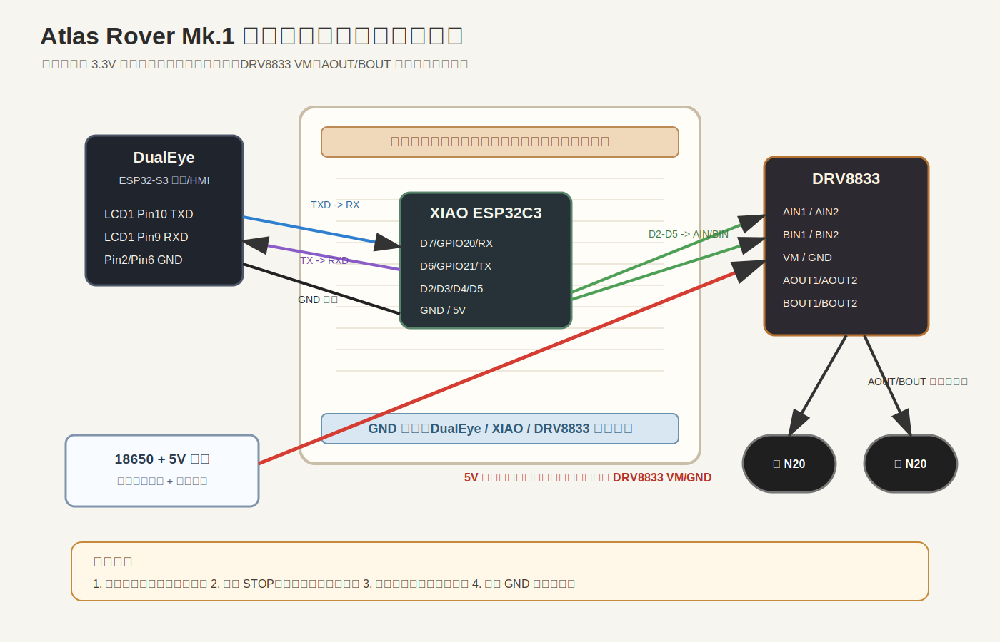

# Atlas Rover Mk.1 面包板临时联调接线说明

这一步的目标不是把整车做漂亮，而是先把“DualEye -> UART -> XIAO -> DRV8833 -> N20 电机”的链路跑通。



## 核心结论

面包板可以买，也值得买，但它只负责临时验证逻辑走线：

| 可以走面包板 | 不建议走面包板 |
|---|---|
| UART TX/RX | 18650 主电流 |
| XIAO 到 DRV8833 的 AIN/BIN 控制线 | 5 V 升压到 DRV8833 VM 的电机电流 |
| GND 共地点 | DRV8833 AOUT/BOUT 到电机的输出电流 |
| 低电流 3.3 V 逻辑参考 | 长时间带载跑电机 |

电机主电流请用螺丝端子、鳄鱼夹、焊接线或较粗杜邦线从面包板外侧走。

## 推荐摆放

1. 面包板中间放 `XIAO ESP32C3`，USB-C 朝外，方便烧录。
2. `DRV8833` 可以插在面包板边缘，只让 `AIN1/AIN2/BIN1/BIN2/GND` 这些逻辑脚进面包板。
3. `VM`、`AOUT1/AOUT2`、`BOUT1/BOUT2` 尽量不要插进面包板电源母线。
4. DualEye 的 SH1.0 14P 转杜邦线从一侧进来，只接 `Pin10 TXD`、`Pin9 RXD`、`GND`。
5. 5 V 升压模块和 18650 先放在面包板外侧，电机支路加独立开关。

## 接线表

### DualEye 到 XIAO UART

| DualEye LCD1 接口 | 接到 XIAO ESP32C3 | 说明 |
|---|---|---|
| Pin10 UART_TXD | D7 / GPIO20 / RX | DualEye 下发 `AR1,` 命令 |
| Pin9 UART_RXD | D6 / GPIO21 / TX | XIAO 回 `AR1,ACK,*` |
| Pin2 或 Pin6 GND | GND | 必须共地 |
| Pin5 3V3 | 暂不接 | 只作逻辑参考，不给 XIAO/电机供电 |

### XIAO 到 DRV8833

| XIAO ESP32C3 | DRV8833 | 作用 |
|---|---|---|
| D2 / GPIO4 | AIN1 | 左轮正转 PWM |
| D3 / GPIO5 | AIN2 | 左轮反转 PWM |
| D4 / GPIO6 | BIN1 | 右轮正转 PWM |
| D5 / GPIO7 | BIN2 | 右轮反转 PWM |
| GND | GND | 共地 |
| 3V3 | nSLEEP/STBY/EN | 仅当你的 DRV8833 模块引出了睡眠/使能脚时使用 |

### 电机与电源

| 线路 | 接法 | 注意 |
|---|---|---|
| 5 V 升压 OUT+ | DRV8833 VM | 不走面包板电源母线 |
| 5 V 升压 OUT- | DRV8833 GND / XIAO GND / DualEye GND | 全系统共地 |
| DRV8833 AOUT1/AOUT2 | 左 N20 电机 | 若方向反，交换这两根线 |
| DRV8833 BOUT1/BOUT2 | 右 N20 电机 | 若方向反，交换这两根线 |
| 470-1000 uF 电容 | 并在 DRV8833 VM/GND 附近 | 减少电机启动导致的电压跌落 |

## 操作步骤

### 1. 不接电机，先测逻辑

1. XIAO 插 USB-C，确认能被电脑识别。
2. 烧录 `firmware/chassis_xiao_esp32c3`。
3. 打开 XIAO 串口监视器，确认能看到启动日志。
4. 只接 XIAO 与 DRV8833 的 AIN/BIN/GND，不接 VM 和电机。
5. 检查没有异常发热。

### 2. 接电机电源，但车轮悬空

1. 断电。
2. 接 5 V 升压模块到 DRV8833 VM/GND。
3. 接左右 N20 电机。
4. 车轮悬空。
5. 合上电机支路开关。

### 3. 用 XIAO 先测底盘

从 XIAO 串口发送：

```text
AR1,STOP
AR1,MOVE,F,25,300
AR1,MOVE,B,25,300
AR1,TURN,L,25,250
AR1,TURN,R,25,250
AR1,STOP
```

验收标准：

- 每条有效命令返回 `AR1,ACK,OK`。
- 错误命令返回 `AR1,ACK,ERR`，电机不继续转。
- `duration_ms` 到时自动停车。
- `AR1,STOP` 立即停车。

### 4. 再接 DualEye UART

确认 XIAO 单独控制 OK 后，再接 DualEye：

```text
DualEye Pin10 TXD -> XIAO D7/GPIO20/RX
DualEye Pin9 RXD  <- XIAO D6/GPIO21/TX
DualEye GND       <-> XIAO GND
```

然后在 DualEye Web 页测试：

1. 先点 STOP。
2. 再点前进/后退。
3. 最后点左转/右转。
4. 如果任何动作不受控，先断电机支路开关，再排查 UART 和 GND。

## 故障排查

| 现象 | 优先排查 |
|---|---|
| XIAO 无 ACK | TX/RX 是否交叉；波特率是否 115200；GND 是否共地 |
| 电机不转 | DRV8833 VM 是否有 5 V；nSLEEP/STBY/EN 是否拉高；电机线是否接牢 |
| 只有一侧轮子转 | 对应 AIN/BIN 线序；对应电机线；DRV8833 通道是否损坏 |
| 前进时一边反转 | 交换反转那一侧电机的两根输出线 |
| 一启动就重启 | 电机电流导致 5 V 下跌；给 DRV8833 VM/GND 加电容；XIAO 单独稳压 |
| DualEye 控制无效 | 先用 XIAO 串口单独测试；再查 DualEye Pin10/Pin9 接线 |

## 面包板测试通过后

通过后再进入半永久走线：

1. XIAO 和 DRV8833 焊到洞洞板或小转接板。
2. 电机电源和电机输出改成端子或焊接线。
3. UART/GPIO 线保留可插拔接口，方便后续维护。
4. 再安装到黄铜车架里。
